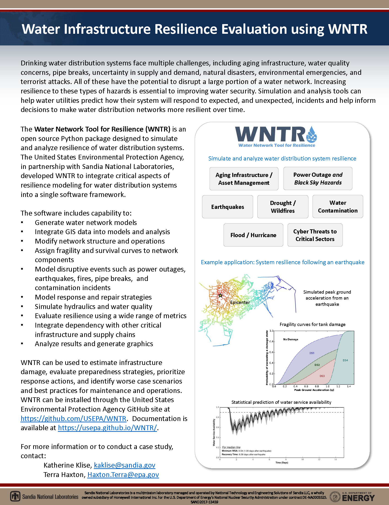

.. attention:: 
    Version 1.2.0 is now available.  
    See `release notes <https://usepa.github.io/WNTR/whatsnew.html>`_
    for more information.

.. _fig-factsheet:

 
Download the :download:`WNTR overview factsheet <factsheets/WNTR_factsheet.pdf>`
 
Download the :download:`WNTR case studies factsheet <factsheets/WATER INFRASTRUCTURE RESILIENCE EVALUATION USING WNTR.pdf>`
