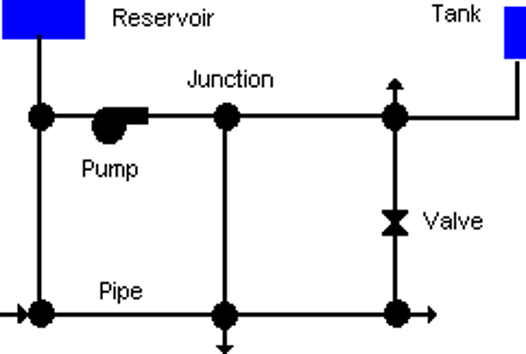

Data requirements
===================

WNTR requires a model of the water distribution system. 
That model can be obtained from the water utility (in EPANET INP or related file format) 
or be generated from data.  The basic features of the model are shown in :numref:`fig-data-req` 
and breifly described in :numref:`table-data-req`.
Some information can be approximated from publicly 
available data sources, as outlined in the table.
  
For more information on water distribution system models, see the 
the `EPANET 2.2 online user manual <https://epanet22.readthedocs.io/en/latest/3_network_model.html#>`_, and 
EPA’s website on `Small System Challenges and Solutions <https://www.epa.gov/water-research/21st-annual-epa-drinking-water-workshop-small-system-challenges-and-solutions>`_. 
The 2020 presentation includes an overview of hydraulic modeling.

.. _fig-data-req:

   
   Physical components in a water distribution system model (from EPANET 2.2 online user manual)

.. _table-data-req:
.. csv-table:: Water distribution system model data requirements
   :file: tables/data_requirements.csv
   :widths: 10, 15, 15, 25, 25
   :header-rows: 1
