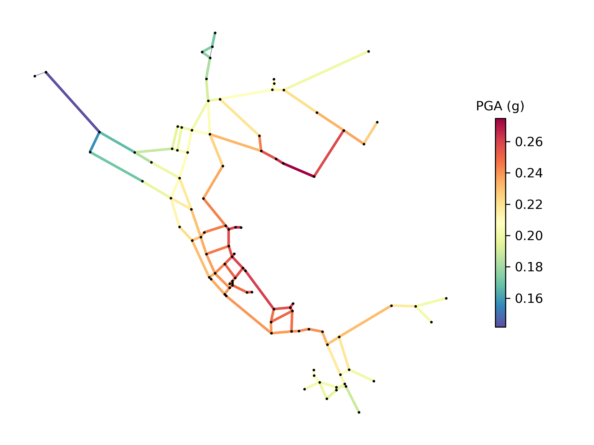

.. raw:: latex

    \clearpage

.. _disaster:

Disaster scenarios
======================================

Drinking water utilities might be interested in examining many different disaster scenarios.
They could be acute incidents like power outages and earthquakes 
or they could be long term issues like persistent pipe 
leaks, population fluctuation, and changes to supply and demand. The following section describes
disaster scenarios that can be modeled in WNTR.  

.. _earthquake:

Earthquake
-----------
Earthquakes can be some of the most sudden and impactful disasters that a 
water system experiences. An earthquake can cause lasting damage to the system that 
could take weeks, if not months, to fully repair. Earthquakes can cause 
damage to pipes, tanks, pumps, and other infrastructure.
Additionally, earthquakes can cause power outages and fires. 

WNTR includes methods 
to add leaks to pipes and tanks, 
shut off power to pumps, 
and change demands for fire conditions, as described in the sections below.
The :class:`~wntr.scenario.earthquake.Earthquake` class includes methods 
to compute peak ground acceleration, peak ground velocity, and repair rate based on the earthquake
location and magnitude.  
Alternatively, external earthquake models or databases (e.g., ShakeMap [WWQP06]_) can be used to compute earthquake properties and 
those properties can be loaded into Python for analysis in WNTR.

When simulating the effects of an earthquake, fragility curves are commonly used to define the probability that a component is 
damaged with respect to 
peak ground acceleration, peak ground velocity, 
or repair rate.
The American Lifelines Alliance report [ALA01]_ includes seismic fragility curves 
for water system components.
See :ref:`fragility_curves` for more information.

Since properties like peak ground acceleration, peak ground velocity, and repair rate are a function of the distance to the epicenter, 
node coordinates in the water network model must be in units of meters.  
Since some network models use other units for node coordinates, 
WNTR includes methods to change coordinate scale, as shown in the following example.

.. doctest::
    :hide:

    >>> import wntr
    >>> import matplotlib.pylab as plt
    >>> try:
    ...    wn = wntr.network.model.WaterNetworkModel('../examples/networks/Net3.inp')
    ... except:
    ...    wn = wntr.network.model.WaterNetworkModel('examples/networks/Net3.inp')
    
.. doctest::

    >>> import wntr # doctest: +SKIP
	
    >>> wn = wntr.network.WaterNetworkModel('networks/Net3.inp') # doctest: +SKIP
    >>> wn = wntr.morph.scale_node_coordinates(wn, 1000)
   
The following example computes peak ground acceleration, peak ground velocity, and repair rate for each pipe.

.. doctest::

    >>> epicenter = (32000,15000) # x,y location
    >>> magnitude = 6.5 # Richter scale
    >>> depth = 10000 # m, shallow depth
    >>> earthquake = wntr.scenario.Earthquake(epicenter, magnitude, depth)
    >>> distance = earthquake.distance_to_epicenter(wn, element_type=wntr.network.Pipe)
    >>> pga = earthquake.pga_attenuation_model(distance)  
    >>> pgv = earthquake.pgv_attenuation_model(distance)
    >>> repair_rate = earthquake.repair_rate_model(pgv) 

The earthquake properties can be plotted on the network using the following example. The resulting map is shown in :numref:`fig-network`.

.. doctest::
    :hide:
    
	>>> fig = plt.figure()
    
.. doctest::

    >>> ax = wntr.graphics.plot_network(wn, link_attribute=pga, node_size=4,
    ...     link_width=2, link_colorbar_label='PGA (g)')

.. doctest::
    :hide:

    >>> plt.tight_layout()
    >>> plt.savefig('network_pga.png', dpi=300)
    
.. _fig-network:

   
   Peak ground acceleration.
   
.. _pipe_leak:
	
Pipe breaks or leaks
---------------------
Pipes are susceptible to leaks.  Leaks can be caused by 
aging infrastructure, 
the freeze/thaw process, 
increased demand, 
or pressure changes. 
This type of damage is especially common in older cities where distribution 
systems were constructed from outdated materials like 
cast iron and even wood. 

WNTR includes methods to add leaks to junctions and tanks (see :ref:`leak_model` for more details).
Leaks can be added to a pipe by splitting the pipe and adding a junction.
The following example adds a leak to a specific pipe.

.. doctest::

    >>> wn = wntr.morph.split_pipe(wn, '123', '123_B', '123_leak_node')
    >>> leak_node = wn.get_node('123_leak_node')           
    >>> leak_node.add_leak(wn, area=0.05, start_time=2*3600, end_time=12*3600)

The method :class:`~wntr.network.elements.Junction.add_leak` adds time controls to 
a junction, which includes the start and stop time for the leak.

Power outage
-------------
Power outages can be small and brief, or they can also span over several days and 
affect whole regions as seen in the 2003 Northeast Blackout. 
While the Northeast Blackout was an extreme case, a 2012 Lawrence Berkeley National Laboratory study [ELLT12]_ 
showed the frequency and duration of power outages are increasing domestically by a 
rate of two percent annually. In water distribution systems, 
a power outage can cause pump stations to shut down and result in 
reduced water pressure. This can lead to shortages in some areas of 
the system. Typically, no lasting damage in the system is associated with power outages. 

WNTR can be used to simulate power outages by changing the pump status from ON to OFF and defining the duration of the outage.
The following example adds a 5 hour power outage to a specific pump.

.. doctest::

    >>> pump = wn.get_link('335')
    >>> pump.add_outage(wn, 5*3600, 10*3600)
   
The method :class:`~wntr.network.elements.Pump.add_outage` adds time controls to a pump to start and stop a power outage.
When simulating power outages, consider placing check bypasses around pumps 
and check valves next to reservoirs.

Fires
----------------
WNTR can be used to simulate damage caused to system components due to fire and/or to simulate water usage due to fighting fires. To fight fires, additional water is drawn from the system. Fire codes vary by 
state. Minimum required fire flow and duration are generally based on the building's area and purpose.
While small residential fires might require 1500 gallons/minute for 2 hours, large commercial
spaces might require 8000 gallons/minute for 4 hours [ICC12]_. This additional demand can 
have a large impact on water pressure in the system.  

WNTR can be used to simulate firefighting conditions in the system.  
WNTR simulates firefighting conditions by specifying the demand, time, and duration of firefighting.
Pressure dependent demand simulation is recommended in cases where firefighting might impact expected demand.
The following example adds fire flow conditions at a specific node.

.. doctest::

    >>> fire_flow_demand = 0.252 # 4000 gal/min = 0.252 m3/s
    >>> fire_start = 10*3600
    >>> fire_end = 14*3600
    >>> node = wn.get_node('197')
    >>> node.add_fire_fighting_demand(wn, fire_flow_demand, fire_start, fire_end)

Environmental change
---------------------
Environmental change is a long term problem for water distribution 
systems. Changes in the environment could lead to 
reduced water availability, 
damage from weather incidents, 
or even damage from subsidence. 
For example, severe drought in California has forced lawmakers to reduce the 
state's water usage by 25 percent. 
Environmental change also leads to sea level rise which can inundate distribution 
systems. This is especially prevalent in cities built on unstable soils like 
New Orleans and Washington, DC, which are experiencing land subsidence. 

WNTR can be used to simulate the effects of environmental change on the water distribution system by
changing supply and demand, adding disruptive conditions (i.e., power outages, pipe leaks) caused by severe weather, or by adding pipe leaks caused by subsidence.
Power outages and pipe leaks are described above.  
Changes to supply and demand can be simple (i.e., changing all nodes by a certain percent), or complex (i.e., using external data or correlated statistical methods).
The following example changes supply and demand in the model.

.. doctest::

    >>> for res_name, res in wn.reservoirs():
    ...     res.head_timeseries.base_value = res.head_timeseries.base_value*0.9
	
    >>> for junc_name, junc in wn.junctions():
    ...     for demand in junc.demand_timeseries_list:
    ...         demand.base_value = demand.base_value*1.15
   
Contamination
--------------------
Water distribution systems are vulnerable to contamination by a variety of chemical, microbial, or radiological substances.
During disasters, contamination can enter the system through reservoirs, tanks, and at other access points within the 
distribution system.  Long term environmental change can lead to degradation of water sources.  Contamination can be difficult to detect and is very expensive to clean up. 
Recent incidents, including the Elk River chemical spill and Flint lead contamination, 
highlight the need to minimize human health and economic impacts.

WNTR simulates contamination incidents by introducing contaminants into the distribution system and allowing them to propagate through the system. 
The section on :ref:`water_quality_simulation` includes steps to define and simulate contamination incidents.

Other disaster scenarios
-------------------------------
Drinking water systems are also susceptible to other natural disasters including floods, droughts, 
hurricanes, tornadoes, extreme winter storms, and wind events.  WNTR can be used to simulate these events 
by combining the disaster models already described above.  For example, tornadoes might cause power 
outages, pipe breaks, other damage to infrastructure, and fires.  Floods might cause power outages, 
changes to source water (because of treatment failures), and pipe breaks.   
