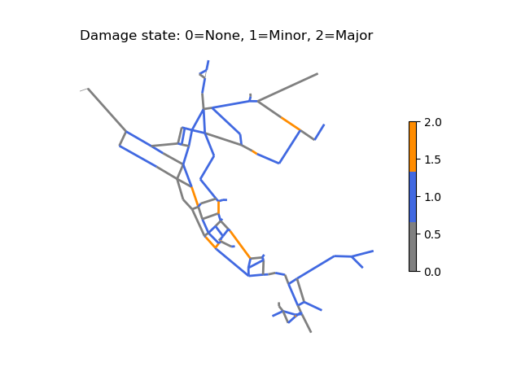

.. raw:: latex

    \clearpage

.. _fragility_curves:

Fragility curves
===============================
Fragility curves are commonly used in disaster models to define the probability 
of exceeding a given damage state as a function of environmental change.
Fragility curves are closely related to survival curves, which are used to define the probability of component failure due to age.  
For example, to estimate earthquake damage, fragility curves are defined as a function of peak
ground acceleration, peak ground velocity, or repair rate.  
The American Lifelines Alliance report [ALA01]_
includes seismic fragility curves for water network components.
Fragility curves can also
be defined as a function of flood stage, wind speed, and temperature for other
types of disasters.  

Fragility curves can have multiple damage states.  
Each state should correspond to specific changes to the network model that represent damage, for example, a major or minor leak.
Each state is defined with a name (i.e., 'Major,' 'Minor'), 
priority (i.e., 1, 2, where increasing (higher) numbers equal higher priority), 
and distribution (using the SciPy Python package).
The distribution can be defined for all elements using the keyword 'Default,'
or can be defined for individual components.
Each fragility curve includes a 'No damage' state with priority 0 (lowest priority).

The following example defines a fragility curve with two damage states: Minor damage and Major damage.

.. doctest::
    :hide:

    >>> import matplotlib.pylab as plt
    >>> import wntr
    >>> import numpy as np
    >>> try:
    ...    wn = wntr.network.model.WaterNetworkModel('../examples/networks/Net3.inp')
    ... except:
    ...    wn = wntr.network.model.WaterNetworkModel('examples/networks/Net3.inp')

.. doctest::

    >>> from scipy.stats import lognorm
    >>> import wntr # doctest: +SKIP
	
    >>> FC = wntr.scenario.FragilityCurve()
    >>> FC.add_state('Minor', 1, {'Default': lognorm(0.5,scale=0.2)})
    >>> FC.add_state('Major', 2, {'Default': lognorm(0.5,scale=0.5)}) 
    >>> ax = wntr.graphics.plot_fragility_curve(FC, xlabel='Peak Ground Acceleration (g)')

.. doctest::
    :hide:
    
    >>> plt.tight_layout()
    >>> plt.savefig('fragility_curve.png', dpi=300)

:numref:`fig-fragility` illustrates the fragility curve as a function of peak ground acceleration.  
For example, if the peak ground acceleration is 0.3 at 
a specific pipe, the probability of exceeding a Major damage state is 0.16 and the probability
of exceeding the Minor damage state is 0.80.  

.. _fig-fragility:
.. figure:: figures/fragility_curve.png
   :width: 800
   :alt: Fragility curve

   Example fragility curve.

To use the fragility curve to assign damage to pipes, a random number is drawn between 
0 and 1 and the associated probability of failure and damage state can be obtained.  
The example below uses the fragility curve to select a damage state for each pipe based on peak ground acceleration.  
After obtaining the damage state for the pipe, the network can be changed to reflect the associated damage.
For example, if the pipe has Major damage, a large leak might be defined at that location.

.. doctest::
    :hide:
    
    >>> np.random.seed(12343)
    
.. doctest::
    
    >>> wn = wntr.network.WaterNetworkModel('networks/Net3.inp') # doctest: +SKIP
    >>> wn = wntr.morph.scale_node_coordinates(wn, 1000)
    >>> epicenter = (32000,15000) # x,y location
    >>> magnitude = 6.5 # Richter scale
    >>> depth = 10000 # m, shallow depth
    >>> earthquake = wntr.scenario.Earthquake(epicenter, magnitude, depth)
    >>> distance = earthquake.distance_to_epicenter(wn, element_type=wntr.network.Pipe)
    >>> pga = earthquake.pga_attenuation_model(distance)  

    >>> failure_probability = FC.cdf_probability(pga)
    >>> damage_state = FC.sample_damage_state(failure_probability)

To plot the damage state on the network, the state (i.e., Major) can be converted to a number using the priority map, as shown below (:numref:`fig-damage-state`).

.. doctest::

    >>> priority_map = FC.get_priority_map()
    >>> damage_value = damage_state.map(priority_map)
    >>> custom_cmp = wntr.graphics.custom_colormap(3, ['grey', 'royalblue', 'darkorange'])
    >>> ax = wntr.graphics.plot_network(wn, link_attribute=damage_value, 
    ...     node_size=0, link_width=2, link_cmap=custom_cmp, 
    ...     title='Damage state: 0=None, 1=Minor, 2=Major') 
   
.. doctest::
    :hide:
    
    >>> plt.tight_layout()
    >>> plt.savefig('damage_state.png', dpi=300)
    
.. _fig-damage-state:

   Damage state, selected from the fragility curve.
	