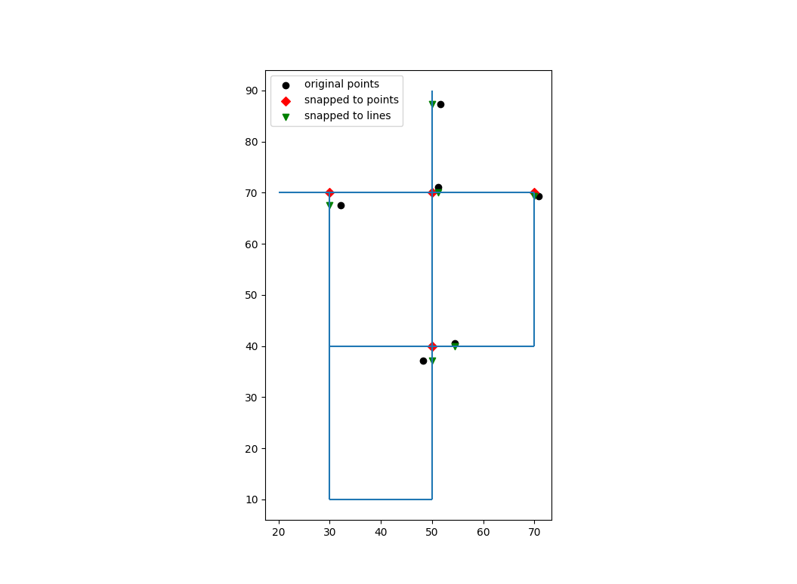

.. raw:: latex

    \clearpage

.. doctest::
    :hide:

    >>> import wntr
    >>> import numpy as np
    >>> import pandas as pd
	  >>> import geopandas as gpd
    >>> import matplotlib.pylab as plt
    >>> try:
    ...    wn = wntr.network.model.WaterNetworkModel('../examples/networks/Net1.inp')
    ... except:
    ...    wn = wntr.network.model.WaterNetworkModel('examples/networks/Net1.inp')

Geospatial capabilities
======================================

The junctions, tanks, reservoirs, pipes, pumps, and valves in a water network model can be converted to 
geospatial data objects. These objects can be used 
directly within WNTR, 
in Python with geospatial packages such as geopandas and shapely, and 
in Global Information System (GIS) platforms.
Open source GIS platforms include QGIS and GRASS GIS.

The following capabilities depend on the geopandas Python package
which stores data in GeoDataFrames.  
Each GeoDataFrame contain a `geometry` column which contains 
geometric objects commonly used in geospatial analysis.

:numref:`table-geometry-type` includes water network model components and the 
geometry type that defines each component.  
Geometry types include 
``Point``, ``LineString``, and ``MultiLineString``.
A few components can be defined using multiple types:

* Pumps and valves can be stored as Points or LineStrings. While Pumps are defined as 
  lines within WNTR (and EPANET), converting the geometry to Points can be useful for geospatial analysis and visualization.
* Pipes that do not contain vertices are stored as a LineString while pipes that contain 
  vertices are stored as a MultiLineString.

.. _table-geometry-type:
.. table:: Geometry types for water network model components
   
   ==============================  ===============================
   Water Network model component   Geometry type
   ==============================  ===============================
   Junction                        Point
   Tank                            Point
   Reservoir                       Point
   Pipe                            LineString or MultiLineString 
   Pump                            LineString or Point
   Valve                           LineString or Point
   ==============================  ===============================

External datasets that are defined using geospatial data objects can be utilized within 
WNTR to add attributes to the water network model and the analysis.  Example external datasets include:

* Point geometries that contain utility billing data, hydrant locations, or valve locations. 
  These geometries can be associated with points and lines in a water network model by snapping the point to the nearest component.
* LineString or MultiLineString geometries that contain street layout, or earthquake fault lines.
  These geometries can be associated with points and lines in a water network model by finding the intersection.
* Polygon geometries that contain elevation, building footprints, zoning, land cover, hazard maps, census data, demographics, or social vulnerability
  These geometries can be associated with points and lines in a water network model by finding the intersection.

Convert a water network model to GeoDataFrames
----------------------------------------------

A water network model can be converted to a group of GeoDataFrames using the function
:class:`~wntr.gis.network.wn_to_gis`.
One GeoDataFrame is created for each type of model component (Junction, Tank, Reservoir, Pipe, Pump, Valve).
Component attributes (e.g., junction elevation) is stored in the GeoDataFrame along with the 
components geometry.

The following example creates GeoDataFrames from a water network model.  

.. doctest::

    >>> import wntr # doctest: +SKIP
	
    >>> wn = wntr.network.WaterNetworkModel('networks/Net1.inp') # doctest: +SKIP
    >>> wn_gis = wntr.gis.wn_to_gis(wn)
	
Individual GeoDataFrames are obtained as follows

.. doctest::

    >>> wn_gis.junctions
    >>> wn_gis.tanks
    >>> wn_gis.reservoirs
    >>> wn_gis.pipes
    >>> wn_gis.pumps
    >>> wn_gis.valves
	
For example, the junctions GeoDataFrame contains the following information

.. doctest::

    >>> print(wn_gis.junctions.head()) # doctest: +SKIP
              type  elevation  ... base_demand                   geometry
    name                       ...                                       
    10    Junction   44.80560  ...    0.000000   POINT (9.00000 27.85000)
    15    Junction    9.75360  ...    0.000063  POINT (38.68000 23.76000)
    20    Junction   39.31920  ...    0.000000  POINT (29.44000 26.91000)
    35    Junction    3.81000  ...    0.000063  POINT (25.46000 10.52000)
    40    Junction   40.20312  ...    0.000000   POINT (27.02000 9.81000)

The GeoDataFrames can be saved to GEOJSON files using the :class:`~wntr.gis.network.WaterNetworkGIS.write` method.

.. doctest::

    >>> wn_gis.write('Net1')
	
This creates the following GEOJSON files for junctions, tanks, reservoirs, pipes, pumps, and valves:

* Net1_junctions.geojson
* Net1_tanks.geojson
* Net1_reservoirs.geojson
* Net1_pipes.geojson
* Net1_pumps.geojson
* Net1_valves.geojson

These files can be loaded into GIS platforms for further analysis and visualization.

Add attributes to the GeoDataFrames
----------------------------------------

Additional attributes can be added to the GeoDataFrames using the 
:class:`~wntr.gis.network.WaterNetworkGIS.add_node_attributes` and 
:class:`~wntr.gis.network.WaterNetworkGIS.add_link_attributes` methods.
Additional attirbutes, such as simulation results or resilience metric, can be used in further analysis and visualization.

The following example adds simulated pressure at hour 1 to nodes (which includes junctions, tanks, and reservoirs).

.. doctest::

    >>> sim = wntr.sim.EpanetSimulator(wn)
    >>> results = sim.run_sim()
    >>> wn_gis.add_node_attributes(results.node['pressure'].loc[3600,:], 'Pressure_1hr')
	
Attributes can also be added directly to individual GeoDataFrames, as shown below.

.. doctest::

    >>> wn_gis.junctions['new attribute'] = 10
	
Convert GeoDataFrames to a water network model
----------------------------------------------

A water network model can be created from a group of GeoDataFrames using the function
:class:`~wntr.gis.network.gis_to_wn`. The water network model can be created from 
a :class:`~wntr.gis.network.WaterNetworkGIS` object or a dictionary of GeoDataFrames, with the following keys:
junctions, tanks, reservoirs, pipes, pumps, valves.

.. note:: 
   A water network model created from GeoDataFrames contains only topography and 
   a subset of attributes.  The network will not contain patterns, curves, rules, controls, 
   or sources.  Options are set to default values. 
   Additional functionality could be added to WNTR in a future release.

The following example creates a water network model from the group of GeoDataFrames created above.

.. doctest::

    >>> wn2 = wntr.gis.gis_to_wn(wn_gis)

Snap points to points
---------------------

The following example snaps household utility data to the nearest junction and then assigns the demand to that junction.

.. doctest::
    :hide:
	
    >>> points = [(48.2,37.2), (70.8,69.3), (54.5, 40.5), (51.2, 71.1), (32.1, 67.6), (51.7, 87.3)]
    >>> point_data = []
    >>> for i, pts in enumerate(points):
    ...     geometry = Point(pts)
    ...     point_data.append({'geometry': geometry})            
    >>> points = gpd.GeoDataFrame(DataFrame(point_data), crs=None)

.. doctest::

    >>> snapped_points = wntr.gis.snap_points_to_points(points, wn_gis, tolerance=5.0)
    >>> print(snapped_points.head(1))
		node	snap_distance	geometry
	0	22	3.33		POINT(50,40)

Snap points to lines
---------------------

The following example snaps valve data to the nearest pipe and then creates a :ref:`valvelayer`.

.. doctest::

    >>> snapped_points = wntr.gis.snap_points_to_lines(points, wn_gis, tolerance=5.0)
    >>> print(snapped_points.head(1))
		link	node	snap_distance	distance_along_line	geometry
	0	122	22	1.8		0.09			POINT(50,37.2)
    >>> G = wn.get_graph()
    >>> node_segments, link_segments, segment_size = wntr.metric.topographic.valve_segments(G,snapped_points)
    
.. _fig-snapped_points:

   Example snapped points to points (junctions) or lines (links).

Intersect polygons with points
---------------------------------

The following example assigns demographic data to junctions.

.. doctest::

    >>> add example

Intersect polygons with lines
---------------------------------

The following example finds pipes that are within landslide hazard regions.

.. doctest::

    >>> add example

