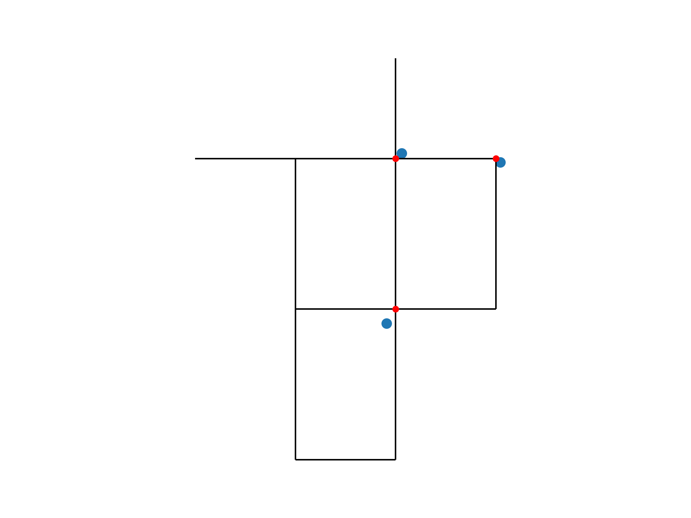
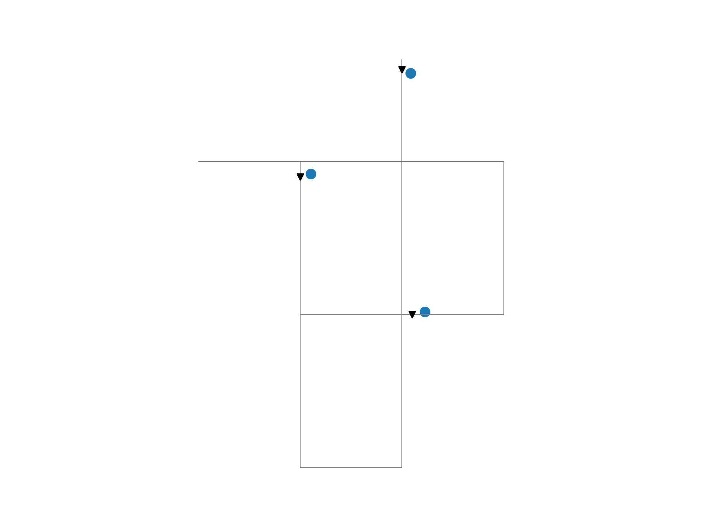
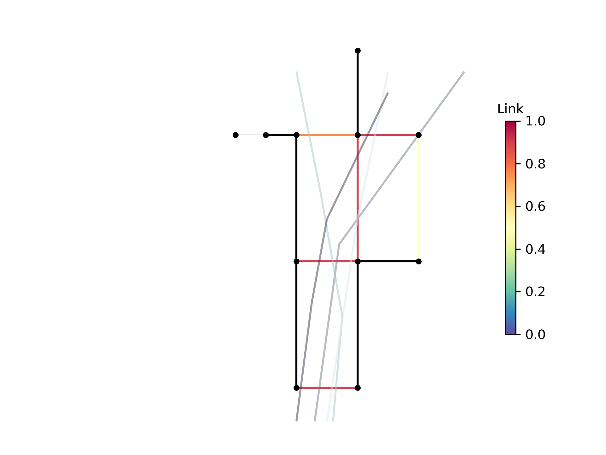
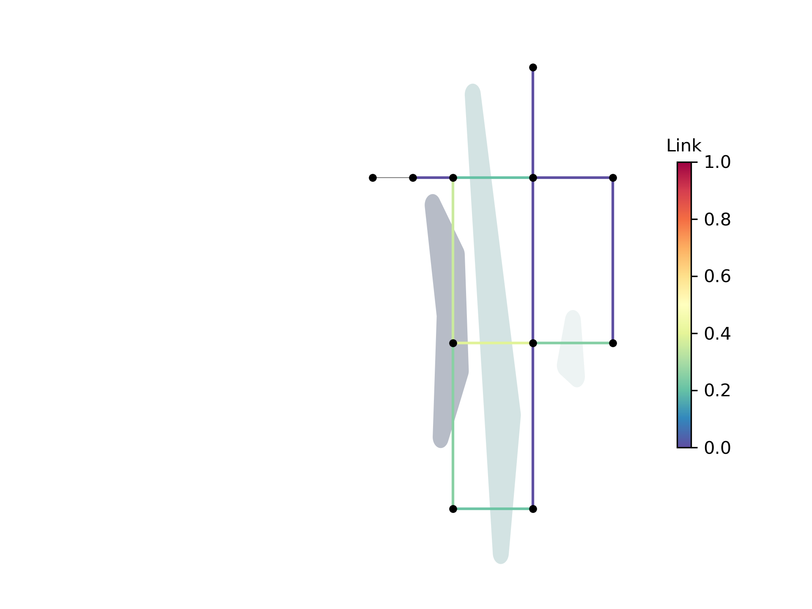
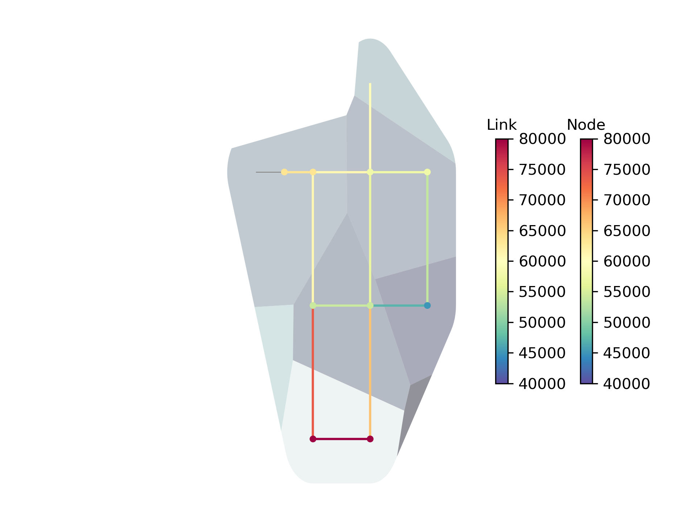

.. raw:: latex

    \clearpage

.. doctest::
    :hide:

    >>> import wntr
    >>> import numpy as np
    >>> import pandas as pd
    >>> pd.options.display.expand_frame_repr = False
    >>> pd.options.display.precision = 3
    >>> try:
    ...    import geopandas as gpd
    ... except ModuleNotFoundError:
    ...    gpd = None
    >>> import matplotlib.pylab as plt
    >>> from os.path import isdir
    >>> examples_dir = '../examples'
    >>> if not isdir(examples_dir):
    ...    examples_dir = 'examples'
    >>> wn = wntr.network.model.WaterNetworkModel(examples_dir+'/networks/Net1.inp')
    
.. doctest::
    :hide:
    :skipif: gpd is None
	
    >>> demographic_data = gpd.read_file(examples_dir+'/data/Net1_demographic_data.geojson')
    >>> landslide_data = gpd.read_file(examples_dir+'/data/Net1_landslide_data.geojson')
    >>> earthquake_data = gpd.read_file(examples_dir+'/data/Net1_earthquake_data.geojson')
    >>> hydrant_data = gpd.read_file(examples_dir+'/data/Net1_hydrant_data.geojson')
    >>> valve_data = gpd.read_file(examples_dir+'/data/Net1_valve_data.geojson')

.. _geospatial:

Geospatial capabilities
======================================

The junctions, tanks, reservoirs, pipes, pumps, and valves in a :class:`~wntr.network.model.WaterNetworkModel` 
can be converted to GeoPandas GeoDataFrames as described in :ref:`model_io`.
The GeoDataFrames can be used 
directly within WNTR, 
with geospatial Python packages such as GeoPandas and Shapely, and saved to GeoJSON and Shapefiles for use
in geographic information system (GIS) platforms.
Open source GIS platforms include QGIS and GRASS GIS.
The following section describes capabilities in WTNR that use GeoPandas GeoDataFrames.  

.. note:: 
   Functions that use GeoDataFrames require the Python package **geopandas** [JVFM21]_ 
   and **rtree** [rtree]_, both are optional dependencies of WNTR.
   Note that **shapely** is installed with geopandas.

The following examples use a water network generated from Net1.inp.
The :class:`~wntr.gis.geospatial.snap` and :class:`~wntr.gis.geospatial.intersect` examples 
also use additional GIS data stored in the 
`examples/data <https://github.com/USEPA/WNTR/blob/main/examples/data>`_ directory.
For simplicity, the examples assume that all data coordinates are in 
the EPSG:4326 coordinate reference system (CRS).  
More information on setting and transforming CRS is included in :ref:`crs`.

.. doctest::
    :skipif: gpd is None

    >>> import wntr # doctest: +SKIP
	
    >>> wn = wntr.network.WaterNetworkModel('networks/Net1.inp') # doctest: +SKIP

Water Network GIS data
------------------------

The :class:`~wntr.network.io.to_gis` function is used to 
create a collection of GeoDataFrames from a WaterNetworkModel.
The collection of GeoDataFrames is stored in a :class:`~wntr.gis.network.WaterNetworkGIS` object 
which contains a GeoDataFrame
for each of the following model components: 

* junctions
* tanks
* reservoirs
* pipes
* pumps
* valves

Note that patterns, curves, sources, controls, and options are not stored in the GeoDataFrame representation.

.. doctest::
    :skipif: gpd is None

    >>> wn_gis = wntr.network.to_gis(wn)

Individual GeoDataFrames are obtained as follows (Note that Net1 has no valves and the GeoDataFrame for valves is empty).

.. doctest::
    :skipif: gpd is None

    >>> wn_gis.junctions # doctest: +SKIP
    >>> wn_gis.tanks # doctest: +SKIP
    >>> wn_gis.reservoirs # doctest: +SKIP
    >>> wn_gis.pipes # doctest: +SKIP
    >>> wn_gis.pumps # doctest: +SKIP
    >>> wn_gis.valves # doctest: +SKIP
	
For example, the junctions GeoDataFrame contains the following information

.. doctest::
    :skipif: gpd is None

    >>> print(wn_gis.junctions.head())
       node_type  elevation  initial_quality                   geometry
    10  Junction    216.408        5.000e-04  POINT (20.00000 70.00000)
    11  Junction    216.408        5.000e-04  POINT (30.00000 70.00000)
    12  Junction    213.360        5.000e-04  POINT (50.00000 70.00000)
    13  Junction    211.836        5.000e-04  POINT (70.00000 70.00000)
    21  Junction    213.360        5.000e-04  POINT (30.00000 40.00000)

Each GeoDataFrame contains attributes and geometry:

Attributes
^^^^^^^^^^

    GeoDataFrame contains attributes that are generated 
    from the WaterNetworkModel dictionary representation.
    However, the GeoDataFrame only includes attributes that are stored as numerical values or strings 
    (such as junction node type and elevation).  
    Attributes that are stored as lists or other objects (such as demand timeseries) 
    are not included in the GeoDataFrame.  
    The index for each GeoDataFrame is the model component name.

    Additional attributes can be added to the GeoDataFrames using the 
    :class:`~wntr.gis.network.WaterNetworkGIS.add_node_attributes` and 
    :class:`~wntr.gis.network.WaterNetworkGIS.add_link_attributes` methods.
    Additional attributes, such as simulation results or resilience metric, can be used in further analysis and visualization.

    The following example adds simulated pressure at hour 1 the water network GIS data 
    (which includes pressure at junctions, tanks, and reservoirs).

    .. doctest::
       :skipif: gpd is None
	   
        >>> sim = wntr.sim.EpanetSimulator(wn)
        >>> results = sim.run_sim()
    	>>> wn_gis.add_node_attributes(results.node['pressure'].loc[3600,:], 'Pressure_1hr')

    Attributes can also be added directly to individual GeoDataFrames, as shown below.

    .. doctest::
       :skipif: gpd is None

        >>> wn_gis.junctions['new attribute'] = 10

Geometry
^^^^^^^^^^

    Each GeoDataFrame also contains a `geometry` column which contains 
    geometric objects commonly used in geospatial analysis.
    :numref:`table-geometry-type` includes water network model components and the 
    geometry type that defines each component.  
    Geometry types include 
    ``shapely.geometry.Point``, ``shapely.geometry.LineString``, and ``shapely.geometry.MultiLineString``.
    A few components can be defined using multiple types:

    * Pumps and valves can be stored as LineStrings (default) or Points. While pumps are defined as 
      lines within WNTR (and EPANET), converting the geometry to Points can be useful for 
      geospatial analysis and visualization. The following example stores pumps and valves as Points.
	  
      .. doctest::
        :skipif: gpd is None

          >>> wn_gis = wntr.network.to_gis(wn, pumps_as_points=True, valves_as_points=True)
		
    * Pipes that do not contain vertices are stored as a LineString while pipes that contain 
      vertices are stored as a MultiLineString.

    .. _table-geometry-type:
    .. table:: Geometry types for water network model components
   
       ==============================  ===============================
       Water Network model component   Shapely geometry type
       ==============================  ===============================
       Junction                        Point
       Tank                            Point
       Reservoir                       Point
       Pipe                            LineString or MultiLineString 
       Pump                            LineString or Point
       Valve                           LineString or Point
       ==============================  ===============================
   
A WaterNetworkGIS object can also be written to GeoJSON and Shapefile files using 
the object's :class:`~wntr.gis.network.WaterNetworkGIS.write_geojson` and 
:class:`~wntr.gis.network.WaterNetworkGIS.write_shapefile` methods. 
The GeoJSON and Shapefile files can be loaded into GIS platforms for further analysis and visualization.

.. doctest::
    :skipif: gpd is None

    >>> wn_gis.write_geojson('Net1')
	
This creates the following GeoJSON files for junctions, tanks, reservoirs, pipes, pumps, and valves:

* Net1_junctions.geojson
* Net1_tanks.geojson
* Net1_reservoirs.geojson
* Net1_pipes.geojson
* Net1_pumps.geojson
* Note, Net1_valves.geojson is not created since Net1 has no valves

A WaterNetworkModel can also be created from a collection of GeoDataFrames using the function
:class:`~wntr.network.io.from_gis` as shown below.

.. doctest::
    :skipif: gpd is None

    >>> wn2 = wntr.network.from_gis(wn_gis)

Additional GIS data
------------------------

Additional GIS data can also be utilized within 
WNTR to add attributes to the water network model and analysis.  Example additional datasets include:

* **Point geometries** that contain utility billing data, hydrant locations, isolation valve locations, or the location of emergency services.
  These geometries can be associated with points and lines in a water network model by snapping the point to the nearest component.
* **LineString or MultiLineString geometries** that contain street layout or earthquake fault lines.
  These geometries can be associated with points and lines in a water network model by finding the intersection.
* **Polygon geometries** that contain elevation, building footprints, zoning, land cover, hazard maps, census data, demographics, or social vulnerability.
  These geometries can be associated with points and lines in a water network model by finding the intersection.

The snap and intersect examples below used additional GIS data stored in the 
`examples/data <https://github.com/USEPA/WNTR/blob/main/examples/data>`_ directory.

Note, the GeoPandas ``read_file`` and ``to_file`` functions can be used to read/write external GeoJSON and Shapefile files in Python.

.. _crs:

Coordinate reference system
--------------------------------------

It is important to understand the coordinate reference system (CRS) of geospatial data.
CRSs can be geographic (e.g., latitude/longitude where the units are in degrees) or 
projected (e.g., Universal Transverse Mercator where units are in meters).
GeoPandas includes documentation on managing projections at https://geopandas.org/en/stable/docs/user_guide/projections.html.
Several important points on CRS are listed below.

* The GeoPandas ``set_crs`` and ``to_crs`` methods can be used to set and transform the CRS of GeoDataFrames.
* The WNTR WaterNetworkGIS object also includes 
  :class:`~wntr.gis.network.WaterNetworkGIS.set_crs` and 
  :class:`~wntr.gis.network.WaterNetworkGIS.to_crs` methods to set and 
  transform the CRS of the junctions, tanks, reservoirs, pipes, pumps, and valves GeoDataFrames.
* WNTR includes additional methods to modify coordinates on the WaterNetworkModel object, see :ref:`modify_node_coords` for more information.
* The CRS for all GeoJSON files is assumed to be EPSG:4326 WGS84 (World Geodetic System 1984 in degrees latitude and degrees longitude).  
  This means that when a GeoJSON file is read into Python using the GeoPandas ``read_file`` function, 
  the CRS will always be EPSG:4326.  The user can override the CRS by changing the ``crs`` attribute directly 
  (not using the ``set_crs`` and ``to_crs`` methods).
* When converting a WaterNetworkModel into GeoDataFrames using :class:`~wntr.network.io.to_gis` and 
  when creating Shapefiles from a WaterNetworkModel using :class:`~wntr.network.io.write_shapefile`, 
  the user can specify a CRS for the node coordinates.
  This does NOT convert node coordinates to a different CRS, this only assigns a CRS to the data or file.
  By default, the CRS is not specified (and is set to None).  
* The :class:`~wntr.gis.geospatial.snap` and :class:`~wntr.gis.geospatial.intersect` functions described 
  in the following sections require that datasets have the same CRS.
* Projected CRSs are preferred for more accurate distance calculations.

The following example reads a GeoJSON file and overrides the CRS to change it from EPSG:4326 to EPSG:3857.
(Note, this does not change the coordinates in the geometry column).

.. doctest::
    :skipif: gpd is None
    
    >>> import geopandas as gpd
	
    >>> hydrant_data = gpd.read_file('data/Net1_hydrant_data.geojson') # doctest: +SKIP
    >>> print(hydrant_data.crs)
    epsg:4326
    >>> print(hydrant_data)
       demand                   geometry
    0    5000  POINT (48.20000 37.20000)
    1    1500  POINT (71.80000 68.30000)
    2    8000  POINT (51.20000 71.10000)
	
    >>> hydrant_data = hydrant_data.set_crs('EPSG:3857', allow_override=True)
    >>> print(hydrant_data.crs)
    EPSG:3857
    >>> print(hydrant_data)
       demand               geometry
    0    5000  POINT (48.200 37.200)
    1    1500  POINT (71.800 68.300)
    2    8000  POINT (51.200 71.100)
	
.. doctest::
    :hide:

    >>> hydrant_data = gpd.read_file(examples_dir+'/data/Net1_hydrant_data.geojson')

The following example reads a GeoJSON file and transforms the CRS to EPSG:3857 
(Note, this transforms the coordinates in the geometry column).

.. doctest::
    :skipif: gpd is None
	
    >>> hydrant_data = gpd.read_file('data/Net1_hydrant_data.geojson') # doctest: +SKIP
	
    >>> hydrant_data.to_crs('EPSG:3857', inplace=True)
    >>> print(hydrant_data.crs)
    EPSG:3857
    >>> print(hydrant_data)
       demand                          geometry
    0    5000   POINT (5365599.456 4467020.994)
    1    1500  POINT (7992739.439 10536729.551)
    2    8000  POINT (5699557.929 11436551.505)

.. doctest::
    :hide:

    >>> hydrant_data = gpd.read_file(examples_dir+'/data/Net1_hydrant_data.geojson')

The following example converts a WaterNetworkModel in EPSG:4326 coordinates into GeoDataFrames
and then translates the GeoDataFrames coordinates to EPSG:3857.

.. doctest::
    :skipif: gpd is None
	
    >>> wn = wntr.network.WaterNetworkModel('networks/Net1.inp') # doctest: +SKIP
	
    >>> wn_gis = wntr.network.to_gis(wn, crs='EPSG:4326')
    >>> print(wn_gis.junctions.head())
       node_type  elevation  initial_quality                   geometry
    10  Junction    216.408        5.000e-04  POINT (20.00000 70.00000)
    11  Junction    216.408        5.000e-04  POINT (30.00000 70.00000)
    12  Junction    213.360        5.000e-04  POINT (50.00000 70.00000)
    13  Junction    211.836        5.000e-04  POINT (70.00000 70.00000)
    21  Junction    213.360        5.000e-04  POINT (30.00000 40.00000)
	
    >>> wn_gis.to_crs('EPSG:3857')
    >>> print(wn_gis.junctions.head())
       node_type  elevation  initial_quality                          geometry
    10  Junction    216.408        5.000e-04  POINT (2226389.816 11068715.659)
    11  Junction    216.408        5.000e-04  POINT (3339584.724 11068715.659)
    12  Junction    213.360        5.000e-04  POINT (5565974.540 11068715.659)
    13  Junction    211.836        5.000e-04  POINT (7792364.356 11068715.659)
    21  Junction    213.360        5.000e-04   POINT (3339584.724 4865942.280)

Snap point geometries to the nearest point or line
----------------------------------------------------

The :class:`~wntr.gis.geospatial.snap` function is used to find the nearest point or line to a set of points. 
This functionality can be used to assign hydrants to junctions or assign isolation valves to pipes.

When snapping Point geometries in GeoDataFrame A to Point or Line geometries in GeoDataFrame B, 
the function returns the following information (one entry for each point in A):

* Nearest point or line in B
* Distance between original and snapped point
* Coordinates of the snapped point
* If B contains Lines, the nearest endpoint along the nearest line
* If B contains Lines, the relative distance from the line's start node (line position)

Net1.inp in EPSG:4326 CRS is used in the example below. 
Additional data in GeoJSON format is always assumed to be in EPSG:4326.
See :ref:`crs` for more information.

.. doctest::
    :skipif: gpd is None
	
    >>> wn = wntr.network.WaterNetworkModel('networks/Net1.inp') # doctest: +SKIP
    >>> wn_gis = wntr.network.to_gis(wn, crs='EPSG:4326')
	
Snap hydrants to junctions
^^^^^^^^^^^^^^^^^^^^^^^^^^^

The dataset used in this example defines hydrant locations.  
The dataset is a GeoDataFrame with a `geometry` column that contains ``shapely.geometry.Point`` geometries and a 
`demand` column that defines fire flow requirements. 
The GeoPandas ``read_file`` method is used to read the GeoJSON file into a GeoDataFrame.  

.. doctest::
    :skipif: gpd is None
    
    >>> import geopandas as gpd
	
    >>> hydrant_data = gpd.read_file('data/Net1_hydrant_data.geojson') # doctest: +SKIP
    >>> print(hydrant_data)
       demand                   geometry
    0    5000  POINT (48.20000 37.20000)
    1    1500  POINT (71.80000 68.30000)
    2    8000  POINT (51.20000 71.10000)

The following example uses the function :class:`~wntr.gis.snap` to snap hydrant locations to the nearest junction.
	
.. doctest::
    :skipif: gpd is None

    >>> snapped_to_junctions = wntr.gis.snap(hydrant_data, wn_gis.junctions, tolerance=5.0)
    >>> print(snapped_to_junctions)
      node  snap_distance                   geometry
    0   22          3.329  POINT (50.00000 40.00000)
    1   13          2.476  POINT (70.00000 70.00000)
    2   12          1.628  POINT (50.00000 70.00000)

The data, water network model, and snapped points can be plotted as follows.

.. doctest::
    :skipif: gpd is None

    >>> ax = hydrant_data.plot()
    >>> ax = wntr.graphics.plot_network(wn, node_attribute=snapped_to_junctions['node'].to_list(), ax=ax)

.. doctest::
    :skipif: gpd is None
    :hide:
    
    >>> bounds = ax.axis('equal')
    >>> plt.tight_layout()
    >>> plt.savefig('snap_points.png', dpi=300)

:numref:`fig-snap-points` illustrates hydrants snapped to junctions.

.. _fig-snap-points:

   Example hydrants snapped to junctions

**By reversing the order of GeoDataFrames in the snap function**,
the nearest hydrant to each junction can also be identified.
Note that the tolerance is increased to ensure all junctions are assigned a hydrant.
   
.. doctest::
    :skipif: gpd is None

    >>> snapped_to_hydrants = wntr.gis.snap(wn_gis.junctions, hydrant_data, tolerance=100.0)
    >>> print(snapped_to_hydrants)
        node  snap_distance                   geometry
    10     2         31.219  POINT (51.20000 71.10000)
    11     2         21.229  POINT (51.20000 71.10000)
    12     2          1.628  POINT (51.20000 71.10000)
    13     1          2.476  POINT (71.80000 68.30000)
    21     0         18.414  POINT (48.20000 37.20000)
    22     0          3.329  POINT (48.20000 37.20000)
    23     0         21.979  POINT (48.20000 37.20000)
    31     0         32.727  POINT (48.20000 37.20000)
    32     0         27.259  POINT (48.20000 37.20000)

Snap valves to pipes
^^^^^^^^^^^^^^^^^^^^^

The dataset used in this example defines valve locations.  
The dataset is a GeoDataFrame with a `geometry` column that contains ``shapely.geometry.Point`` geometries.

.. doctest::
    :skipif: gpd is None

    >>> valve_data = gpd.read_file('data/Net1_valve_data.geojson') # doctest: +SKIP
    >>> print(valve_data)
                        geometry
    0  POINT (56.50000 41.50000)
    1  POINT (32.10000 67.60000)
    2  POINT (52.70000 86.30000)
	
The following example uses the function :class:`~wntr.gis.snap` to snap valve locations to the nearest pipe.

.. doctest::
    :skipif: gpd is None

    >>> snapped_to_pipes = wntr.gis.snap(valve_data, wn_gis.pipes, tolerance=5.0)
    >>> print(snapped_to_pipes)
      link node  snap_distance  line_position                   geometry
    0   22   22            1.5          0.325  POINT (56.50000 40.00000)
    1  111   11            2.1          0.080  POINT (30.00000 67.60000)
    2  110    2            2.7          0.185  POINT (50.00000 86.30000)
	
The snapped locations can be used to define a :ref:`valvelayer` and then create network segments.

.. doctest::
    :skipif: gpd is None

    >>> valve_layer = snapped_to_pipes[['link', 'node']]
    >>> G = wn.to_graph()
    >>> node_segments, link_segments, segment_size = wntr.metrics.valve_segments(G, valve_layer)

The data, water network model, and valve layer can be plotted as follows.

.. doctest::
    :skipif: gpd is None

    >>> ax = valve_data.plot()
    >>> ax = wntr.graphics.plot_valve_layer(wn, valve_layer, add_colorbar=False, ax=ax)

.. doctest::
    :skipif: gpd is None 
    :hide:
    
    >>> bounds = ax.axis('equal')
    >>> plt.tight_layout()
    >>> plt.savefig('snap_lines.png', dpi=300)

:numref:`fig-snap-lines` illustrates the valve layer created by snapping points to lines.

.. _fig-snap-lines:

   Example valve layer created by snapping points to lines

Find the intersect between geometries
--------------------------------------

The :class:`~wntr.gis.geospatial.intersect`  function is used to find the intersection between geometries.
This functionality can be used to identify faults or landslides that intersect pipes,
or assign demographic data to network components.

When finding the intersection of GeoDataFrame A with GeoDataFrame B (where A and B can contain Points, Lines, or Polygons),
the function returns the following information (one entry for each geometry in A):

* List of intersecting B geometry indices
* Number of intersecting B geometries

The following additional information is returned when geometries in B are assigned a value:

* List of intersecting B geometry values
* Minimum B geometry value
* Maximum B geometry value
* Mean B geometry value
* If A contains Lines and B contains Polygons, weighted mean value (weighted by intersecting length)

When the B geometry contains Polygons, the user can optionally include the background in the intersection.
This is useful when working with geometries that do not cover the entire region of interest.
For example, while census tracts cover the entire region, hazard maps might contain gaps (regions with no hazard) 
that the user might want to include in the intersection.

Net1.inp in EPSG:4326 CRS is used in the example below. 
Additional data in GeoJSON format is always assumed to be in EPSG:4326.
See :ref:`crs` for more information.

.. doctest::
    :skipif: gpd is None
	
    >>> wn = wntr.network.WaterNetworkModel('networks/Net1.inp') # doctest: +SKIP
    >>> wn_gis = wntr.network.to_gis(wn, crs='EPSG:4326')
	
Assign earthquake probability to pipes
^^^^^^^^^^^^^^^^^^^^^^^^^^^^^^^^^^^^^^

The dataset used in this example contains earthquake fault lines.
The dataset is a GeoDataFrame with a `geometry` column that contains ``shapely.geometry.LineString`` geometries and a 
`Pr` column which contains probability of an earthquake over magnitude 7.

.. doctest::
    :skipif: gpd is None

    >>> earthquake_data = gpd.read_file('data/Net1_earthquake_data.geojson') # doctest: +SKIP
    >>> print(earthquake_data)
         Pr                                           geometry
    0  0.50  LINESTRING (36.00000 2.00000, 44.00000 44.0000...
    1  0.75  LINESTRING (42.00000 2.00000, 45.00000 27.0000...
    2  0.90  LINESTRING (40.00000 2.00000, 50.00000 50.0000...
    3  0.25  LINESTRING (30.00000 2.00000, 35.00000 30.0000...
	
The following example uses the function :class:`~wntr.gis.intersect` to assign earthquake probability to pipes. 

.. doctest::
    :skipif: gpd is None

    >>> pipe_Pr = wntr.gis.intersect(wn_gis.pipes, earthquake_data, 'Pr')
    >>> print(pipe_Pr)
        intersections                  values  n   sum   min   max  mean
    10             []                      []  0   NaN   NaN   NaN   NaN
    11            [1]                  [0.75]  1  0.75  0.75  0.75  0.75
    12      [3, 2, 0]        [0.25, 0.9, 0.5]  3  1.65  0.25  0.90  0.55
    21   [1, 3, 2, 0]  [0.75, 0.25, 0.9, 0.5]  4  2.40  0.25  0.90  0.60
    22             []                      []  0   NaN   NaN   NaN   NaN
    31   [1, 3, 2, 0]  [0.75, 0.25, 0.9, 0.5]  4  2.40  0.25  0.90  0.60
    110            []                      []  0   NaN   NaN   NaN   NaN
    111            []                      []  0   NaN   NaN   NaN   NaN
    112     [3, 2, 0]        [0.25, 0.9, 0.5]  3  1.65  0.25  0.90  0.55
    113           [0]                   [0.5]  1  0.50  0.50  0.50  0.50
    121            []                      []  0   NaN   NaN   NaN   NaN
    122            []                      []  0   NaN   NaN   NaN   NaN
	
The data and water network model can be plotted as follows.  
Pipes are colored with their max probability.

.. doctest::
    :skipif: gpd is None

    >>> ax = earthquake_data.plot(column='Pr', alpha=0.5, cmap='bone', vmin=0, vmax=1)
    >>> ax = wntr.graphics.plot_network(wn, link_attribute=pipe_Pr['max'], link_width=1.5, 
    ...     node_range=[0,1], link_range=[0,1], ax=ax)

.. doctest::
    :skipif: gpd is None
    :hide:
    
    >>> bounds = ax.axis('equal')
    >>> plt.tight_layout()
    >>> plt.savefig('intersect_earthquake.png', dpi=300)
	
:numref:`fig-intersect-earthquake` illustrates the intersection of junctions and pipes with the lines. 

.. _fig-intersect-earthquake:

   Example intersection of junctions and pipes with earthquake fault lines

The intersect function can also be used to identify pipes that cross each fault simply by reversing 
the order in which the geometries intersect, as shown below:

.. doctest::
    :skipif: gpd is None

    >>> pipes_that_intersect_each_fault = wntr.gis.intersect(earthquake_data, wn_gis.pipes)
    >>> print(pipes_that_intersect_each_fault)
                intersections  n
    0  [21, 31, 112, 12, 113]  5
    1            [21, 31, 11]  3
    2       [21, 31, 112, 12]  4
    3       [21, 31, 112, 12]  4

Assign landslide probability to pipes
^^^^^^^^^^^^^^^^^^^^^^^^^^^^^^^^^^^^^^

The dataset used in this example contains landslide hazard zones.
The dataset is a GeoDataFrame with a `geometry` column that contains ``shapely.geometry.LineString`` geometries and a 
`Pr` column which contains probability of damage from a landslide in that zone.

.. doctest::
    :skipif: gpd is None

    >>> landslide_data = gpd.read_file('data/Net1_landslide_data.geojson') # doctest: +SKIP
    >>> print(landslide_data)
         Pr                                           geometry
    0  0.50  POLYGON ((28.84615 22.23077, 28.76040 22.05079...
    1  0.75  POLYGON ((40.00708 1.83192, 33.00708 84.83192,...
    2  0.90  POLYGON ((58.05971 44.48507, 58.11776 44.67615...
	
The following example uses the function :class:`~wntr.gis.intersect` to assign earthquake hazard map with pipes. 
This is very similar to the earthquake example above, except that the landslide hazards are polygons.  Additionally, since the 
hazard map does not include a "background" value that defines the probability of damage outside landslide zones, 
the background conditions are included in the intersection function.

.. doctest::
    :skipif: gpd is None 

    >>> pipe_Pr = wntr.gis.intersect(wn_gis.pipes, landslide_data, 'Pr', include_background=True, 
    ...    background_value=0)
    >>> print(pipe_Pr)
              intersections            values  n   sum  min   max   mean  weighted_mean
    10         [BACKGROUND]             [0.0]  1  0.00  0.0  0.00  0.000          0.000
    11      [BACKGROUND, 1]       [0.0, 0.75]  2  0.75  0.0  0.75  0.375          0.201
    12         [BACKGROUND]             [0.0]  1  0.00  0.0  0.00  0.000          0.000
    21   [BACKGROUND, 1, 0]  [0.0, 0.75, 0.5]  3  1.25  0.0  0.75  0.417          0.394
    22      [BACKGROUND, 2]        [0.0, 0.9]  2  0.90  0.0  0.90  0.450          0.246
    31      [BACKGROUND, 1]       [0.0, 0.75]  2  0.75  0.0  0.75  0.375          0.212
    110        [BACKGROUND]             [0.0]  1  0.00  0.0  0.00  0.000          0.000
    111     [BACKGROUND, 0]        [0.0, 0.5]  2  0.50  0.0  0.50  0.250          0.352
    112        [BACKGROUND]             [0.0]  1  0.00  0.0  0.00  0.000          0.000
    113        [BACKGROUND]             [0.0]  1  0.00  0.0  0.00  0.000          0.000
    121     [BACKGROUND, 0]        [0.0, 0.5]  2  0.50  0.0  0.50  0.250          0.250
    122        [BACKGROUND]             [0.0]  1  0.00  0.0  0.00  0.000          0.000

The data and water network model can be plotted as follows.  
Pipes are colored with the weighted mean probability.

.. doctest::
    :skipif: gpd is None

    >>> ax = landslide_data.plot(column='Pr', alpha=0.5, cmap='bone', vmin=0, vmax=1)
    >>> ax = wntr.graphics.plot_network(wn, link_attribute=pipe_Pr['weighted_mean'], link_width=1.5, 
    ...     node_range=[0,1], link_range=[0,1], ax=ax)

.. doctest::
    :skipif: gpd is None
    :hide:
    
    >>> bounds = ax.axis('equal')
    >>> plt.tight_layout()
    >>> plt.savefig('intersect_landslide.png', dpi=300)
	
:numref:`fig-intersect-landslide` illustrates the intersection. 

.. _fig-intersect-landslide:

   Example intersection of pipes with landslide zones
   
**By reversing the order of GeoDataFrames in the intersection function**, 
the pipes that intersect each landslide zone and information about 
the intersecting pipe diameters can also be identified:

.. doctest::
    :skipif: gpd is None 

    >>> pipes_that_intersect_each_landslide = wntr.gis.intersect(landslide_data, wn_gis.pipes, 'diameter')
    >>> print(pipes_that_intersect_each_landslide)
        intersections                                             values  n    sum    min    max   mean
    0  [111, 121, 21]                             [0.254, 0.2032, 0.254]  3  0.711  0.203  0.254  0.237
    1    [21, 11, 31]  [0.254, 0.35559999999999997, 0.15239999999999998]  3  0.762  0.152  0.356  0.254
    2            [22]                              [0.30479999999999996]  1  0.305  0.305  0.305  0.305
	
Assign demographic data to pipes and junctions
^^^^^^^^^^^^^^^^^^^^^^^^^^^^^^^^^^^^^^^^^^^^^^^

The dataset used in this example contains demographic data.
The dataset is a GeoDataFrame with a `geometry` column that contains ``shapely.geometry.Polygon`` geometries along with 
columns that store mean income, mean age, and population.

.. doctest::
    :skipif: gpd is None

    >>> demographic_data = gpd.read_file('data/Net1_demographic_data.geojson') # doctest: +SKIP
    >>> print(demographic_data)
       mean_income  mean_age  population                                           geometry
    0      63326.0      35.0      3362.0  POLYGON ((41.67813 82.75023, 41.98596 60.85779...
    1      78245.0      31.0      5618.0  POLYGON ((23.21084 40.19160, 22.99063 27.71777...
    2      91452.0      40.0      5650.0  POLYGON ((22.99063 27.71777, 61.93720 16.36165...
    3      54040.0      39.0      5546.0  POLYGON ((61.93720 16.36165, 22.99063 27.71777...
    4      26135.0      38.0      5968.0  POLYGON ((61.93720 16.36165, 64.04456 22.10119...
    5      57620.0      31.0      4315.0  POLYGON ((44.48497 87.21487, 79.81144 71.92669...
    6      44871.0      54.0      4547.0  POLYGON ((64.04456 22.10119, 51.72994 45.92347...
    7      69067.0      55.0      2541.0  POLYGON ((46.01047 99.15725, 46.40654 99.33204...
	
The following example uses the function :class:`~wntr.gis.intersect`
to assign demographic data to junctions and pipes.  

.. doctest::
    :skipif: gpd is None

    >>> junction_demographics = wntr.gis.intersect(wn_gis.junctions, demographic_data, 'mean_income')
    >>> print(junction_demographics)
       intersections     values  n      sum      min      max     mean
    10           [0]  [63326.0]  1  63326.0  63326.0  63326.0  63326.0
    11           [0]  [63326.0]  1  63326.0  63326.0  63326.0  63326.0
    12           [5]  [57620.0]  1  57620.0  57620.0  57620.0  57620.0
    13           [5]  [57620.0]  1  57620.0  57620.0  57620.0  57620.0
    21           [3]  [54040.0]  1  54040.0  54040.0  54040.0  54040.0
    22           [3]  [54040.0]  1  54040.0  54040.0  54040.0  54040.0
    23           [6]  [44871.0]  1  44871.0  44871.0  44871.0  44871.0
    31           [2]  [91452.0]  1  91452.0  91452.0  91452.0  91452.0
    32           [2]  [91452.0]  1  91452.0  91452.0  91452.0  91452.0
	
.. doctest::
    :skipif: gpd is None

    >>> pipe_demographics = wntr.gis.intersect(wn_gis.pipes, demographic_data, 'mean_income')
    >>> print(pipe_demographics)
        intersections              values  n       sum      min      max     mean  weighted_mean
    10            [0]           [63326.0]  1   63326.0  63326.0  63326.0  63326.0      63326.000
    11         [0, 5]  [63326.0, 57620.0]  2  120946.0  57620.0  63326.0  60473.0      61002.920
    12            [5]           [57620.0]  1   57620.0  57620.0  57620.0  57620.0      57620.000
    21            [3]           [54040.0]  1   54040.0  54040.0  54040.0  54040.0      54040.000
    22         [3, 6]  [54040.0, 44871.0]  2   98911.0  44871.0  54040.0  49455.5      47067.895
    31            [2]           [91452.0]  1   91452.0  91452.0  91452.0  91452.0      91452.000
    110        [5, 7]  [57620.0, 69067.0]  2  126687.0  57620.0  69067.0  63343.5      60580.117
    111        [0, 3]  [63326.0, 54040.0]  2  117366.0  54040.0  63326.0  58683.0      60953.558
    112        [5, 3]  [57620.0, 54040.0]  2  111660.0  54040.0  57620.0  55830.0      56596.728
    113        [5, 6]  [57620.0, 44871.0]  2  102491.0  44871.0  57620.0  51245.5      53707.370
    121        [3, 2]  [54040.0, 91452.0]  2  145492.0  54040.0  91452.0  72746.0      73586.482
    122        [3, 2]  [54040.0, 91452.0]  2  145492.0  54040.0  91452.0  72746.0      66314.037
	
The data and water network model can be plotted as follows. 
Junctions and pipes are colored with their average value (weighted average for pipes).

.. doctest::
    :skipif: gpd is None

    >>> ax = demographic_data.plot(column='mean_income', alpha=0.5,  
    ...     cmap='bone', vmin=10000, vmax=100000)
    >>> ax = wntr.graphics.plot_network(wn, node_attribute=junction_demographics['mean'], 
    ...     link_attribute=pipe_demographics['weighted_mean'], link_width=1.5,
    ...     node_range=[40000,80000], link_range=[40000,80000], ax=ax)
						   
.. doctest::
    :skipif: gpd is None
    :hide:
    
    >>> bounds = ax.axis('equal')
    >>> plt.tight_layout()
    >>> plt.savefig('intersect_demographics.png', dpi=300)

:numref:`fig-intersect-demographics` illustrates the intersection of junctions and pipes with the polygons. Note that the color scale for 
the polygons is different than the junction and pipe attributes.  

.. _fig-intersect-demographics:

   Example intersection of junctions and pipes with demographic data