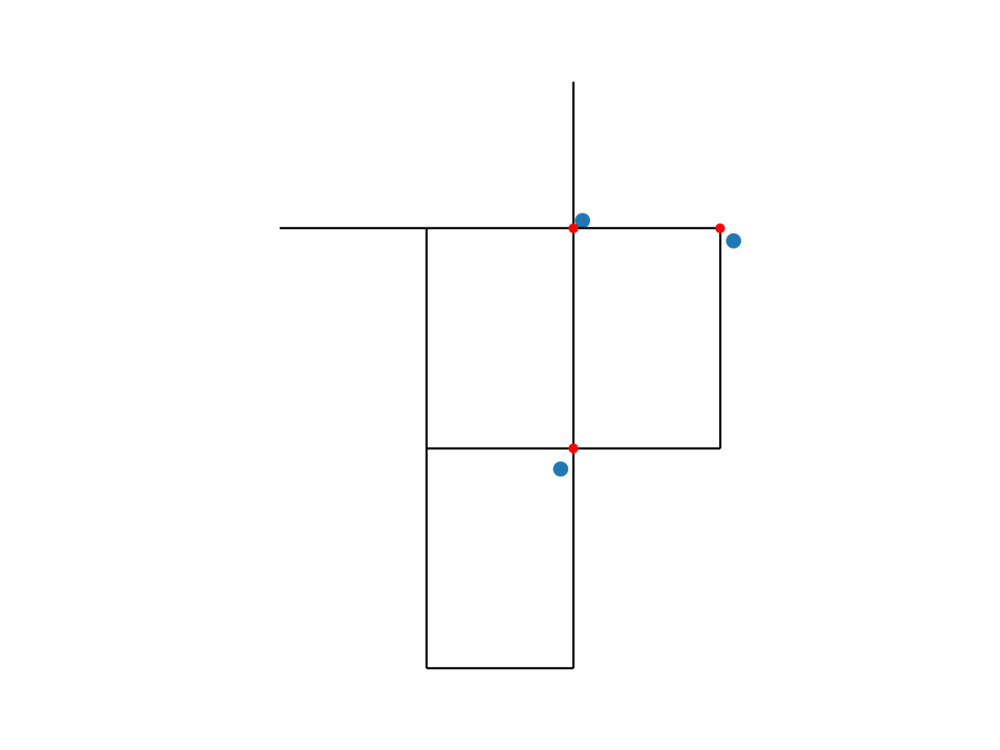

.. raw:: latex

    \clearpage

.. doctest::
    :hide:

    >>> import wntr
    >>> import numpy as np
    >>> import pandas as pd
    >>> import geopandas as gpd
    >>> import shapely
    >>> from scipy.spatial import Voronoi, voronoi_plot_2d
    >>> import matplotlib.pylab as plt
    >>> try:
    ...    wn = wntr.network.model.WaterNetworkModel('../examples/networks/Net1.inp')
    ... except:
    ...    wn = wntr.network.model.WaterNetworkModel('examples/networks/Net1.inp')

Geospatial capabilities
======================================

The junctions, tanks, reservoirs, pipes, pumps, and valves in a water network model can be converted to 
geospatial data objects. These objects can be used 
directly within WNTR, 
in Python with geospatial packages such as geopandas and shapely, and 
in Global Information System (GIS) platforms.
Open source GIS platforms include QGIS and GRASS GIS.

The following capabilities depend on the geopandas Python package
which stores data in GeoDataFrames.  
Each GeoDataFrame contain a `geometry` column which contains 
geometric objects commonly used in geospatial analysis.

:numref:`table-geometry-type` includes water network model components and the 
geometry type that defines each component.  
Geometry types include 
``shapely.geometry.Point``, ``shapely.geometry.LineString``, and ``shapely.geometry.MultiLineString``.
A few components can be defined using multiple types:

* Pumps and valves can be stored as Points or LineStrings. While Pumps are defined as 
  lines within WNTR (and EPANET), converting the geometry to Points can be useful for geospatial analysis and visualization.
* Pipes that do not contain vertices are stored as a LineString while pipes that contain 
  vertices are stored as a MultiLineString.

.. _table-geometry-type:
.. table:: Geometry types for water network model components
   
   ==============================  ===============================
   Water Network model component   Shapely geometry type
   ==============================  ===============================
   Junction                        Point
   Tank                            Point
   Reservoir                       Point
   Pipe                            LineString or MultiLineString 
   Pump                            LineString or Point
   Valve                           LineString or Point
   ==============================  ===============================

External datasets that are defined using geospatial data objects can be utilized within 
WNTR to add attributes to the water network model and the analysis.  Example external datasets include:

* Point geometries that contain utility billing data, hydrant locations, or valve locations. 
  These geometries can be associated with points and lines in a water network model by snapping the point to the nearest component.
* LineString or MultiLineString geometries that contain street layout, or earthquake fault lines.
  These geometries can be associated with points and lines in a water network model by finding the intersection.
* Polygon geometries that contain elevation, building footprints, zoning, land cover, hazard maps, census data, demographics, or social vulnerability
  These geometries can be associated with points and lines in a water network model by finding the intersection.

Convert a water network model to GeoDataFrames
----------------------------------------------

A water network model can be converted to a group of GeoDataFrames using the function
:class:`~wntr.gis.network.wn_to_gis`.
One GeoDataFrame is created for each type of model component (Junction, Tank, Reservoir, Pipe, Pump, Valve).
Component attributes (e.g., junction elevation) is stored in the GeoDataFrame along with the 
components geometry.

The following example creates GeoDataFrames from a water network model.  Note that Net1 is used in the following example.

.. doctest::

    >>> import wntr # doctest: +SKIP
	
    >>> wn = wntr.network.WaterNetworkModel('networks/Net1.inp') # doctest: +SKIP
    >>> wn_gis = wntr.gis.wn_to_gis(wn)
	
Individual GeoDataFrames are obtained as follows (Note that Net1 has no valves and the GeoDataFrame for valves is empty).

.. doctest::

    >>> wn_gis.junctions # doctest: +SKIP
    >>> wn_gis.tanks # doctest: +SKIP
    >>> wn_gis.reservoirs # doctest: +SKIP
    >>> wn_gis.pipes # doctest: +SKIP
    >>> wn_gis.pumps # doctest: +SKIP
    >>> wn_gis.valves # doctest: +SKIP
	
For example, the junctions GeoDataFrame contains the following information

.. doctest::

    >>> print(wn_gis.junctions.head()) # doctest: +SKIP
              type  elevation  ... base_demand                   geometry
    name                       ...                                       
    10    Junction    216.408  ...    0.000000  POINT (20.00000 70.00000)
    11    Junction    216.408  ...    0.009464  POINT (30.00000 70.00000)
    12    Junction    213.360  ...    0.009464  POINT (50.00000 70.00000)
    13    Junction    211.836  ...    0.006309  POINT (70.00000 70.00000)
    21    Junction    213.360  ...    0.009464  POINT (30.00000 40.00000)

The GeoDataFrames can be saved to GEOJSON files using the :class:`~wntr.gis.network.WaterNetworkGIS.write` method.

.. doctest::

    >>> wn_gis.write('Net1')
	
This creates the following GEOJSON files for junctions, tanks, reservoirs, pipes, pumps, and valves:

* Net1_junctions.geojson
* Net1_tanks.geojson
* Net1_reservoirs.geojson
* Net1_pipes.geojson
* Net1_pumps.geojson
* Net1_valves.geojson

These files can be loaded into GIS platforms for further analysis and visualization.

Add attributes to the GeoDataFrames
----------------------------------------

Additional attributes can be added to the GeoDataFrames using the 
:class:`~wntr.gis.network.WaterNetworkGIS.add_node_attributes` and 
:class:`~wntr.gis.network.WaterNetworkGIS.add_link_attributes` methods.
Additional attirbutes, such as simulation results or resilience metric, can be used in further analysis and visualization.

The following example adds simulated pressure at hour 1 to nodes (which includes junctions, tanks, and reservoirs).

.. doctest::

    >>> sim = wntr.sim.EpanetSimulator(wn)
    >>> results = sim.run_sim()
    >>> wn_gis.add_node_attributes(results.node['pressure'].loc[3600,:], 'Pressure_1hr')
	
Attributes can also be added directly to individual GeoDataFrames, as shown below.

.. doctest::

    >>> wn_gis.junctions['new attribute'] = 10
	
Convert GeoDataFrames to a water network model
----------------------------------------------

A water network model can be created from a group of GeoDataFrames using the function
:class:`~wntr.gis.network.gis_to_wn`. The water network model can be created from 
a :class:`~wntr.gis.network.WaterNetworkGIS` object or a dictionary of GeoDataFrames, with the following keys:
junctions, tanks, reservoirs, pipes, pumps, valves.

.. note:: 
   A water network model created from GeoDataFrames contains only topography and 
   a subset of attributes.  The network will not contain patterns, curves, rules, controls, 
   or sources.  Options are set to default values. 
   Additional functionality could be added to WNTR in a future release.

The following example creates a water network model from the group of GeoDataFrames created above.

.. doctest::

    >>> wn2 = wntr.gis.gis_to_wn(wn_gis)

Snap points to points
---------------------

The external dataset used in this example defines hydrant locations.  
The dataset is a GeoDataFrame with a `geometry` column that contains ``shapely.geometry.Point`` geometries.

.. doctest::
    :hide:
	
    >>> points = [(48.2,37.2), (70.8,69.3), (51.2, 71.1), (54.5, 40.5), (32.1, 67.6), (51.7, 87.3)]
    >>> point_data = []
    >>> for i, pts in enumerate(points):
    ...     geometry = shapely.geometry.Point(pts)
    ...     point_data.append({'geometry': geometry})            
    >>> points = gpd.GeoDataFrame(pd.DataFrame(point_data), crs=None)
    >>> hydrant_locations = points.iloc[[0,1,2],:]
    >>> valve_locations = points.iloc[[3,4,5],:]
    >>> valve_locations.reset_index(inplace=True, drop=True)

.. doctest::

    >>> print(hydrant_locations)
                        geometry
    0  POINT (48.20000 37.20000)
    1  POINT (70.80000 69.30000)
    2  POINT (51.20000 71.10000)

The following example uses the function :class:`~wntr.gis.snap_points_to_points` to snap hydrant locations to the nearest junction.
	
.. doctest::

    >>> snapped_junction = wntr.gis.snap_points_to_points(hydrant_locations, wn_gis.junctions, tolerance=5.0)
    >>> print(snapped_junction)
      node  snap_distance                   geometry
    0   22       3.328663  POINT (50.00000 40.00000)
    1   13       1.063015  POINT (70.00000 70.00000)
    2   12       1.627882  POINT (50.00000 70.00000)

The data, water network model, and snapped points can be plotted as follows.

.. doctest::

    >>> ax = hydrant_locations.plot()
    >>> ax = wntr.graphics.plot_network(wn, node_attribute=snapped_junction['node'].to_list(), ax=ax)

.. doctest::
    :hide:
    
    >>> plt.tight_layout()
    >>> plt.savefig('snap_points.png', dpi=300)

:numref:`fig-snap-points` illustrates points snapped to junctions.

.. _fig-snap-points:

   Example points snapped to junctions
   
Snap points to lines
---------------------

The external dataset used in this example defines valve locations.  
The dataset is a GeoDataFrame with a `geometry` column that contains ``shapely.geometry.Point`` geometries.

.. doctest::

    >>> print(valve_locations)
                        geometry
    0  POINT (54.50000 40.50000)
    1  POINT (32.10000 67.60000)
    2  POINT (51.70000 87.30000)
	
The following example uses the function :class:`~wntr.gis.snap_points_to_lines` to snap valve locations to the nearest pipe.

.. doctest::

    >>> snapped_pipe = wntr.gis.snap_points_to_lines(valve_locations, wn_gis.pipes, tolerance=5.0)
    >>> print(snapped_pipe)
      link node  snap_distance  distance_along_line                   geometry
    0   22   22            0.5                0.225  POINT (54.50000 40.00000)
    1  111   11            2.1                0.080  POINT (30.00000 67.60000)
    2  110    2            1.7                0.135  POINT (50.00000 87.30000)
	
The snapped locations can be used to define a :ref:`valvelayer` and then create network segments.

.. doctest::

    >>> valve_layer = snapped_pipe[['link', 'node']]
    >>> G = wn.get_graph()
    >>> node_segments, link_segments, segment_size = wntr.metrics.valve_segments(G, valve_layer)

The data, water network model, and valve layer can be plotted as follows.

.. doctest::

    >>> ax = valve_locations.plot()
    >>> ax = wntr.graphics.plot_valve_layer(wn, valve_layer, add_colorbar=False, ax=ax)

.. doctest::
    :hide:
    
    >>> plt.tight_layout()
    >>> plt.savefig('snap_lines.png', dpi=300)

:numref:`fig-snap-lines` illustrates the valve layer created by snapping points to lines.

.. _fig-snap-lines:
.. figure:: figures/snap_lines.png
   :width: 600
   :alt: Snapped points to lines

   Example valve layer created by snapping points to lines

Intersect polygons with points and lines
----------------------------------------

The external dataset used in this example is demographic data.
The dataset is a GeoDataFrame with a `geometry` column that contains ``shapely.geometry.Polygon`` geometries and a 
`values` column which contains demographic data (set to a value between 0 and 1 for the example).

.. doctest::
    :hide:
	
    >>> coords = wn.query_node_attribute('coordinates')
    >>> coord_vals = pd.DataFrame.from_records(coords.values, columns=['x', 'y'])
    >>> wn_hull = shapely.geometry.MultiPoint(coords.values).convex_hull
    >>> wn_hull = wn_hull.buffer(10)
	
    >>> points = np.random.random((10, 2))*100
    >>> corners = np.array([[0,0],[0,100],[100,100],[100,0]])
    >>> points = np.append(points, corners, axis=0)
    >>> vor = Voronoi(points)
	
    >>> line_data = []
    >>> for line in vor.ridge_vertices:
    ...     if -1 not in line:
    ...         line_data.append(shapely.geometry.LineString(vor.vertices[line]))
    
	>>> poly_data = []
    >>> for poly in shapely.ops.polygonize(line_data):
    ...     poly_data.append({'geometry': poly, 'value': np.round(np.random.rand(),2)})      
    >>> polygons = gpd.GeoDataFrame(pd.DataFrame(poly_data), crs=None)
    >>> demographic_data = gpd.clip(polygons, wn_hull) 

.. doctest::

    >>> print(demographic_data) # doctest: +SKIP
                                                geometry  value
    0  POLYGON ((13.569 62.876, 17.826 60.684, 34.367...   0.40
    8  POLYGON ((18.930 78.148, 13.569 62.876, 2.085 ...   0.88
    6  POLYGON ((34.367 41.946, 17.826 60.684, 50.044...   0.77
    7  POLYGON ((18.930 78.148, 17.537 84.949, 37.912...   0.39
    9  POLYGON ((17.826 60.684, 13.569 62.876, 18.930...   0.41
    1  POLYGON ((32.134 25.013, 58.883 5.296, 58.321 ...   0.29
    5  POLYGON ((73.994 27.964, 58.883 5.296, 32.134 ...   0.96
    2  POLYGON ((80.000 66.228, 80.000 57.058, 54.816...   0.08
    4  POLYGON ((42.449 44.043, 54.816 54.591, 80.000...   0.66
    3  POLYGON ((74.674 79.468, 77.071 77.071, 77.730...   0.55
	
The following example uses the functions :class:`~wntr.gis.intersect_points_with_polygons` and :class:`~wntr.gis.intersect_lines_with_polygons`
to assign demographic data to junctions and pipes.  Note that intersection with lines returns a weighted average.

.. doctest::

    >>> junction_demographics = wntr.gis.intersect_points_with_polygons(wn_gis.junctions, demographic_data, 'value')
    >>> pipe_demographics = wntr.gis.intersect_lines_with_polygons(wn_gis.pipes, demographic_data, 'value')

.. doctest::

    >>> ax = demographic_data.plot(column='value', alpha=0.5)
    >>> ax = wntr.graphics.plot_network(wn, node_attribute=junction_demographics['Average'], 
    ...     link_attribute=pipe_demographics['Weighted Average'], 
    ...     node_range=[0,1], link_range=[0,1], ax=ax)
						   
.. doctest::
    :hide:
    
    >>> plt.tight_layout()
    >>> plt.savefig('intersect_points_lines.png', dpi=300)

:numref:`fig-intersect-points-lines` illustrates the intersection of junctions and pipes with the polygons. Note that the color scale for 
the polygons is different than the junction and pipe attributes.  

.. _fig-intersect-points-lines:
.. figure:: figures/intersect_points_lines.png
   :width: 800
   :alt: Intersection of junctions and pipes with polygons

   Example intersection of junctions and pipes with polygons