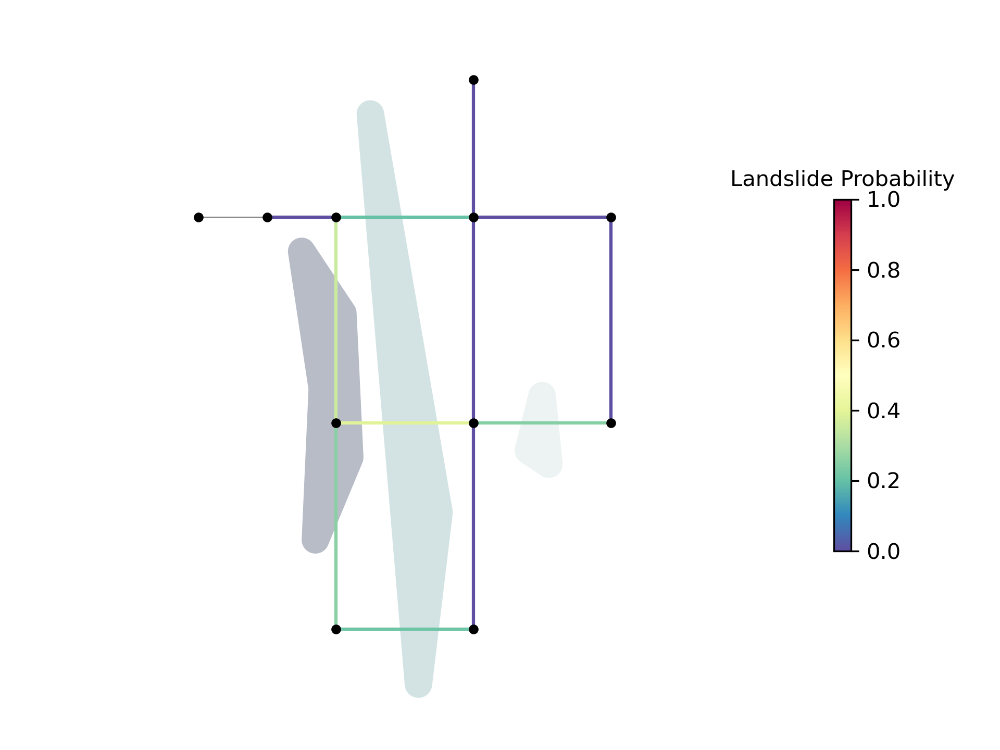
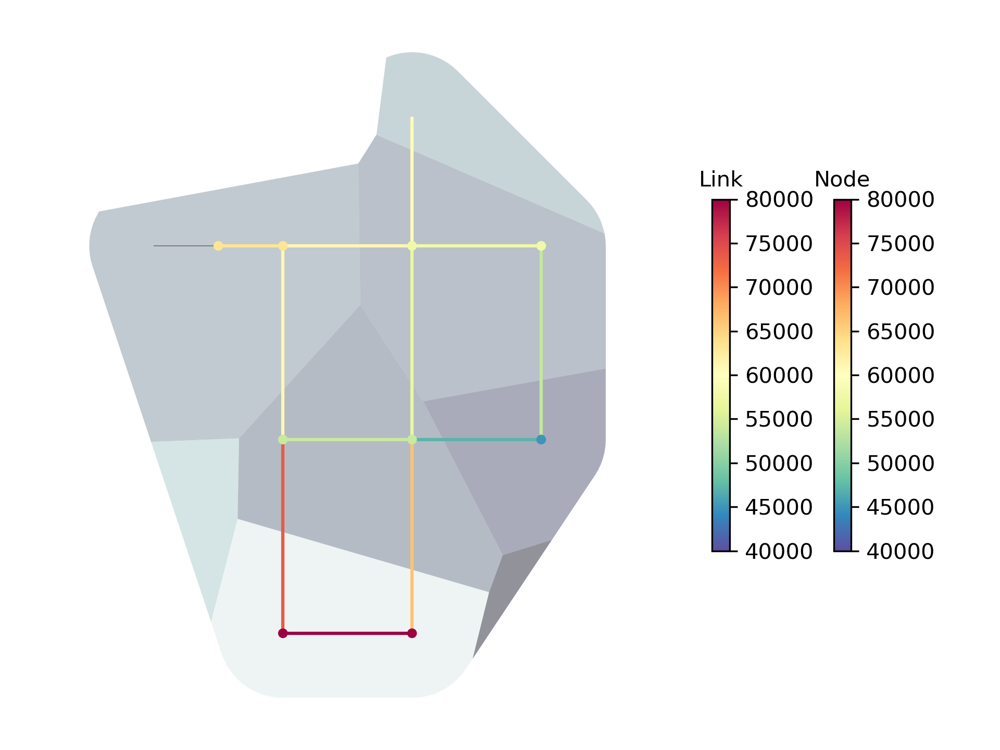

.. raw:: latex

    \clearpage

.. doctest::
    :hide:

    >>> import wntr
    >>> import numpy as np
    >>> import pandas as pd
    >>> pd.options.display.expand_frame_repr = False
    >>> pd.options.display.precision = 3
    >>> try:
    ...    import geopandas as gpd
    ...    has_geopandas = True
    ... except ModuleNotFoundError:
    ...    has_geopandas = False
    >>> import matplotlib.pylab as plt
    >>> from os.path import isdir
    >>> examples_dir = '../examples'
    >>> if not isdir(examples_dir):
    ...    examples_dir = 'examples'
    >>> wn = wntr.network.model.WaterNetworkModel(examples_dir+'/networks/Net1.inp')
    >>> demographic_data = gpd.read_file(examples_dir+'/data/Net1_demographic_data.geojson')
    >>> landslide_data = gpd.read_file(examples_dir+'/data/Net1_landslide_data.geojson')
    >>> earthquake_data = gpd.read_file(examples_dir+'/data/Net1_earthquake_data.geojson')
    >>> hydrant_data = gpd.read_file(examples_dir+'/data/Net1_hydrant_data.geojson')
    >>> valve_data = gpd.read_file(examples_dir+'/data/Net1_valve_data.geojson')

.. _geospatial:

Geospatial capabilities
======================================

The junctions, tanks, reservoirs, pipes, pumps, and valves in a water network model can be converted to 
geospatial data objects. These objects can be used 
directly within WNTR, 
in Python with geospatial packages such as GeoPandas and Shapely, and 
in geographic information system (GIS) platforms.
Open source GIS platforms include QGIS and GRASS GIS.

.. note:: 
   The GIS capabilities described below require the Python packages **geopandas** [JVFM21]_ 
   and **rtree** [rtree]_, both are optional dependencies of WNTR.
   Note that **shapely** is installed with geopandas.
	
The following capabilities use data stored in GeoPandas GeoDataFrames.  
Each GeoDataFrame contain a `geometry` column which contains 
geometric objects commonly used in geospatial analysis.

:numref:`table-geometry-type` includes water network model components and the 
geometry type that defines each component.  
Geometry types include 
``shapely.geometry.Point``, ``shapely.geometry.LineString``, and ``shapely.geometry.MultiLineString``.
A few components can be defined using multiple types:

* Pumps and valves can be stored as Points or LineStrings. While Pumps are defined as 
  lines within WNTR (and EPANET), converting the geometry to Points can be useful for geospatial analysis and visualization.
* Pipes that do not contain vertices are stored as a LineString while pipes that contain 
  vertices are stored as a MultiLineString.

.. _table-geometry-type:
.. table:: Geometry types for water network model components
   
   ==============================  ===============================
   Water Network model component   Shapely geometry type
   ==============================  ===============================
   Junction                        Point
   Tank                            Point
   Reservoir                       Point
   Pipe                            LineString or MultiLineString 
   Pump                            LineString or Point
   Valve                           LineString or Point
   ==============================  ===============================

External datasets that are defined using geospatial data objects can be utilized within 
WNTR to add attributes to the water network model and the analysis.  Example external datasets include:

* Point geometries that contain utility billing data, hydrant locations, isolation valve locations, or the location of emergency services.
  These geometries can be associated with points and lines in a water network model by snapping the point to the nearest component.
* LineString or MultiLineString geometries that contain street layout or earthquake fault lines.
  These geometries can be associated with points and lines in a water network model by finding the intersection.
* Polygon geometries that contain elevation, building footprints, zoning, land cover, hazard maps, census data, demographics, or social vulnerability.
  These geometries can be associated with points and lines in a water network model by finding the intersection.

Convert a water network model to GeoDataFrames
----------------------------------------------

A water network model can be converted to a group of GeoDataFrames using the function
:class:`~wntr.gis.network.wn_to_gis`.
One GeoDataFrame is created for each type of model component (Junction, Tank, Reservoir, Pipe, Pump, Valve).
Component attributes (e.g., junction elevation) are stored in the GeoDataFrame along with the 
component's geometry.

.. note:: 
   When converting a water network model into GeoDataFrames, the user can specify the 
   coordinate reference system (CRS) for the node coordinates.
   By default, the CRS is not specified (and is set to None).  
   CRSs can be geographic (e.g., latitude/longitude where the units are in degrees) or 
   projected (e.g., Universal Transverse Mercator where units are in meters).
   Projected CRSs are preferred for more accurate distance calculations.  
   GeoPandas includes documentation on managing projections and includes the ``to_crs`` method to convert between CRSs 
   Additionally, WNTR includes methods to modify coordinates, see :ref:`modify_node_coords` for more information.
   
The following example creates GeoDataFrames from a water network model.  Note that Net1 is used in the following example.
The CRS EPSG:4326 assumes that the coordinates are in degrees latitude and degrees longitude (which is not realistic for this network).  

.. doctest::
    :skipif: not has_geopandas 

    >>> import wntr # doctest: +SKIP
	
    >>> wn = wntr.network.WaterNetworkModel('networks/Net1.inp') # doctest: +SKIP
    >>> wn_gis = wntr.gis.wn_to_gis(wn, crs='EPSG:4326')
	
Individual GeoDataFrames are obtained as follows (Note that Net1 has no valves and the GeoDataFrame for valves is empty).

.. doctest::
    :skipif: not has_geopandas 

    >>> wn_gis.junctions # doctest: +SKIP
    >>> wn_gis.tanks # doctest: +SKIP
    >>> wn_gis.reservoirs # doctest: +SKIP
    >>> wn_gis.pipes # doctest: +SKIP
    >>> wn_gis.pumps # doctest: +SKIP
    >>> wn_gis.valves # doctest: +SKIP
	
For example, the junctions GeoDataFrame contains the following information

.. doctest::
    :skipif: not has_geopandas 

    >>> print(wn_gis.junctions.head()) # doctest: +SKIP
              type  elevation  ... base_demand                   geometry
    name                       ...                                       
    10    Junction    216.408  ...    0.000000  POINT (20.00000 70.00000)
    11    Junction    216.408  ...    0.009464  POINT (30.00000 70.00000)
    12    Junction    213.360  ...    0.009464  POINT (50.00000 70.00000)
    13    Junction    211.836  ...    0.006309  POINT (70.00000 70.00000)
    21    Junction    213.360  ...    0.009464  POINT (30.00000 40.00000)

The GeoDataFrames can be saved to GeoJSON files using the :class:`~wntr.gis.network.WaterNetworkGIS.write` method.

.. doctest::
    :skipif: not has_geopandas 

    >>> wn_gis.write('Net1', driver='GeoJSON')
	
This creates the following GeoJSON files for junctions, tanks, reservoirs, pipes, pumps, and valves:

* Net1_junctions.geojson
* Net1_tanks.geojson
* Net1_reservoirs.geojson
* Net1_pipes.geojson
* Net1_pumps.geojson
* Note, Net1_valves.geojson not created since Net1 has no valves

The `write` method includes an optional argument that sets the GeoPandas driver.  
This allows the user to create Shapefiles and GeoPackage (GPKG) files in addition to GeoJSON files.
These files can be loaded into GIS platforms for further analysis and visualization.

The water network model also contains methods to write GeoJSON, Shapefile, and GPKG files directly (without converting the water network model to GeoDataFrames).
See :ref:`giswrite` for more information.

Add attributes to the GeoDataFrames
----------------------------------------

Additional attributes can be added to the GeoDataFrames using the 
:class:`~wntr.gis.network.WaterNetworkGIS.add_node_attributes` and 
:class:`~wntr.gis.network.WaterNetworkGIS.add_link_attributes` methods.
Additional attributes, such as simulation results or resilience metric, can be used in further analysis and visualization.

The following example adds simulated pressure at hour 1 to nodes (which includes junctions, tanks, and reservoirs).

.. doctest::
    :skipif: not has_geopandas 

    >>> sim = wntr.sim.EpanetSimulator(wn)
    >>> results = sim.run_sim()
    >>> wn_gis.add_node_attributes(results.node['pressure'].loc[3600,:], 'Pressure_1hr')
	
Attributes can also be added directly to individual GeoDataFrames, as shown below.

.. doctest::
    :skipif: not has_geopandas 

    >>> wn_gis.junctions['new attribute'] = 10
	

.. _gisread:

Convert GeoDataFrames to a water network model
----------------------------------------------

A water network model can be created from a group of GeoDataFrames using the function
:class:`~wntr.gis.network.gis_to_wn`. The water network model can be created from 
a :class:`~wntr.gis.network.WaterNetworkGIS` object or a dictionary of GeoDataFrames, with the following keys:
junctions, tanks, reservoirs, pipes, pumps, valves.

.. note:: 
   A water network model created from GeoDataFrames contains only topography and 
   select attributes.  The attributes are limited to those included in the following methods:

   * :class:`~wntr.network.WaterNetworkModel.add_junction`
   * :class:`~wntr.network.WaterNetworkModel.add_tank`
   * :class:`~wntr.network.WaterNetworkModel.add_reservoir`
   * :class:`~wntr.network.WaterNetworkModel.add_pipe`
   * :class:`~wntr.network.WaterNetworkModel.add_pump`
   * :class:`~wntr.network.WaterNetworkModel.add_valve`
   
   The network will **NOT** contain patterns, curves, rules, controls, 
   or sources.  Water network model options are set to default values. 
   Additional functionality could be added to WNTR in a future release.

The following example creates a water network model from the group of GeoDataFrames created above.

.. doctest::
    :skipif: not has_geopandas 

    >>> wn2 = wntr.gis.gis_to_wn(wn_gis)

Snap point geometries to the nearest point or line
----------------------------------------------------

The :class:`~wntr.gis.snap` function is used to find the nearest point or line to a set of points. 
This functionality can be used to assign hydrants to junctions or assign isolation valves to pipes.

When snapping Point geometries in GeoDataFrame A to Point or Line geometries in GeoDataFrame B, 
the function returns the following information (one entry for each point in A):

* Nearest point or line in B
* Distance between original and snapped point
* Coordinates of the snapped point
* If B contains Lines, the nearest endpoint along the nearest line
* If B contains Lines, the relative distance from the line's start node (line position)

The following examples used geospatial data stored in the `examples/data <https://github.com/USEPA/WNTR/blob/main/examples/data>`_ directory.
The GeoPandas ``read_file`` method is used to read the GeoJSON files into GeoDataFrames.  

Snap hydrants to junctions
^^^^^^^^^^^^^^^^^^^^^^^^^^^

The dataset used in this example defines hydrant locations.  
The dataset is a GeoDataFrame with a `geometry` column that contains ``shapely.geometry.Point`` geometries and a 
`demand` column that defines fire flow requirements.

.. doctest::
    :skipif: not has_geopandas 
    
    >>> import geopandas as gpd # doctest: +SKIP
	
    >>> hydrant_data = gpd.read_file('data/Net1_hydrant_data.geojson') # doctest: +SKIP
    >>> print(hydrant_data)
       demand                   geometry
    0    5000  POINT (48.20000 37.20000)
    1    1500  POINT (71.80000 68.30000)
    2    8000  POINT (51.20000 71.10000)

The following example uses the function :class:`~wntr.gis.snap` to snap hydrant locations to the nearest junction.
	
.. doctest::
    :skipif: not has_geopandas 

    >>> snapped_to_junctions = wntr.gis.snap(hydrant_data, wn_gis.junctions, tolerance=5.0)
    >>> print(snapped_to_junctions)
      node  snap_distance                   geometry
    0   22          3.329  POINT (50.00000 40.00000)
    1   13          2.476  POINT (70.00000 70.00000)
    2   12          1.628  POINT (50.00000 70.00000)

The data, water network model, and snapped points can be plotted as follows.

.. doctest::
    :skipif: not has_geopandas 

    >>> ax = hydrant_data.plot()
    >>> ax = wntr.graphics.plot_network(wn, node_attribute=snapped_to_junctions['node'].to_list(), ax=ax)

.. doctest::
    :skipif: not has_geopandas 
    :hide:
    
    >>> bounds = ax.axis('equal')
    >>> plt.tight_layout()
    >>> plt.savefig('snap_points.png', dpi=300)

:numref:`fig-snap-points` illustrates hydrants snapped to junctions.

.. _fig-snap-points:
.. figure:: figures/snap_points.png
   :width: 800
   :alt: napped points to points

   Example hydrants snapped to junctions

** By reversing the order of GeoDataFrames in the snap function**,
the nearest hydrant to each junction can also be identified.
Note that the tolerance is increased to ensure all junctions are assigned a hydrant.
   
.. doctest::
    :skipif: not has_geopandas 

    >>> snapped_to_hydrants = wntr.gis.snap(wn_gis.junctions, hydrant_data, tolerance=100.0)
    >>> print(snapped_to_hydrants)
        node  snap_distance                   geometry
    10     2         31.219  POINT (51.20000 71.10000)
    11     2         21.229  POINT (51.20000 71.10000)
    12     2          1.628  POINT (51.20000 71.10000)
    13     1          2.476  POINT (71.80000 68.30000)
    21     0         18.414  POINT (48.20000 37.20000)
    22     0          3.329  POINT (48.20000 37.20000)
    23     0         21.979  POINT (48.20000 37.20000)
    31     0         32.727  POINT (48.20000 37.20000)
    32     0         27.259  POINT (48.20000 37.20000)

Snap valves to pipes
^^^^^^^^^^^^^^^^^^^^^

The dataset used in this example defines valve locations.  
The dataset is a GeoDataFrame with a `geometry` column that contains ``shapely.geometry.Point`` geometries.

.. doctest::
    :skipif: not has_geopandas 

    >>> valve_data = gpd.read_file('data/Net1_valve_data.geojson') # doctest: +SKIP
    >>> print(valve_data)
                        geometry
    0  POINT (56.50000 41.50000)
    1  POINT (32.10000 67.60000)
    2  POINT (52.70000 86.30000)
	
The following example uses the function :class:`~wntr.gis.snap` to snap valve locations to the nearest pipe.

.. doctest::
    :skipif: not has_geopandas 

    >>> snapped_to_pipes = wntr.gis.snap(valve_data, wn_gis.pipes, tolerance=5.0)
    >>> print(snapped_to_pipes)
      link node  snap_distance  line_position                   geometry
    0   22   22            1.5          0.325  POINT (56.50000 40.00000)
    1  111   11            2.1          0.080  POINT (30.00000 67.60000)
    2  110    2            2.7          0.185  POINT (50.00000 86.30000)
	
The snapped locations can be used to define a :ref:`valvelayer` and then create network segments.

.. doctest::
    :skipif: not has_geopandas 

    >>> valve_layer = snapped_to_pipes[['link', 'node']]
    >>> G = wn.get_graph()
    >>> node_segments, link_segments, segment_size = wntr.metrics.valve_segments(G, valve_layer)

The data, water network model, and valve layer can be plotted as follows.

.. doctest::
    :skipif: not has_geopandas 

    >>> ax = valve_data.plot()
    >>> ax = wntr.graphics.plot_valve_layer(wn, valve_layer, add_colorbar=False, ax=ax)

.. doctest::
    :skipif: not has_geopandas 
    :hide:
    
    >>> bounds = ax.axis('equal')
    >>> plt.tight_layout()
    >>> plt.savefig('snap_lines.png', dpi=300)

:numref:`fig-snap-lines` illustrates the valve layer created by snapping points to lines.

.. _fig-snap-lines:
.. figure:: figures/snap_lines.png
   :width: 600
   :alt: Snapped points to lines

   Example valve layer created by snapping points to lines

Find the intersect between geometries
--------------------------------------

The :class:`~wntr.gis.intersect`  function is used to find the intersection between geometries.
This functionality can be used to identify faults or landslides that intersect pipes,
or assign demographic data to network components.

When finding the intersection of GeoDataFrame A with GeoDataFrame B (where A and B can contain Points, Lines, or Polygons),
the function returns the following information (one entry for each geometry in A):

* List of intersecting B geometry indices
* Number of intersecting B geometries

The following additional information is returned when geometries in B are assigned a value:

* List of intersecting B geometry values
* Minimum B geometry value
* Maximum B geometry value
* Mean B geometry value
* If A contains Lines and B contains Polygons, weighted mean value (weighted by intersecting length)

When the B geometry contains Polygons, the user can optionally include the background in the intersection.
This is useful when working with geometries that do not cover the entire region of interest.
For example, while census tracts cover the entire region, hazard maps might contain gaps (regions with no hazard) 
that the user might want to include in the intersection.

Assign earthquake probability to pipes
^^^^^^^^^^^^^^^^^^^^^^^^^^^^^^^^^^^^^^

The dataset used in this example contains earthquake fault lines.
The dataset is a GeoDataFrame with a `geometry` column that contains ``shapely.geometry.LineString`` geometries and a 
`Pr` column which contains probability of an earthquake over magnitude 7.

.. doctest::
    :skipif: not has_geopandas 

    >>> earthquake_data = gpd.read_file('data/Net1_earthquake_data.geojson') # doctest: +SKIP
    >>> print(earthquake_data)
         Pr                                           geometry
    0  0.50  LINESTRING (36.00000 2.00000, 44.00000 44.0000...
    1  0.75  LINESTRING (42.00000 2.00000, 45.00000 27.0000...
    2  0.90  LINESTRING (40.00000 2.00000, 50.00000 50.0000...
    3  0.25  LINESTRING (30.00000 2.00000, 35.00000 30.0000...
	
The following example uses the function :class:`~wntr.gis.intersect` to assign earthquake probability to pipes. 

.. doctest::
    :skipif: not has_geopandas 

    >>> pipe_Pr = wntr.gis.intersect(wn_gis.pipes, earthquake_data, 'Pr')
    >>> print(pipe_Pr)
        intersections                  values  n   sum   min   max  mean
    10             []                      []  0   NaN   NaN   NaN   NaN
    11            [1]                  [0.75]  1  0.75  0.75  0.75  0.75
    12      [3, 2, 0]        [0.25, 0.9, 0.5]  3  1.65  0.25  0.90  0.55
    21   [1, 3, 2, 0]  [0.75, 0.25, 0.9, 0.5]  4  2.40  0.25  0.90  0.60
    22             []                      []  0   NaN   NaN   NaN   NaN
    31   [1, 3, 2, 0]  [0.75, 0.25, 0.9, 0.5]  4  2.40  0.25  0.90  0.60
    110            []                      []  0   NaN   NaN   NaN   NaN
    111            []                      []  0   NaN   NaN   NaN   NaN
    112     [3, 2, 0]        [0.25, 0.9, 0.5]  3  1.65  0.25  0.90  0.55
    113           [0]                   [0.5]  1  0.50  0.50  0.50  0.50
    121            []                      []  0   NaN   NaN   NaN   NaN
    122            []                      []  0   NaN   NaN   NaN   NaN
	
The data and water network model can be plotted as follows.  
Pipes are colored with their max probability.

.. doctest::
    :skipif: not has_geopandas 

    >>> ax = earthquake_data.plot(column='Pr', alpha=0.5, cmap='bone', vmin=0, vmax=1)
    >>> ax = wntr.graphics.plot_network(wn, link_attribute=pipe_Pr['max'], link_width=1.5, 
    ...     node_range=[0,1], link_range=[0,1], ax=ax)

.. doctest::
    :skipif: not has_geopandas 
    :hide:
    
    >>> bounds = ax.axis('equal')
    >>> plt.tight_layout()
    >>> plt.savefig('intersect_earthquake.png', dpi=300)
	
:numref:`fig-intersect-earthquake` illustrates the intersection of junctions and pipes with the lines. 

.. _fig-intersect-earthquake:
.. figure:: figures/intersect_earthquake.png
   :width: 800
   :alt: Intersection of junctions and pipes with earthquake fault lines

   Example intersection of junctions and pipes with earthquake fault lines

The intersect function can also be used to identify pipes that cross each fault simply by reversing 
the order in which the geometries intersect, as shown below:

.. doctest::
    :skipif: not has_geopandas 

    >>> pipes_that_intersect_each_fault = wntr.gis.intersect(earthquake_data, wn_gis.pipes)
    >>> print(pipes_that_intersect_each_fault)
                intersections  n
    0  [21, 31, 112, 12, 113]  5
    1            [21, 31, 11]  3
    2       [21, 31, 112, 12]  4
    3       [21, 31, 112, 12]  4

Assign landslide probability to pipes
^^^^^^^^^^^^^^^^^^^^^^^^^^^^^^^^^^^^^^

The dataset used in this example contains landslide hazard zones.
The dataset is a GeoDataFrame with a `geometry` column that contains ``shapely.geometry.LineString`` geometries and a 
`Pr` column which contains probability of damage from a landslide in that zone.

.. doctest::
    :skipif: not has_geopandas 

    >>> landslide_data = gpd.read_file('data/Net1_landslide_data.geojson') # doctest: +SKIP
    >>> print(landslide_data)
         Pr                                           geometry
    0  0.50  POLYGON ((28.84615 22.23077, 28.76040 22.05079...
    1  0.75  POLYGON ((40.00708 1.83192, 33.00708 84.83192,...
    2  0.90  POLYGON ((58.05971 44.48507, 58.11776 44.67615...
	
The following example uses the function :class:`~wntr.gis.intersect` to assign earthquake hazard map with pipes. 
This is very similar to the earthquake example above, except that the landslide hazards are polygons.  Additionally, since the 
hazard map does not include a "background" value that defines the probability of damage outside landslide zones, 
the background conditions are included in the intersection function.

.. doctest::
    :skipif: not has_geopandas 

    >>> pipe_Pr = wntr.gis.intersect(wn_gis.pipes, landslide_data, 'Pr', include_background=True, 
    ...    background_value=0)
    >>> print(pipe_Pr)
              intersections            values  n   sum  min   max   mean  weighted_mean
    10         [BACKGROUND]             [0.0]  1  0.00  0.0  0.00  0.000          0.000
    11      [BACKGROUND, 1]       [0.0, 0.75]  2  0.75  0.0  0.75  0.375          0.201
    12         [BACKGROUND]             [0.0]  1  0.00  0.0  0.00  0.000          0.000
    21   [BACKGROUND, 1, 0]  [0.0, 0.75, 0.5]  3  1.25  0.0  0.75  0.417          0.394
    22      [BACKGROUND, 2]        [0.0, 0.9]  2  0.90  0.0  0.90  0.450          0.246
    31      [BACKGROUND, 1]       [0.0, 0.75]  2  0.75  0.0  0.75  0.375          0.212
    110        [BACKGROUND]             [0.0]  1  0.00  0.0  0.00  0.000          0.000
    111     [BACKGROUND, 0]        [0.0, 0.5]  2  0.50  0.0  0.50  0.250          0.352
    112        [BACKGROUND]             [0.0]  1  0.00  0.0  0.00  0.000          0.000
    113        [BACKGROUND]             [0.0]  1  0.00  0.0  0.00  0.000          0.000
    121     [BACKGROUND, 0]        [0.0, 0.5]  2  0.50  0.0  0.50  0.250          0.250
    122        [BACKGROUND]             [0.0]  1  0.00  0.0  0.00  0.000          0.000

The data and water network model can be plotted as follows.  
Pipes are colored with the weighted mean probability.

.. doctest::
    :skipif: not has_geopandas 

    >>> ax = landslide_data.plot(column='Pr', alpha=0.5, cmap='bone', vmin=0, vmax=1)
    >>> ax = wntr.graphics.plot_network(wn, link_attribute=pipe_Pr['weighted_mean'], link_width=1.5, 
    ...     node_range=[0,1], link_range=[0,1], ax=ax)

.. doctest::
    :skipif: not has_geopandas 
    :hide:
    
    >>> bounds = ax.axis('equal')
    >>> plt.tight_layout()
    >>> plt.savefig('intersect_landslide.png', dpi=300)
	
:numref:`fig-intersect-landslide` illustrates the intersection. 

.. _fig-intersect-landslide:

   Example intersection of pipes with landslide zones
   
**By reversing the order of GeoDataFrames in the intersection function**, the pipes that intersect each landslide zone and information about 
the intersecting pipe diameters can also be identified:

.. doctest::
    :skipif: not has_geopandas 

    >>> pipes_that_intersect_each_landslide = wntr.gis.intersect(landslide_data, wn_gis.pipes, 'diameter')
    >>> print(pipes_that_intersect_each_landslide)
        intersections                                             values  n    sum    min    max   mean
    0  [111, 121, 21]                             [0.254, 0.2032, 0.254]  3  0.711  0.203  0.254  0.237
    1    [21, 11, 31]  [0.254, 0.35559999999999997, 0.15239999999999998]  3  0.762  0.152  0.356  0.254
    2            [22]                              [0.30479999999999996]  1  0.305  0.305  0.305  0.305
	
Assign demographic data to pipes and junctions
^^^^^^^^^^^^^^^^^^^^^^^^^^^^^^^^^^^^^^^^^^^^^^^

The dataset used in this example contains demographic data.
The dataset is a GeoDataFrame with a `geometry` column that contains ``shapely.geometry.Polygon`` geometries along with 
columns that store mean income, mean age, and population.

.. doctest::
    :skipif: not has_geopandas 

    >>> demographic_data = gpd.read_file('data/Net1_demographic_data.geojson') # doctest: +SKIP
    >>> print(demographic_data)
       mean_income  mean_age  population                                           geometry
    0      63326.0      35.0      3362.0  POLYGON ((41.67813 82.75023, 41.98596 60.85779...
    1      78245.0      31.0      5618.0  POLYGON ((23.21084 40.19160, 22.99063 27.71777...
    2      91452.0      40.0      5650.0  POLYGON ((22.99063 27.71777, 61.93720 16.36165...
    3      54040.0      39.0      5546.0  POLYGON ((61.93720 16.36165, 22.99063 27.71777...
    4      26135.0      38.0      5968.0  POLYGON ((61.93720 16.36165, 64.04456 22.10119...
    5      57620.0      31.0      4315.0  POLYGON ((44.48497 87.21487, 79.81144 71.92669...
    6      44871.0      54.0      4547.0  POLYGON ((64.04456 22.10119, 51.72994 45.92347...
    7      69067.0      55.0      2541.0  POLYGON ((46.01047 99.15725, 46.40654 99.33204...
	
The following example uses the function :class:`~wntr.gis.intersect`
to assign demographic data to junctions and pipes.  

.. doctest::
    :skipif: not has_geopandas 

    >>> junction_demographics = wntr.gis.intersect(wn_gis.junctions, demographic_data, 'mean_income')
    >>> print(junction_demographics)
       intersections     values  n      sum      min      max     mean
    10           [0]  [63326.0]  1  63326.0  63326.0  63326.0  63326.0
    11           [0]  [63326.0]  1  63326.0  63326.0  63326.0  63326.0
    12           [5]  [57620.0]  1  57620.0  57620.0  57620.0  57620.0
    13           [5]  [57620.0]  1  57620.0  57620.0  57620.0  57620.0
    21           [3]  [54040.0]  1  54040.0  54040.0  54040.0  54040.0
    22           [3]  [54040.0]  1  54040.0  54040.0  54040.0  54040.0
    23           [6]  [44871.0]  1  44871.0  44871.0  44871.0  44871.0
    31           [2]  [91452.0]  1  91452.0  91452.0  91452.0  91452.0
    32           [2]  [91452.0]  1  91452.0  91452.0  91452.0  91452.0
	
.. doctest::
    :skipif: not has_geopandas 

    >>> pipe_demographics = wntr.gis.intersect(wn_gis.pipes, demographic_data, 'mean_income')
    >>> print(pipe_demographics)
        intersections              values  n       sum      min      max     mean  weighted_mean
    10            [0]           [63326.0]  1   63326.0  63326.0  63326.0  63326.0      63326.000
    11         [0, 5]  [63326.0, 57620.0]  2  120946.0  57620.0  63326.0  60473.0      61002.920
    12            [5]           [57620.0]  1   57620.0  57620.0  57620.0  57620.0      57620.000
    21            [3]           [54040.0]  1   54040.0  54040.0  54040.0  54040.0      54040.000
    22         [3, 6]  [54040.0, 44871.0]  2   98911.0  44871.0  54040.0  49455.5      47067.895
    31            [2]           [91452.0]  1   91452.0  91452.0  91452.0  91452.0      91452.000
    110        [5, 7]  [57620.0, 69067.0]  2  126687.0  57620.0  69067.0  63343.5      60580.117
    111        [0, 3]  [63326.0, 54040.0]  2  117366.0  54040.0  63326.0  58683.0      60953.558
    112        [5, 3]  [57620.0, 54040.0]  2  111660.0  54040.0  57620.0  55830.0      56596.728
    113        [5, 6]  [57620.0, 44871.0]  2  102491.0  44871.0  57620.0  51245.5      53707.370
    121        [3, 2]  [54040.0, 91452.0]  2  145492.0  54040.0  91452.0  72746.0      73586.482
    122        [3, 2]  [54040.0, 91452.0]  2  145492.0  54040.0  91452.0  72746.0      66314.037
	
The data and water network model can be plotted as follows. 
Junctions and pipes are colored with their average value (weighted average for pipes).

.. doctest::
    :skipif: not has_geopandas 

    >>> ax = demographic_data.plot(column='mean_income', alpha=0.5,  
    ...     cmap='bone', vmin=10000, vmax=100000)
    >>> ax = wntr.graphics.plot_network(wn, node_attribute=junction_demographics['mean'], 
    ...     link_attribute=pipe_demographics['weighted_mean'], link_width=1.5,
    ...     node_range=[40000,80000], link_range=[40000,80000], ax=ax)
						   
.. doctest::
    :skipif: not has_geopandas 
    :hide:
    
    >>> bounds = ax.axis('equal')
    >>> plt.tight_layout()
    >>> plt.savefig('intersect_demographics.png', dpi=300)

:numref:`fig-intersect-demographics` illustrates the intersection of junctions and pipes with the polygons. Note that the color scale for 
the polygons is different than the junction and pipe attributes.  

.. _fig-intersect-demographics:

   Example intersection of junctions and pipes with demographic data