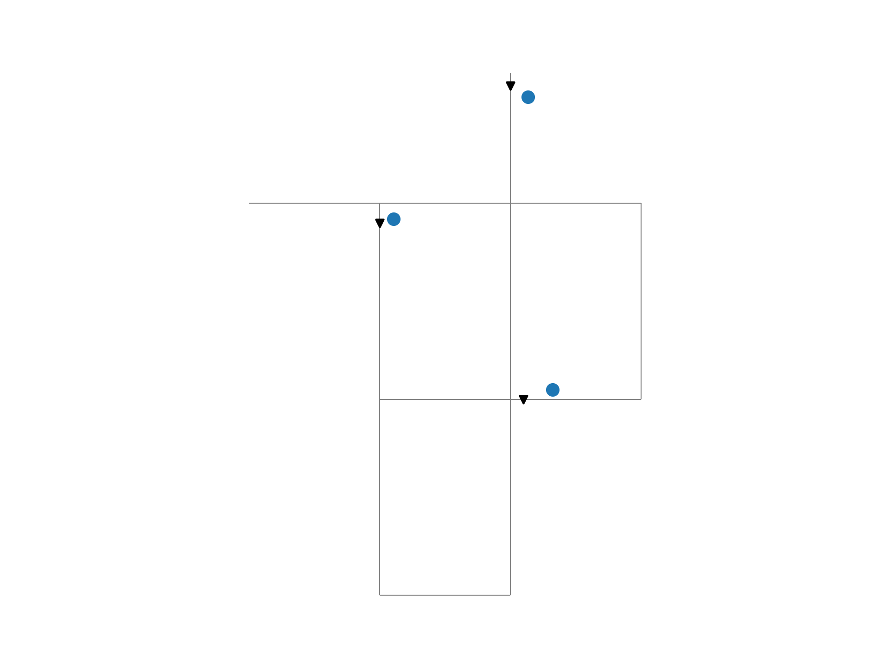
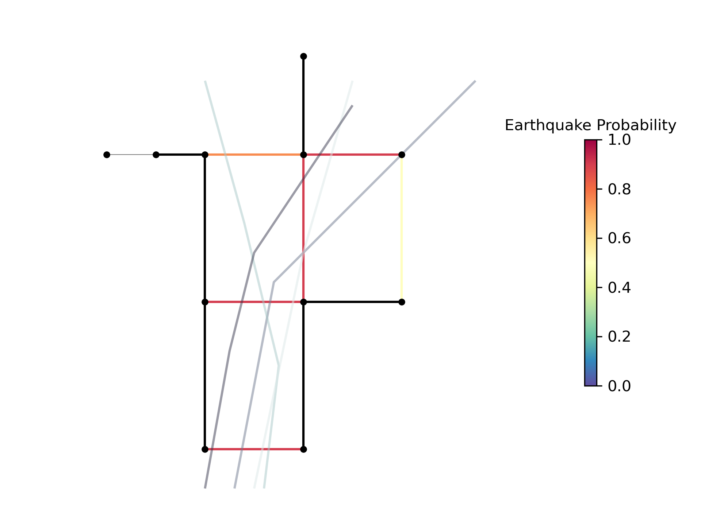
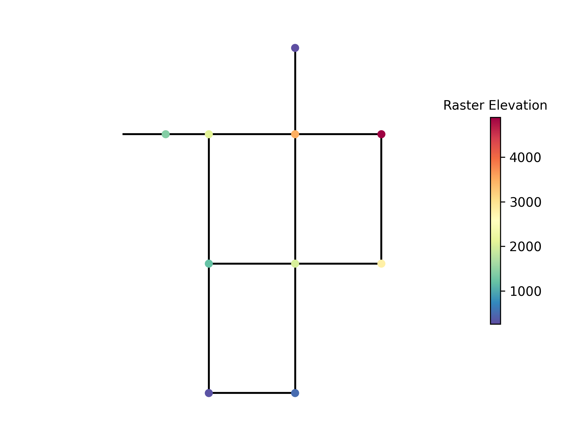

.. raw:: latex

    \clearpage

.. doctest::
    :hide:

    >>> import numpy as np
    >>> import pandas as pd
    >>> pd.options.display.expand_frame_repr = False
    >>> pd.options.display.precision = 3
    >>> try:
    ...    import geopandas as gpd
    ... except ModuleNotFoundError:
    ...    gpd = None
    >>> import matplotlib.pylab as plt
    >>> from os.path import isdir
    >>> examples_dir = '../examples'
    >>> if not isdir(examples_dir):
    ...    examples_dir = 'examples'
    
.. doctest::
    :hide:
    :skipif: gpd is None
	
    >>> demographic_data = gpd.read_file(examples_dir+'/data/Net1_demographic_data.geojson')
    >>> landslide_data = gpd.read_file(examples_dir+'/data/Net1_landslide_data.geojson')
    >>> earthquake_data = gpd.read_file(examples_dir+'/data/Net1_earthquake_data.geojson')
    >>> hydrant_data = gpd.read_file(examples_dir+'/data/Net1_hydrant_data.geojson')
    >>> valve_data = gpd.read_file(examples_dir+'/data/Net1_valve_data.geojson')

.. doctest::
    :hide:
    :skipif: gpd is None or rasterio is None
	
    >>> elevation_data_path = examples_dir+'/data/Net1_elevation_data.tif'

.. _geospatial:

Geospatial capabilities
======================================

The junctions, tanks, reservoirs, pipes, pumps, and valves in a :class:`~wntr.network.model.WaterNetworkModel` 
can be converted to GeoPandas GeoDataFrames as described in :ref:`model_io`.
The GeoDataFrames can be used 
directly within WNTR, 
with geospatial Python packages such as GeoPandas and Shapely, and saved to GeoJSON and Shapefiles for use
in GIS platforms.
Open source GIS platforms include QGIS and GRASS GIS.
The following section describes capabilities in WTNR that use GeoPandas GeoDataFrames.  

.. note:: 
   Functions that use GeoDataFrames require the Python package **geopandas** :cite:p:`jvfm21` 
   and **rtree** :cite:p:`rtree`, and functions that use raster files require the
   Python package **rasterio**. All three are optional dependencies of WNTR.
   Note that **shapely** is installed with geopandas.

The following examples use a water network generated from Net1.inp.
The :class:`~wntr.gis.geospatial.snap` and :class:`~wntr.gis.geospatial.intersect` examples 
also use additional GIS data stored in the 
`examples/data <https://github.com/USEPA/WNTR/blob/main/examples/data>`_ directory.

For simplicity, the examples in this section assume that all network and data coordinates are in 
the EPSG:4326 coordinate reference system (CRS).  
**Note that EPANET does not have a standard or default coordinate reference system.**
More information on setting and transforming CRS is included in :ref:`crs`.
    

.. doctest::
    :skipif: gpd is None

    >>> import wntr
	
    >>> wn = wntr.network.WaterNetworkModel('Net1')

.. _gis_data:

Water network GIS data
------------------------

The :class:`~wntr.network.io.to_gis` function is used to 
create a collection of GeoDataFrames from a WaterNetworkModel.
The collection of GeoDataFrames is stored in a :class:`~wntr.gis.network.WaterNetworkGIS` object 
which contains a GeoDataFrame
for each of the following model components: 

* junctions
* tanks
* reservoirs
* pipes
* pumps
* valves

Note that patterns, curves, sources, controls, and options are not stored in the GeoDataFrame representation.

.. doctest::
    :skipif: gpd is None

    >>> wn_gis = wntr.network.to_gis(wn)

Individual GeoDataFrames are obtained as follows (Note that the example network, Net1, has no valves and thus the GeoDataFrame for valves is empty).

.. doctest::
    :skipif: gpd is None

    >>> wn_gis.junctions # doctest: +SKIP
    >>> wn_gis.tanks # doctest: +SKIP
    >>> wn_gis.reservoirs # doctest: +SKIP
    >>> wn_gis.pipes # doctest: +SKIP
    >>> wn_gis.pumps # doctest: +SKIP
    >>> wn_gis.valves # doctest: +SKIP
	
For example, the junctions GeoDataFrame contains the following information:

.. doctest::
    :skipif: gpd is None

    >>> print(wn_gis.junctions.head())
          base_demand demand_pattern  elevation  initial_quality demand_category       geometry
    name                                                                                       
    10          0.000              1    216.408        5.000e-04            None  POINT (20 70)
    11          0.009              1    216.408        5.000e-04            None  POINT (30 70)
    12          0.009              1    213.360        5.000e-04            None  POINT (50 70)
    13          0.006              1    211.836        5.000e-04            None  POINT (70 70)
    21          0.009              1    213.360        5.000e-04            None  POINT (30 40)

Each GeoDataFrame contains attributes and geometry:

Attributes
^^^^^^^^^^

    A GeoDataFrame contains attributes that are generated 
    from the WaterNetworkModel dictionary representation.
    However, the GeoDataFrame only includes attributes that are stored as numerical values or strings 
    (such as junction node type and elevation).  
    Attributes that are stored as lists or other objects (such as demand timeseries) 
    are not included in the GeoDataFrame.  
    The index for each GeoDataFrame is the model component name.

    Additional attributes can be added to the GeoDataFrames using the 
    :class:`~wntr.gis.network.WaterNetworkGIS.add_node_attributes` and 
    :class:`~wntr.gis.network.WaterNetworkGIS.add_link_attributes` methods.
    Additional attributes, such as simulation results or a resilience metric, can be used in further analysis and visualization.

    The following example adds the simulated pressure at hour 1 to the water network GIS data 
    (which includes pressure at junctions, tanks, and reservoirs).
    
    .. doctest::
       :skipif: gpd is None

        >>> sim = wntr.sim.EpanetSimulator(wn)
        >>> results = sim.run_sim()
        >>> wn_gis.add_node_attributes(results.node['pressure'].loc[3600,:], 
    	...     'Pressure_1hr')
    
    Attributes can also be added directly to individual GeoDataFrames, as shown below.
    
    .. doctest::
       :skipif: gpd is None

        >>> wn_gis.junctions['new attribute'] = 10

Geometry
^^^^^^^^^^

    Each GeoDataFrame also contains a `geometry` column which contains 
    geometric objects commonly used in geospatial analysis.
    :numref:`table-geometry-type` includes water network model components and the 
    geometry type that defines each component.  
    Geometry types include 
    ``shapely.geometry.Point``, ``shapely.geometry.LineString``, and ``shapely.geometry.MultiLineString``.
    A few components can be defined using multiple types:

    * Pumps and valves can be stored as lines (default) or points. While pumps are defined as 
      lines within WNTR (and EPANET), converting the geometry to points can be useful for 
      geospatial analysis and visualization. The following example stores pumps and valves as points.
	  
      .. doctest::
        :skipif: gpd is None

        >>> wn_gis = wntr.network.to_gis(wn, pumps_as_points=True, 
    	...     valves_as_points=True)
		
    * Pipes that do not contain vertices, interior vertex points that allow the visual depiction of curved pipes, are stored as a LineString while pipes that contain 
      vertices are stored as a MultiLineString.

    .. _table-geometry-type:
    .. table:: Geometry Types for Water Network Model Components
   
       ==============================  ===============================
       Water Network Model Component   Shapely Geometry Type
       ==============================  ===============================
       Junction                        Point
       Tank                            Point
       Reservoir                       Point
       Pipe                            LineString or MultiLineString 
       Pump                            LineString or Point
       Valve                           LineString or Point
       ==============================  ===============================
   
A WaterNetworkGIS object can also be written to GeoJSON and Shapefiles using 
the object's :class:`~wntr.gis.network.WaterNetworkGIS.write_geojson` and 
:class:`~wntr.gis.network.WaterNetworkGIS.write_shapefile` methods. 
See :ref:`shapefile_format` for more information on Shapefile format.

The GeoJSON and Shapefiles can be loaded into GIS platforms for further analysis and visualization.
An example of creating GeoJSON files from a WaterNetworkModel using the function :class:`~wntr.gis.network.WaterNetworkGIS.write_geojson`
is shown below.

.. doctest::
    :skipif: gpd is None

    >>> wn_gis.write_geojson('Net1')
	
This creates the following GeoJSON files for junctions, tanks, reservoirs, pipes, and pumps 
(Note that the example network, Net1, has no valves and thus the Net1_valves.geojson file is not created):

* Net1_junctions.geojson
* Net1_tanks.geojson
* Net1_reservoirs.geojson
* Net1_pipes.geojson
* Net1_pumps.geojson

A WaterNetworkModel can also be created from a collection of GeoDataFrames using the function
:class:`~wntr.network.io.from_gis` as shown below.

.. doctest::
    :skipif: gpd is None

    >>> wn2 = wntr.network.from_gis(wn_gis)

Additional GIS data
------------------------

Additional GIS data can also be utilized within 
WNTR to add attributes to the water network model and analysis. Examples of these additional GIS datasets include:

* **Point geometries** that could contain utility billing data, hydrant locations, isolation valve locations, or the location of emergency services.
  These geometries can be associated with points and lines in a water network model by snapping the point to the nearest component.
* **LineString or MultiLineString geometries** that could contain street layout or earthquake fault lines.
  These geometries can be associated with points and lines in a water network model by finding the intersection.
* **Polygon geometries** that could contain elevation, building footprints, zoning, land cover, hazard maps, census data, or demographics.
  These geometries can be associated with points and lines in a water network model by finding the intersection.

The snap and intersect examples below used additional GIS data stored in the 
`examples/data <https://github.com/USEPA/WNTR/blob/main/examples/data>`_ directory.

Note, the GeoPandas ``read_file`` and ``to_file`` functions can be used to read/write external GeoJSON and Shapefiles in Python.

.. _crs:

Coordinate reference system
--------------------------------------

The coordinate reference system (CRS) of geospatial data is important to understand.
CRSs can be geographic (e.g., latitude/longitude where the units are in degrees) or 
projected (e.g., Universal Transverse Mercator where units are in meters).
GeoPandas includes documentation on managing projections at https://geopandas.org/en/stable/docs/user_guide/projections.html.
Several important points on CRS are listed below.

* The GeoPandas ``set_crs`` and ``to_crs`` methods can be used to set and transform the CRS of GeoDataFrames.
* The WNTR WaterNetworkGIS object also includes 
  :class:`~wntr.gis.network.WaterNetworkGIS.set_crs` and 
  :class:`~wntr.gis.network.WaterNetworkGIS.to_crs` methods to set and 
  transform the CRS of the junctions, tanks, reservoirs, pipes, pumps, and valves GeoDataFrames.
* WNTR includes additional methods to modify coordinates on the WaterNetworkModel object, see :ref:`modify_node_coords` for more information.
* When converting a WaterNetworkModel into GeoDataFrames using :class:`~wntr.network.io.to_gis` and 
  when creating GeoJSON and Shapefiles from a WaterNetworkModel using 
  :class:`~wntr.network.io.write_geojson` and :class:`~wntr.network.io.write_shapefile`, 
  the user can specify a CRS for the node coordinates.
  This does NOT convert node coordinates to a different CRS. It only assigns a CRS to the data or file.
  By default, the CRS is not specified (and is set to None).  
* The :class:`~wntr.gis.geospatial.snap` and :class:`~wntr.gis.geospatial.intersect` functions described 
  in the following sections require that datasets have the same CRS.
* Projected CRSs are preferred for more accurate distance calculations.

The following example reads a GeoJSON file and overrides the CRS to change it from EPSG:4326 to EPSG:3857.
(Note, this does not change the coordinates in the geometry column.)

.. doctest::
    :skipif: gpd is None
    
    >>> import geopandas as gpd
	
    >>> hydrant_data = gpd.read_file('data/Net1_hydrant_data.geojson') # doctest: +SKIP
    >>> print(hydrant_data.crs) # doctest: +SKIP
    EPSG:4326
    >>> print(hydrant_data)
       demand           geometry
    0    5000  POINT (48.2 37.2)
    1    1500  POINT (71.8 68.3)
    2    8000  POINT (51.2 71.1)
	
    >>> hydrant_data = hydrant_data.set_crs('EPSG:3857', allow_override=True)
    >>> print(hydrant_data.crs) # doctest: +SKIP
    EPSG:3857 
    >>> print(hydrant_data)
       demand           geometry
    0    5000  POINT (48.2 37.2)
    1    1500  POINT (71.8 68.3)
    2    8000  POINT (51.2 71.1)
	
.. doctest::
    :hide:

    >>> hydrant_data = gpd.read_file(examples_dir+'/data/Net1_hydrant_data.geojson')

The following example reads a GeoJSON file and transforms the CRS to EPSG:3857. 
(Note, this transforms the coordinates in the geometry column.)

.. doctest::
    :skipif: gpd is None
	
    >>> hydrant_data = gpd.read_file('data/Net1_hydrant_data.geojson') # doctest: +SKIP
	
    >>> hydrant_data.to_crs('EPSG:3857', inplace=True)
    >>> print(hydrant_data.crs) # doctest: +SKIP
    EPSG:3857
    >>> print(hydrant_data)
       demand                          geometry
    0    5000   POINT (5365599.456 4467020.994)
    1    1500  POINT (7992739.439 10536729.551)
    2    8000  POINT (5699557.929 11436551.505)

.. doctest::
    :hide:

    >>> hydrant_data = gpd.read_file(examples_dir+'/data/Net1_hydrant_data.geojson')

The following example converts a WaterNetworkModel in EPSG:4326 coordinates into GeoDataFrames
and then translates the GeoDataFrames coordinates to EPSG:3857.

.. doctest::
    :skipif: gpd is None
	
    >>> wn = wntr.network.WaterNetworkModel('Net1')
	
    >>> wn_gis = wntr.network.to_gis(wn, crs='EPSG:4326')
    >>> print(wn_gis.junctions.head())
          base_demand demand_pattern  elevation  initial_quality demand_category       geometry
    name                                                                                       
    10          0.000              1    216.408        5.000e-04            None  POINT (20 70)
    11          0.009              1    216.408        5.000e-04            None  POINT (30 70)
    12          0.009              1    213.360        5.000e-04            None  POINT (50 70)
    13          0.006              1    211.836        5.000e-04            None  POINT (70 70)
    21          0.009              1    213.360        5.000e-04            None  POINT (30 40)

    >>> wn_gis.to_crs('EPSG:3857')
    >>> print(wn_gis.junctions.head())
          base_demand demand_pattern  elevation  initial_quality demand_category                          geometry
    name                                                                                                          
    10          0.000              1    216.408        5.000e-04            None  POINT (2226389.816 11068715.659)
    11          0.009              1    216.408        5.000e-04            None  POINT (3339584.724 11068715.659)
    12          0.009              1    213.360        5.000e-04            None   POINT (5565974.54 11068715.659)
    13          0.006              1    211.836        5.000e-04            None  POINT (7792364.356 11068715.659)
    21          0.009              1    213.360        5.000e-04            None    POINT (3339584.724 4865942.28)

Snap point geometries to the nearest point or line
----------------------------------------------------

The :class:`~wntr.gis.geospatial.snap` function is used to find the nearest point or line to a set of points. 
This functionality can be used to assign hydrants to junctions or assign isolation valves to pipes.

For example, when snapping point geometries in GeoDataFrame A to point or line geometries in GeoDataFrame B, 
the function returns the following information (one entry for each point in A):

* Nearest point or line in B
* Distance between original and snapped point
* Coordinates of the snapped point
* If B contains lines, the nearest endpoint along the nearest line
* If B contains lines, the relative distance from the line's start node (line position)

The network file, Net1.inp, in EPSG:4326 CRS is used in the example below. 
The additional GIS data in the GeoJSON format is also in EPSG:4326 CRS.
See :ref:`crs` for more information.

.. doctest::
    :skipif: gpd is None
	
    >>> wn = wntr.network.WaterNetworkModel('Net1')
    >>> wn_gis = wntr.network.to_gis(wn, crs='EPSG:4326')
	
Snap hydrants to junctions
^^^^^^^^^^^^^^^^^^^^^^^^^^^

GIS data which include the network hydrant locations is useful in a resilience analysis. In particular, 
this information identifies which junctions could have their demands increased to simulate the opening 
of hydrants to fight fires or flush contaminated water out of the network, either of which could caused by a disaster scenario. 
The following example highlights the process to snap hydrants to junctions. The example dataset of hydrant 
locations is a GeoDataFrame with a `geometry` column that contains ``shapely.geometry.Point`` geometries and a 
`demand` column that defines fire flow requirements. 
The GeoPandas ``read_file`` method is used to read the GeoJSON file into a GeoDataFrame.  

.. doctest::
    :skipif: gpd is None
    
    >>> import geopandas as gpd
	
    >>> hydrant_data = gpd.read_file('data/Net1_hydrant_data.geojson') # doctest: +SKIP
    >>> print(hydrant_data)
       demand           geometry
    0    5000  POINT (48.2 37.2)
    1    1500  POINT (71.8 68.3)
    2    8000  POINT (51.2 71.1)

The following example uses the function :class:`~wntr.gis.snap` to snap hydrant locations to the nearest junction 
within a tolerance of 5.0 units (the tolerance is in the units of the GIS coordinate system).
	
.. doctest::
    :skipif: gpd is None

    >>> snapped_to_junctions = wntr.gis.snap(hydrant_data, wn_gis.junctions, tolerance=5.0)
    >>> print(snapped_to_junctions)
      node  snap_distance       geometry
    0   22          3.329  POINT (50 40)
    1   13          2.476  POINT (70 70)
    2   12          1.628  POINT (50 70)

The data, water network model, and snapped points can be plotted as follows. The resulting :numref:`fig-snap-points` illustrates 
the hydrants snapped to the junctions in Net1.

.. doctest::
    :skipif: gpd is None

    >>> ax = hydrant_data.plot()
    >>> ax = wntr.graphics.plot_network(wn, 
    ...     node_attribute=snapped_to_junctions['node'].to_list(), ax=ax)

.. doctest::
    :skipif: gpd is None
    :hide:
    
    >>> bounds = ax.axis('equal')
    >>> plt.tight_layout()
    >>> plt.savefig('snap_points.png', dpi=300)
    >>> plt.close()

.. _fig-snap-points:
.. figure:: figures/snap_points.png
   :width: 535
   :alt: Hydrants snapped to junctions in EPANET example Net1 using the snapped points to points function

   Net1 with example hydrants snapped to junctions, in which the larger blue circles are the hydrant locations and the smaller red circles are the associated junctions.

**By reversing the order of GeoDataFrames in the snap function**,
the nearest hydrant to each junction can also be identified.
Note that the tolerance is increased to ensure all junctions are assigned a hydrant.
   
.. doctest::
    :skipif: gpd is None

    >>> snapped_to_hydrants = wntr.gis.snap(wn_gis.junctions, hydrant_data, tolerance=100.0)
    >>> print(snapped_to_hydrants)
        node  snap_distance           geometry
    10     2         31.219  POINT (51.2 71.1)
    11     2         21.229  POINT (51.2 71.1)
    12     2          1.628  POINT (51.2 71.1)
    13     1          2.476  POINT (71.8 68.3)
    21     0         18.414  POINT (48.2 37.2)
    22     0          3.329  POINT (48.2 37.2)
    23     0         21.979  POINT (48.2 37.2)
    31     0         32.727  POINT (48.2 37.2)
    32     0         27.259  POINT (48.2 37.2)

Snap valves to pipes
^^^^^^^^^^^^^^^^^^^^^

GIS data of the network isolation valve locations can be used to identify which pipes to 
close during a pipe break scenario. The following example highlights the process to snap valves to pipes.   
The example dataset of valve locations is a GeoDataFrame with a `geometry` column that contains ``shapely.geometry.Point`` geometries.

.. doctest::
    :skipif: gpd is None

    >>> valve_data = gpd.read_file('data/Net1_valve_data.geojson') # doctest: +SKIP
    >>> print(valve_data)
                geometry
    0  POINT (56.5 41.5)
    1  POINT (32.1 67.6)
    2  POINT (52.7 86.3)
	
The following example uses the function :class:`~wntr.gis.snap` to snap valve locations to the nearest pipe 
within a tolerance of 5.0 degrees.

.. doctest::
    :skipif: gpd is None

    >>> snapped_to_pipes = wntr.gis.snap(valve_data, wn_gis.pipes, tolerance=5.0)
    >>> print(snapped_to_pipes)
      link node  snap_distance  line_position         geometry
    0   22   22            1.5          0.325  POINT (56.5 40)
    1  111   11            2.1          0.080  POINT (30 67.6)
    2  110    2            2.7          0.185  POINT (50 86.3)
	
The snapped locations can be used to define a :ref:`valvelayer` and then create network segments.

.. doctest::
    :skipif: gpd is None

    >>> valve_layer = snapped_to_pipes[['link', 'node']]
    >>> G = wn.to_graph()
    >>> node_segments, link_segments, segment_size = wntr.metrics.valve_segments(G, 
    ...     valve_layer)

The data, water network model, and valve layer can be plotted as follows. The resulting :numref:`fig-snap-lines` 
illustrates the valve layer created by snapping points to lines in Net1.

.. doctest::
    :skipif: gpd is None

    >>> ax = valve_data.plot()
    >>> ax = wntr.graphics.plot_valve_layer(wn, valve_layer, add_colorbar=False, ax=ax)

.. doctest::
    :skipif: gpd is None 
    :hide:
    
    >>> bounds = ax.axis('equal')
    >>> plt.tight_layout()
    >>> plt.savefig('snap_lines.png', dpi=300)
    >>> plt.close()

.. _fig-snap-lines:

   Net1 with example valve layer created by snapping points to lines, in which the blue circles are the isolation valve locations 
   and the black triangles are the associated locations on the pipes.  

Find the intersect between geometries
--------------------------------------

The :class:`~wntr.gis.geospatial.intersect`  function is used to find the intersection between geometries.
This functionality can be used to identify faults, landslides, or other hazards that intersect pipes,
or assign community resilience indicators (e.g., population characteristics, economic), hazards/risks, or other data to network components.

When finding the intersection of GeoDataFrame A with GeoDataFrame B (where A and B can contain points, lines, or polygons),
the function returns the following information (one entry for each geometry in A):

* List of intersecting B geometry indices
* Number of intersecting B geometries

The following additional information is returned when geometries in B are assigned a value:

* List of intersecting B geometry values
* Minimum B geometry value
* Maximum B geometry value
* Mean B geometry value
* If A contains lines and B contains polygons, weighted mean value (weighted by intersecting length)

When the B geometry contains polygons, the user can optionally include the background in the intersection.
This is useful when working with geometries that do not cover the entire region of interest.
For example, while census tracts cover the entire region, hazard maps might contain gaps (regions with no hazard) 
that the user might want to include in the intersection.

The network file, Net1.inp, in EPSG:4326 CRS is used in the example below. 
Additional GIS data in the GeoJSON format is also in EPSG:4326 CRS.
See :ref:`crs` for more information.

.. doctest::
    :skipif: gpd is None
	
    >>> wn = wntr.network.WaterNetworkModel('Net1')
    >>> wn_gis = wntr.network.to_gis(wn, crs='EPSG:4326')
	
Assign earthquake probability to pipes
^^^^^^^^^^^^^^^^^^^^^^^^^^^^^^^^^^^^^^

GIS data that includes earthquake fault lines can be used in a resilience analysis to identify pipes which 
have the potential to be damaged during an earthquake. The following example highlights the process to assign earthquake
probabilities to pipes. The example dataset of earthquake fault lines is a GeoDataFrame with a `geometry` column 
that contains ``shapely.geometry.LineString`` geometries and a `Pr` column which contains probability of an earthquake over magnitude 7.

.. doctest::
    :skipif: gpd is None

    >>> earthquake_data = gpd.read_file('data/Net1_earthquake_data.geojson') # doctest: +SKIP
    >>> print(earthquake_data)
         Pr                                geometry
    0  0.50         LINESTRING (36 2, 44 44, 85 85)
    1  0.75  LINESTRING (42 2, 45 27, 38 56, 30 85)
    2  0.90         LINESTRING (40 2, 50 50, 60 85)
    3  0.25  LINESTRING (30 2, 35 30, 40 50, 60 80)
	
The following example uses the function :class:`~wntr.gis.intersect` to assign earthquake probability to pipes. 

.. doctest::
    :skipif: gpd is None

    >>> pipe_Pr = wntr.gis.intersect(wn_gis.pipes, earthquake_data, 'Pr')
    >>> print(pipe_Pr)
        intersections                  values  n   sum   min   max  mean
    10             []                      []  0   NaN   NaN   NaN   NaN
    11            [1]                  [0.75]  1  0.75  0.75  0.75  0.75
    12      [0, 2, 3]        [0.5, 0.9, 0.25]  3  1.65  0.25  0.90  0.55
    21   [0, 1, 2, 3]  [0.5, 0.75, 0.9, 0.25]  4  2.40  0.25  0.90  0.60
    22             []                      []  0   NaN   NaN   NaN   NaN
    31   [0, 1, 2, 3]  [0.5, 0.75, 0.9, 0.25]  4  2.40  0.25  0.90  0.60
    110            []                      []  0   NaN   NaN   NaN   NaN
    111            []                      []  0   NaN   NaN   NaN   NaN
    112     [0, 2, 3]        [0.5, 0.9, 0.25]  3  1.65  0.25  0.90  0.55
    113           [0]                   [0.5]  1  0.50  0.50  0.50  0.50
    121            []                      []  0   NaN   NaN   NaN   NaN
    122            []                      []  0   NaN   NaN   NaN   NaN
	
The data, water network model, and fault lines can be plotted as follows. The 
resulting :numref:`fig-intersect-earthquake` illustrates Net1 with the intersection of pipes with the fault lines. 
The pipes are colored based upon their maximum earthquake probability.

.. doctest::
    :skipif: gpd is None

    >>> ax = earthquake_data.plot(column='Pr', alpha=0.5, cmap='bone', vmin=0, vmax=1)
    >>> ax = wntr.graphics.plot_network(wn, link_attribute=pipe_Pr['max'], link_width=1.5, 
    ...     node_range=[0,1], link_range=[0,1], ax=ax, 
    ...     link_colorbar_label='Earthquake Probability')

.. doctest::
    :skipif: gpd is None
    :hide:
    
    >>> bounds = ax.axis('equal')
    >>> plt.tight_layout()
    >>> plt.savefig('intersect_earthquake.png', dpi=300)
    >>> plt.close()

.. _fig-intersect-earthquake:

   Net1 with example earthquake fault lines intersected with pipes, which are colored based upon their maximum earthquake probability.  
   
The intersect function can also be used to identify pipes that cross each fault simply by reversing 
the order in which the geometries intersect, as shown below:

.. doctest::
    :skipif: gpd is None

    >>> pipes_that_intersect_each_fault = wntr.gis.intersect(earthquake_data, wn_gis.pipes)
    >>> print(pipes_that_intersect_each_fault)
                intersections  n
    0  [112, 113, 12, 21, 31]  5
    1            [11, 21, 31]  3
    2       [112, 12, 21, 31]  4
    3       [112, 12, 21, 31]  4

Assign landslide probability to pipes
^^^^^^^^^^^^^^^^^^^^^^^^^^^^^^^^^^^^^^

Landslide hazard zones GIS data can be used to identify pipes with the potential to be affected during a landslide. 
The following example highlights the process to assign landslide probabilities to pipes. The landslide hazard zones example dataset 
is a GeoDataFrame with a `geometry` column that contains ``shapely.geometry.LineString`` geometries and a 
`Pr` column which contains the probability of damage from a landslide in that zone.

.. doctest::
    :skipif: gpd is None

    >>> landslide_data = gpd.read_file('data/Net1_landslide_data.geojson') # doctest: +SKIP
    >>> print(landslide_data)
         Pr                                           geometry
    0  0.50  POLYGON ((28.84615 22.23077, 28.7604 22.05079,...
    1  0.75  POLYGON ((40.00708 1.83192, 33.00708 84.83192,...
    2  0.90  POLYGON ((58.05971 44.48507, 58.11776 44.67615...
	
The following example uses the function :class:`~wntr.gis.intersect` to assign landslide hazard zone probabilities to pipes. 
This is very similar to the earthquake example above, except that the landslide hazards are polygons. Additionally, since the 
hazard map does not include a "background" value that defines the probability of damage outside landslide zones, 
the background conditions are included in the intersection function (i.e, the background value is assumed to be zero).

.. doctest::
    :skipif: gpd is None 

    >>> pipe_Pr = wntr.gis.intersect(wn_gis.pipes, landslide_data, 'Pr', 
    ...    include_background=True, background_value=0)
    >>> print(pipe_Pr)
              intersections            values  n   sum  min   max   mean  weighted_mean
    10         [BACKGROUND]             [0.0]  1  0.00  0.0  0.00  0.000          0.000
    11      [BACKGROUND, 1]       [0.0, 0.75]  2  0.75  0.0  0.75  0.375          0.201
    12         [BACKGROUND]             [0.0]  1  0.00  0.0  0.00  0.000          0.000
    21   [BACKGROUND, 0, 1]  [0.0, 0.5, 0.75]  3  1.25  0.0  0.75  0.417          0.394
    22      [BACKGROUND, 2]        [0.0, 0.9]  2  0.90  0.0  0.90  0.450          0.246
    31      [BACKGROUND, 1]       [0.0, 0.75]  2  0.75  0.0  0.75  0.375          0.212
    110        [BACKGROUND]             [0.0]  1  0.00  0.0  0.00  0.000          0.000
    111     [BACKGROUND, 0]        [0.0, 0.5]  2  0.50  0.0  0.50  0.250          0.352
    112        [BACKGROUND]             [0.0]  1  0.00  0.0  0.00  0.000          0.000
    113        [BACKGROUND]             [0.0]  1  0.00  0.0  0.00  0.000          0.000
    121     [BACKGROUND, 0]        [0.0, 0.5]  2  0.50  0.0  0.50  0.250          0.250
    122        [BACKGROUND]             [0.0]  1  0.00  0.0  0.00  0.000          0.000

The data, water network model, and landslide zones can be plotted as follows. The 
resulting :numref:`fig-intersect-landslide` illustrates Net1 with the intersection of pipes with the landslide zones. 
The pipes are colored based upon their weighted mean landslide probability.

.. doctest::
    :skipif: gpd is None

    >>> ax = landslide_data.plot(column='Pr', alpha=0.5, cmap='bone', vmin=0, vmax=1)
    >>> ax = wntr.graphics.plot_network(wn, link_attribute=pipe_Pr['weighted_mean'], 
    ...     link_width=1.5, node_range=[0,1], link_range=[0,1], ax=ax, 
    ...     link_colorbar_label='Landslide Probability')

.. doctest::
    :skipif: gpd is None
    :hide:
    
    >>> bounds = ax.axis('equal')
    >>> plt.tight_layout()
    >>> plt.savefig('intersect_landslide.png', dpi=300)
    >>> plt.close()

.. _fig-intersect-landslide:
.. figure:: figures/intersect_landslide.png
   :width: 535
   :alt: Intersection of junctions with landslide zones in EPANET example Net1

   Net1 with example landslide zones intersected with pipes, which are colored based upon their weighted mean landslide probability. 
   
**By reversing the order of GeoDataFrames in the intersection function**, 
the pipes that intersect each landslide zone and information about 
the intersecting pipe diameters can also be identified:

.. doctest::
    :skipif: gpd is None 

    >>> pipes_that_intersect_each_landslide = wntr.gis.intersect(landslide_data, 
    ...     wn_gis.pipes, 'diameter')
    >>> print(pipes_that_intersect_each_landslide)
        intersections                                             values  n    sum    min    max   mean
    0  [111, 121, 21]                             [0.254, 0.2032, 0.254]  3  0.711  0.203  0.254  0.237
    1    [11, 21, 31]  [0.35559999999999997, 0.254, 0.15239999999999998]  3  0.762  0.152  0.356  0.254
    2            [22]                              [0.30479999999999996]  1  0.305  0.305  0.305  0.305
	
Assign demographic data to pipes and junctions
^^^^^^^^^^^^^^^^^^^^^^^^^^^^^^^^^^^^^^^^^^^^^^^

GIS data that includes community resilience indicators (e.g., population characteristics, economic data), 
hazards/risks, or other data can be used to identify 
the effects of disasters to different portions of the community, which can help utilities to improve equitable resilience. 
The following example highlights the process to assign demographic data to pipes and junctions. The demographic example dataset 
is a GeoDataFrame with a `geometry` column that contains ``shapely.geometry.Polygon`` geometries along with 
columns that store the mean income, the mean age, and the population within each census tract.

.. doctest::
    :skipif: gpd is None

    >>> demographic_data = gpd.read_file('data/Net1_demographic_data.geojson') # doctest: +SKIP
    >>> print(demographic_data)
       mean_income  mean_age  population                                           geometry
    0      63326.0      35.0      3362.0  POLYGON ((41.67813 82.75023, 41.98596 60.85779...
    1      78245.0      31.0      5618.0  POLYGON ((23.21084 40.1916, 22.99063 27.71777,...
    2      91452.0      40.0      5650.0  POLYGON ((22.99063 27.71777, 61.9372 16.36165,...
    3      54040.0      39.0      5546.0  POLYGON ((61.9372 16.36165, 22.99063 27.71777,...
    4      26135.0      38.0      5968.0  POLYGON ((61.9372 16.36165, 64.04456 22.10119,...
    5      57620.0      31.0      4315.0  POLYGON ((44.48497 87.21487, 79.81144 71.92669...
    6      44871.0      54.0      4547.0  POLYGON ((64.04456 22.10119, 51.72994 45.92347...
    7      69067.0      55.0      2541.0  POLYGON ((46.01047 99.15725, 46.40654 99.33204...
	
The following example uses the function :class:`~wntr.gis.intersect`
to assign the demographic data, specifically the mean income, to junctions and pipes.  

.. doctest::
    :skipif: gpd is None

    >>> junction_demographics = wntr.gis.intersect(wn_gis.junctions, demographic_data, 
    ...     'mean_income')
    >>> print(junction_demographics)
       intersections     values  n      sum      min      max     mean
    10           [0]  [63326.0]  1  63326.0  63326.0  63326.0  63326.0
    11           [0]  [63326.0]  1  63326.0  63326.0  63326.0  63326.0
    12           [5]  [57620.0]  1  57620.0  57620.0  57620.0  57620.0
    13           [5]  [57620.0]  1  57620.0  57620.0  57620.0  57620.0
    21           [3]  [54040.0]  1  54040.0  54040.0  54040.0  54040.0
    22           [3]  [54040.0]  1  54040.0  54040.0  54040.0  54040.0
    23           [6]  [44871.0]  1  44871.0  44871.0  44871.0  44871.0
    31           [2]  [91452.0]  1  91452.0  91452.0  91452.0  91452.0
    32           [2]  [91452.0]  1  91452.0  91452.0  91452.0  91452.0
	
.. doctest::
    :skipif: gpd is None

    >>> pipe_demographics = wntr.gis.intersect(wn_gis.pipes, demographic_data, 'mean_income')
    >>> print(pipe_demographics)
        intersections              values  n       sum      min      max     mean  weighted_mean
    10            [0]           [63326.0]  1   63326.0  63326.0  63326.0  63326.0      63326.000
    11         [0, 5]  [63326.0, 57620.0]  2  120946.0  57620.0  63326.0  60473.0      61002.920
    12            [5]           [57620.0]  1   57620.0  57620.0  57620.0  57620.0      57620.000
    21            [3]           [54040.0]  1   54040.0  54040.0  54040.0  54040.0      54040.000
    22         [3, 6]  [54040.0, 44871.0]  2   98911.0  44871.0  54040.0  49455.5      47067.895
    31            [2]           [91452.0]  1   91452.0  91452.0  91452.0  91452.0      91452.000
    110        [5, 7]  [57620.0, 69067.0]  2  126687.0  57620.0  69067.0  63343.5      60580.117
    111        [0, 3]  [63326.0, 54040.0]  2  117366.0  54040.0  63326.0  58683.0      60953.558
    112        [3, 5]  [54040.0, 57620.0]  2  111660.0  54040.0  57620.0  55830.0      56596.728
    113        [5, 6]  [57620.0, 44871.0]  2  102491.0  44871.0  57620.0  51245.5      53707.370
    121        [2, 3]  [91452.0, 54040.0]  2  145492.0  54040.0  91452.0  72746.0      73586.482
    122        [2, 3]  [91452.0, 54040.0]  2  145492.0  54040.0  91452.0  72746.0      66314.037

The data, water network model, and census tracts can be plotted as follows. The 
resulting :numref:`fig-intersect-demographics` illustrates Net1 with the intersection of junctions and pipes with the census tracts (polygons). 
The junctions and pipes are colored with their mean income and weighted mean income, respectively. Note that the color scale for 
the census tracts (polygons) is different than the junction and pipe attributes.

.. doctest::
    :skipif: gpd is None

    >>> ax = demographic_data.plot(column='mean_income', alpha=0.5,  
    ...     cmap='bone', vmin=10000, vmax=100000)
    >>> ax = wntr.graphics.plot_network(wn, node_attribute=junction_demographics['mean'], 
    ...     link_attribute=pipe_demographics['weighted_mean'], link_width=1.5,
    ...     node_range=[40000,80000], link_range=[40000,80000], ax=ax)
						   
.. doctest::
    :skipif: gpd is None
    :hide:
    
    >>> bounds = ax.axis('equal')
    >>> plt.tight_layout()
    >>> plt.savefig('intersect_demographics.png', dpi=300)
    >>> plt.close()

.. _fig-intersect-demographics:
.. figure:: figures/intersect_demographics.png
   :width: 535
   :alt: Intersection of junctions and pipes with mean income demographic data in EPANET example Net1

   Net1 with mean income demographic data intersected with junctions and pipes.

Sample raster at points geometries
--------------------------------------

The :class:`~wntr.gis.sample_raster` function can be used to sample a raster file at point geometries,
such as the nodes of a water network. A common use case for this function is to assign elevation to the 
nodes of a water network model, however other geospatial information such as hazard data could be sampled 
using this function.

The network file, Net1.inp, in EPSG:4326 CRS is used in the example below. 
The raster data in the GeoTIFF format is also in EPSG:4326 CRS.
See :ref:`crs` for more information.

.. doctest::
    :skipif: gpd is None
	
    >>> wn = wntr.network.WaterNetworkModel('Net1')
    >>> wn_gis = wntr.network.to_gis(wn, crs='EPSG:4326')

Sample elevations at junctions
^^^^^^^^^^^^^^^^^^^^^^^^^^^^^^

Elevation is an essential attribute for accurate simulation of pressure in a water network and is
commonly provided in GeoTIFF (.tif) files. The following example shows how such files can be sampled 
and assigned to the junctions and tanks of a network. Note that elevation data generally needs 
to be adjusted to account for buried pipes.

.. doctest::
    :skipif: gpd is None or rasterio is None

    >>> elevation_data_path = 'data/Net1_elevation_data.tif' # doctest: +SKIP
    >>> junctions = wn_gis.junctions
    >>> junction_elevations = wntr.gis.sample_raster(junctions, elevation_data_path)
    >>> print(junction_elevations)
    name
    10    1400.0
    11    2100.0
    12    3500.0
    13    4900.0
    21    1200.0
    22    2000.0
    23    2800.0
    31     300.0
    32     500.0
    dtype: float64

.. doctest::
    :skipif: gpd is None or rasterio is None

    >>> tanks = wn_gis.tanks
    >>> tank_elevations = wntr.gis.sample_raster(tanks, elevation_data_path)
    >>> print(tank_elevations)
    name
    2    4500.0
    dtype: float64

To use these elevations for hydraulic simulations, 
they need to be added to the water network object.

.. doctest::
    :skipif: gpd is None or rasterio is None

    >>> for junction_name in wn.junction_name_list:
    ...     junction = wn.get_node(junction_name)
    ...     junction.elevation = junction_elevations[junction_name]

.. doctest::
    :skipif: gpd is None or rasterio is None

    >>> for tank_name in wn.tank_name_list:
    ...     tank = wn.get_node(tank_name)
    ...     tank.elevation = tank_elevations[tank_name]

The sampled elevations can be plotted as follows. The 
resulting :numref:`fig-sample-elevations` illustrates Net1 with the elevations 
sampled from the raster file.

.. doctest::
    :skipif: gpd is None or rasterio is None

    >>> ax = wntr.graphics.plot_network(wn, node_attribute="elevation", link_width=1.5, 
    ...     node_size=40, node_colorbar_label='Raster Elevation')

.. doctest::
    :skipif: gpd is None or rasterio is None
    :hide:
    
    >>> bounds = ax.axis('equal')
    >>> plt.tight_layout()
    >>> plt.savefig('sample_elevations.png', dpi=300)
    >>> plt.close()

.. _fig-sample-elevations:

   Net1 with elevations sampled from raster.

Connect lines
--------------------------------------

The :class:`~wntr.gis.connect_lines` function can be used connect line geometries that do not connect.
This is useful, for example, when utility pipe data does not perfectly connect at line endpoints and junction coordinates are unknown.
The :class:`~wntr.gis.connect_lines` function takes a GeoDataFrame with LineString geometries and a distance threshold and returns
a line GeoDataFrame with connected LineStrings and 
a node GeoDataFrame with Point coordinates.

Connect pipe data
^^^^^^^^^^^^^^^^^^^^^^^^^^^^^^
A WaterNetworkModel requires pipe data with `start_node_name` and `end_node_name` attributes.  
These node names refer to Junctions, Tanks, or Reservoirs.
When this connectivity information is not known (i.e., the pipe data has no `start_node_name` and `end_node_name`), the 
:class:`~wntr.gis.connect_lines` function can be used to connect line end points with a user specified distance threshold.

The following example creates disconnected pipe data using Net1, and then generates the data needed to create a 
connected WaterNetworkModel.  This assumes that all start and end nodes are Junctions.

.. doctest::
    :skipif: gpd is None
	
    >>> wn = wntr.network.WaterNetworkModel('Net1')
    >>> wn_gis = wntr.network.to_gis(wn, crs='EPSG:2236')
    >>> original_pipes = wn_gis.pipes

.. doctest::
    :skipif: gpd is None
    :hide:
	
    >>> np.random.seed(123)
    >>> disconnected_pipes = original_pipes[['diameter', 'length', 'geometry']]
    >>> for i, line in disconnected_pipes.iterrows():
    ...     angle = np.random.uniform(-5,5,1)
    ...     geom = gpd.GeoSeries(line['geometry'])
    ...     geom = geom.rotate(angle)
    ...     geom = geom.scale(0.9, 0.9)
    ...     disconnected_pipes.loc[i,'geometry'] = geom[0]

To create the disconnected pipe data in this example, the original pipes were rotated (+/- 5 degrees) and scaled (90% in the x and y direction).
The disconnected pipe data is missing start and end node names, and end points do not connect.

Connect the disconnected pipes using a distance threshold of 5 ft (same distance units as the CRS)

.. doctest::
    :skipif: gpd is None

    >>> distance_threshold = 5 # ft
    >>> pipes, junctions = wntr.gis.connect_lines(disconnected_pipes, distance_threshold)

:numref:`fig-connect-lines` illustrates the original pipe data, the disconnected pipe data, 
and the connected pipe and junction data.

    >>> ax = disconnected_pipes.plot(ax=ax, color='r', label='Disconnected pipe data')
    >>> ax = pipes.plot(ax=ax, color='k', linewidth=6, alpha=0.35, label='Connected pipe data')
    >>> ax = junctions.plot(ax=ax, color='k', label='Connected junctions')
    >>> legend = ax.legend()

.. doctest::
    :skipif: gpd is None
    :hide:
    
    >>> bounds = ax.axis('equal')
    >>> plt.tight_layout()
    >>> temp = plt.axis('off')
    >>> plt.savefig('connect_lines.png', dpi=300)
    >>> plt.close()

.. _fig-connect-lines:
.. figure:: figures/connect_lines.png
   :width: 640
   :alt: Connected pipes and junctions from a disconnected dataset.

   Connected pipes and junctions from a disconnected dataset
   
Use the junction and pipe data to create a basic WaterNetworkModel (without tanks, reservoirs, pumps, or valves).

.. doctest::
    :skipif: gpd is None
    
    >>> gis_data = wntr.gis.WaterNetworkGIS({"junctions": junctions, "pipes": pipes})
    >>> wn = wntr.network.from_gis(gis_data)
	