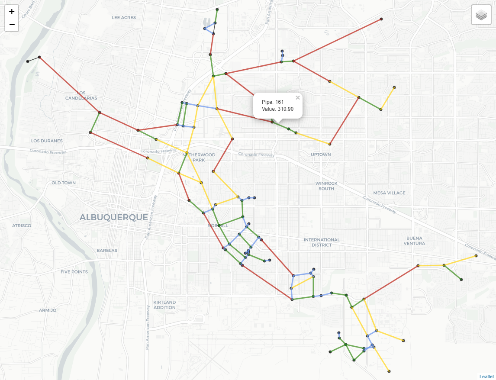
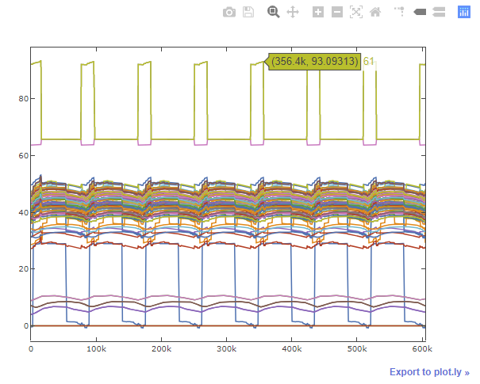

.. raw:: latex

    \clearpage

.. doctest::
    :hide:

    >>> import wntr
    >>> import numpy as np
    >>> import matplotlib.pylab as plt
    >>> import plotly
    >>> from __future__ import print_function
    >>> try:
    ...    wn = wntr.network.model.WaterNetworkModel('../examples/networks/Net3.inp')
    ... except:
    ...    wn = wntr.network.model.WaterNetworkModel('examples/networks/Net3.inp')
	
Graphics
======================================

WNTR includes several functions to plot water network models and plot 
fragility and pump curves.

Networks
--------------------
Basic network graphics can be generated using the 
function :class:`~wntr.graphics.network.plot_network`.  
A wide range of options can be supplied, including
node attributes, node size, node range, 
link attributes, link width, and link range.

Node and link attributes can be specified using the following options:

* Name of the attribute (i.e. 'elevation' for nodes or 'length' for links), this calls
  :class:`~wntr.network.model.WaterNetworkModel.query_node_attribute` or
  :class:`~wntr.network.model.WaterNetworkModel.query_link_attribute` method on the water network model and returns 
  a Pandas Series with node/link names and associated values
* Pandas Series with node/link names and associated values, this option is useful to show simulation results (i.e. ``results.node['pressure'].loc[5*3600, :]``) and metrics (i.e. ``wntr.metrics.population(wn)``)
* Dictionary with node/link names and associated values (similar to Pandas Series)
* List of node/link names (i.e. ``['123', '199']``), this highlights the node or link in red

The following example plots the network along with node elevation.

.. doctest::

    >>> wntr.graphics.plot_network(wn, node_attribute='elevation') # doctest: +ELLIPSIS
    (<matplotlib.collections.PathCollection object ...
    
.. _fig-network:
.. figure:: figures/plot_basic_network.png
   :scale: 100 %
   :alt: Network
   
   Example basic network graphic.
   
Interactive Plotly networks
---------------------------------

Interactive plotly network graphics can be generated using the 
function :class:`~wntr.graphics.network.plot_interactive_network`.  
This function produces an HTML file that the user can pan, zoom, and hover-over network elements.
As with basic network graphics, a wide range of plotting options can be supplied. 
However, link attributes currently cannot be displayed on the graphic.

.. note:: 
   This function requires the Python package plotly, which is an optional dependency of WNTR.
   
The following example plots the network along with node population.

.. doctest::

    >>> population = wntr.metrics.population(wn)
    >>> wntr.graphics.plot_interactive_network(wn, node_attribute=population, node_range=[0,500], 
    ...                                        auto_open=False) # doctest: +ELLIPSIS

.. _fig-plotly:
.. figure:: figures/plot_plotly_network.png
   :scale: 100 %
   :alt: Network
   
   Example interactive network graphic.
   
Interactive Leaflet networks
------------------------------------------
Interactive Leaflet network graphics can be generated using the 
function :class:`~wntr.graphics.network.plot_leaflet_network`.
This function produces an HTML file that overlays the network model onto a Leaflet map.
The network model should have coordinates in longitude/latitude. 
See :ref:`modify_node_coords` for more information on converting node coordinates.
As with basic network graphics, a wide range of plotting options can be supplied. 

.. note:: 
   This function requires the Python package folium, which is an optional dependency of WNTR.
   
The following example converts node coordinates to longitude/latitude and plots the network along with pipe length over the city of Albuquerque (for demonstration purposes only). 

.. doctest::

    >>> longlat_map = {'Lake':(-106.6851, 35.1344), '219': (-106.5073, 35.0713)}
    >>> wn2 = wntr.morph.convert_node_coordinates_to_longlat(wn, longlat_map)
    >>> length = wn2.query_link_attribute('length')
    >>> wntr.graphics.plot_leaflet_network(wn2, link_attribute=length, link_width=3, 
    ...                                    link_range=[0,1000]) # doctest: +ELLIPSIS

.. _fig-leaflet:

   
   Example interactive Leaflet network graphic.
   
Network animation
----------------------

Network animation can be generated using the 
function :class:`~wntr.graphics.network.network_animation`.

Node and link attributes can be specified using pandas DataFrames, where the 
index is time and columns are the node or link name.  

The following example creates a network animation of node quality over time.

.. doctest::

    >>> sim = wntr.sim.EpanetSimulator(wn)
    >>> results = sim.run_sim()
    >>> quality = results.node['quality']
    >>> wntr.graphics.network_animation(wn, node_attribute=quality) # doctest: +SKIP
   
Timeseries
------------------

Timeseries graphics can be generated using options available in matplotlib and pandas.

The following example plots simulation results from above, showing pressure at a single node over time.

.. doctest::

    >>> pressure_at_node123 = results.node['pressure'].loc[:,'123']
    >>> pressure_at_node123.plot() # doctest: +ELLIPSIS
    <matplotlib.axes._subplots.AxesSubplot object ...

.. _fig-timeseries:
.. figure:: figures/plot_timeseries.png
   :scale: 100 %
   :alt: Network
   
   Example timeseries graphic.
	
Interactive timeseries
--------------------------------

Interactive timeseries graphics are useful when visualizing large datasets.  
Basic timeseries graphics can be converted to interactive timeseries graphics using the ``plot_mpl`` function from plotly.

.. note:: 
   This functionality requires the Python package plotly, which is an optional dependency of WNTR.
   
The following example uses simulation results from above, and converts the graphic to an interactive graphic.

.. doctest::

    >>> pressure = results.node['pressure']
    >>> fig = plt.figure()
    >>> ax = plt.gca()
    >>> pressure.plot(legend=False, ax=ax) # doctest: +ELLIPSIS
    <matplotlib.axes._subplots.AxesSubplot object ...
    >>> plotly.offline.plot_mpl(fig, filename='pressure_timeseries.html', auto_open=False) # doctest: +SKIP
    
.. _fig-interactive_timeseries:

   
   Example interactive timeseries graphic.

Fragility curves
-----------------

Fragility curves can be plotted using the 
function :class:`~wntr.graphics.curve.plot_fragility_curve`.

.. doctest::

    >>> from scipy.stats import lognorm
    >>> FC = wntr.scenario.FragilityCurve()
    >>> FC.add_state('Minor', 1, {'Default': lognorm(0.5,scale=0.3)})
    >>> FC.add_state('Major', 2, {'Default': lognorm(0.5,scale=0.7)}) 
    >>> wntr.graphics.plot_fragility_curve(FC, xlabel='Peak Ground Acceleration (g)') # doctest: +ELLIPSIS

.. _fig-fragility2:
.. figure:: figures/fragility_curve.png
   :scale: 100 %
   :alt: Fragility curve

   Example fragility curve.
   
Pump curves
-----------------

Pump curves can be plotted using the 
function :class:`~wntr.graphics.curve.plot_pump_curve`.
By default, a 2nd order polynomial is included in the graphic.

.. doctest::

    >>> pump = wn.get_link('10')
    >>> wntr.graphics.plot_pump_curve(pump) # doctest: +ELLIPSIS

.. _fig-pump:
.. figure:: figures/plot_pump_curve.png
   :scale: 100 %
   :alt: Pump curve

   Example pump curve.
   