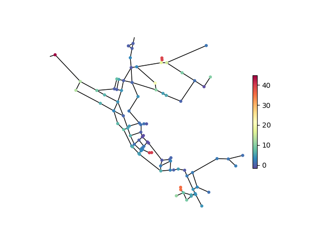
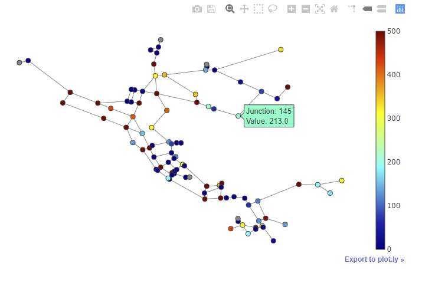
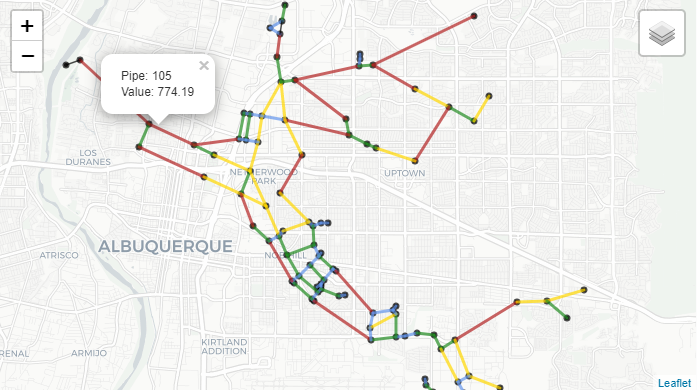
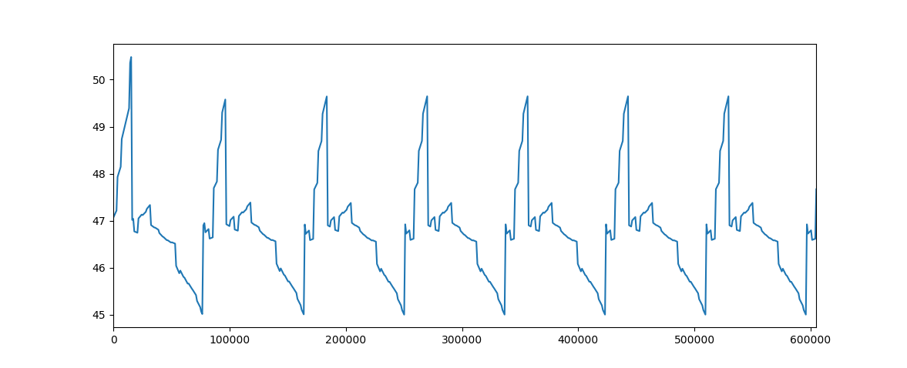
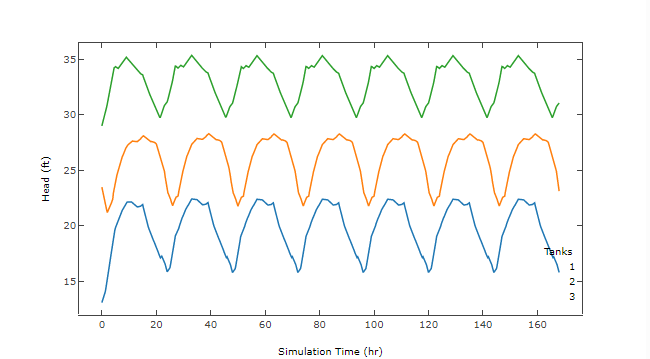
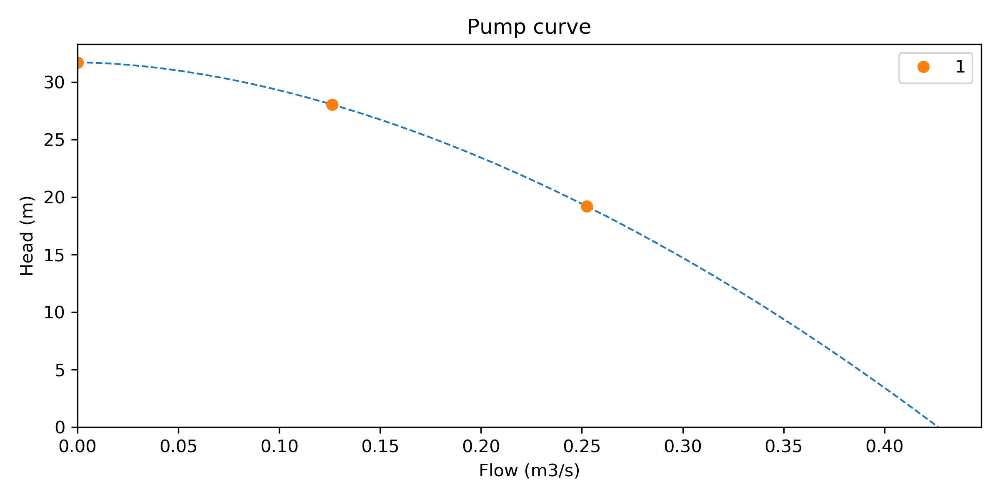
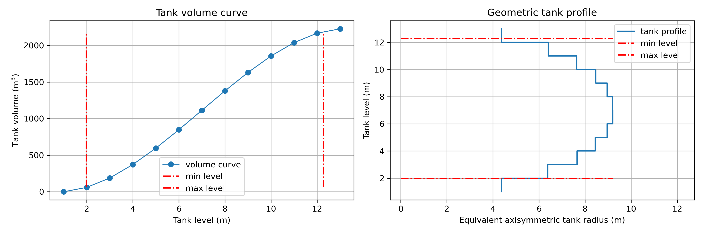

.. raw:: latex

    \clearpage

.. doctest::
    :hide:

    >>> import wntr
    >>> import numpy as np
    >>> import matplotlib.pylab as plt
    >>> import plotly
    >>> from __future__ import print_function
    >>> try:
    ...    wn = wntr.network.model.WaterNetworkModel('../examples/networks/Net3.inp')
    ... except:
    ...    wn = wntr.network.model.WaterNetworkModel('examples/networks/Net3.inp')
	
Graphics
======================================

WNTR includes several functions to plot water network models and to plot 
fragility and pump curves.

Networks
--------------------
Basic network graphics can be generated using the 
function :class:`~wntr.graphics.network.plot_network`.  
A wide range of options can be supplied, including
node attributes, node size, node range, 
link attributes, link width, and link range.

Node and link attributes can be specified using the following options:

* Name of the attribute (i.e., 'elevation' for nodes or 'length' for links), this calls
  :class:`~wntr.network.model.WaterNetworkModel.query_node_attribute` or
  :class:`~wntr.network.model.WaterNetworkModel.query_link_attribute` method on the water network model and returns 
  a pandas Series with node/link names and associated values
* Pandas Series with node/link names and associated values, this option is useful to show simulation results (i.e., ``results.node['pressure'].loc[5*3600, :]``) and metrics (i.e., ``wntr.metrics.population(wn)``)
* Dictionary with node/link names and associated values (similar to pandas Series)
* List of node/link names (i.e., ``['123', '199']``), this highlights the node or link in red

The following example plots the network along with node elevation (:numref:`fig-network-2`).
Note that the :class:`~wntr.graphics.network.plot_network` function returns matplotlib objects 
for the network nodes and edges, which can be further customized by the user.

.. doctest::
    :hide:
    
    >>> fig = plt.figure()
    
.. doctest::

    >>> nodes, edges = wntr.graphics.plot_network(wn, node_attribute='elevation', 
    ...    node_colorbar_label='Elevation (m)')

.. doctest::
    :hide:

    >>> plt.tight_layout()
    >>> plt.savefig('plot_basic_network.png', dpi=300)
    
.. _fig-network-2:

   
   Basic network graphic.
   
Interactive plotly networks
---------------------------------

Interactive plotly network graphics can be generated using the 
function :class:`~wntr.graphics.network.plot_interactive_network`.  
This function produces an HTML file that the user can pan, zoom, and hover-over network elements.
As with basic network graphics, a wide range of plotting options can be supplied. 
However, link attributes currently cannot be displayed on the graphic.

.. note:: 
   This function requires the Python package **plotly**, which is an optional dependency of WNTR.
   
The following example plots the network along with node population (:numref:`fig-plotly`).

.. doctest::

    >>> pop = wntr.metrics.population(wn)
    >>> nodes, edges = wntr.graphics.plot_interactive_network(wn, node_attribute=pop, 
    ...    node_range=[0,500], auto_open=False) # doctest: +SKIP

.. _fig-plotly:

   Interactive network graphic with the legend showing the node population.
   
Interactive Leaflet networks
------------------------------------------
Interactive Leaflet network graphics can be generated using the 
function :class:`~wntr.graphics.network.plot_leaflet_network`. 
This function produces an HTML file that overlays the network model onto a Leaflet map. Leaflet is an open-source JavaScript library for mobile-friendly interactive maps. More information on Leaflet is provided at https://leafletjs.com/.  
The network model should have coordinates in longitude/latitude. 
See :ref:`modify_node_coords` for more information on converting node coordinates.
As with basic network graphics, a wide range of plotting options can be supplied. 

.. note:: 
   This function requires the Python package **folium**, which is an optional dependency of WNTR.
   
The following example converts node coordinates to longitude/latitude and plots the network along 
with pipe length over the city of Albuquerque (for demonstration purposes only) (:numref:`fig-leaflet`).

.. doctest::

    >>> longlat_map = {'Lake':(-106.6851, 35.1344), '219': (-106.5073, 35.0713)}
    >>> wn2 = wntr.morph.convert_node_coordinates_to_longlat(wn, longlat_map)
    >>> length = wn2.query_link_attribute('length')
    >>> wntr.graphics.plot_leaflet_network(wn2, link_attribute=length, link_width=3, 
    ...                                    link_range=[0,1000])

.. _fig-leaflet:

   
   Interactive Leaflet network graphic.
   
.. raw:: html
    
    The interactive Leaflet network graphic is included below.
    
    

        <iframe src="_static/comp_leaflet_map.html" frameborder="0" style="position: absolute; top: 0; left: 0; width: 100%; height: 100%;"></iframe>
    

Network animation
----------------------

Network animation can be generated using the 
function :class:`~wntr.graphics.network.network_animation`. Node and link attributes can be specified using pandas DataFrames, where the 
index is time and columns are the node or link name.  

The following example creates a network animation of node quality over time.

.. doctest::

    >>> sim = wntr.sim.EpanetSimulator(wn)
    >>> results = sim.run_sim()
    >>> quality = results.node['quality']
    >>> wntr.graphics.network_animation(wn, node_attribute=quality) # doctest: +SKIP
   
Time series
------------------

Time series graphics can be generated using options available in Matplotlib and pandas.

The following example plots simulation results from above, showing pressure at a single node over time (:numref:`fig-timeseries`).

.. doctest::
    :hide:
    
    >>> fig = plt.figure()
    
.. doctest::

    >>> pressure_at_node123 = results.node['pressure'].loc[:,'123']
    >>> ax = pressure_at_node123.plot()
    >>> text = ax.set_xlabel("Time (s)")
    >>> text = ax.set_ylabel("Pressure (m)") 

.. _fig-timeseries:

   
   Time series graphic.
	
Interactive time series
--------------------------------

Interactive time series graphics are useful when visualizing large datasets.  
Basic time series graphics can be converted to interactive time series graphics using the ``plot_mpl`` function from plotly.

.. note:: 
   This functionality requires the Python package **plotly**, which is an optional dependency of WNTR.
   
The following example uses simulation results from above, and converts the graphic to an interactive graphic  (:numref:`fig-interactive-timeseries`).

.. doctest::

    >>> tankH = results.node['pressure'].loc[:,wn.tank_name_list]
    >>> tankH = tankH * 3.28084 # Convert tank head to ft
    >>> tankH.index /= 3600 # convert time to hours
    >>> ax = tankH.plot(legend=True)
    >>> text = ax.set_xlabel('Time (hr)')
    >>> text = ax.set_ylabel('Head (ft)') 
    >>> plotly.offline.plot_mpl(fig, filename='tankhead_timeseries.html', auto_open=False) # doctest: +SKIP
    
.. _fig-interactive-timeseries:

   
   Interactive time series graphic with the tank heights for Tank 1 (blue), Tank 2 (orange), and Tank 3 (green).
   
.. raw:: html
    
    The interactive time series graphic is included below.
    
    

        <iframe src="_static/tanklevel_timeseries.html" frameborder="0" style="position: absolute; top: 0; left: 0; width: 100%; height: 100%;"></iframe>
    

Fragility curves
-----------------

Fragility curves can be plotted using the 
function :class:`~wntr.graphics.curve.plot_fragility_curve`.

The following example plots a fragility curve with two states (:numref:`fig-fragility2`).

.. doctest::

    >>> from scipy.stats import lognorm
    >>> FC = wntr.scenario.FragilityCurve()
    >>> FC.add_state('Minor', 1, {'Default': lognorm(0.5,scale=0.3)})
    >>> FC.add_state('Major', 2, {'Default': lognorm(0.5,scale=0.7)}) 
    >>> ax = wntr.graphics.plot_fragility_curve(FC, xlabel='Peak Ground Acceleration (g)')

.. _fig-fragility2:
.. figure:: figures/fragility_curve.png
   :width: 800
   :alt: Fragility curve

   Fragility curve graphic.
   
Pump curves
-----------------

Pump curves can be plotted using the 
function :class:`~wntr.graphics.curve.plot_pump_curve`.
By default, a 2nd order polynomial is included in the graphic.

The following example plots a pump curve (:numref:`fig-pump`).

.. doctest::
    :hide:
    
    >>> fig = plt.figure()
    
.. doctest::

    >>> pump = wn.get_link('10')
    >>> ax = wntr.graphics.plot_pump_curve(pump)

.. doctest::
    :hide:

    >>> plt.tight_layout()
    >>> plt.savefig('plot_pump_curve.png', dpi=300)
    
.. _fig-pump:

   Pump curve graphic.
   
Tank volume curves
-------------------

Tank curves and profiles can be plotted using the 
function :class:`~wntr.graphics.curve.plot_tank_volume_curve`.

The following example creates a tank curve and then plots the curve and 
corresponding tank profile (:numref:`fig-tank`). The profile is 
plotted as a stairstep line between points.  The minimum and maximum 
level of the tank is included in the figure.

.. doctest::
    :hide:
    
    >>> fig = plt.figure()
    
.. doctest::

    >>> wn.add_curve('Curve', 'VOLUME', [
    ...    (1,	0),
    ...    (2,	60),
    ...    (3,	188),
    ...    (4,	372),
    ...    (5,	596),
    ...    (6,	848),
    ...    (7,	1114),
    ...    (8,	1379),
    ...    (9,	1631),
    ...    (10, 1856),
    ...    (11, 2039),
    ...    (12, 2168),
    ...    (13, 2228)])
    >>> tank = wn.get_node('2')
    >>> tank.vol_curve_name = 'Curve'
    >>> ax = wntr.graphics.plot_tank_volume_curve(tank)

.. doctest::
    :hide:

    >>> plt.tight_layout()
    >>> plt.savefig('plot_tank_volume_curve.png', dpi=300)
    
.. _fig-tank:

   Tank curve and profile graphic.
   