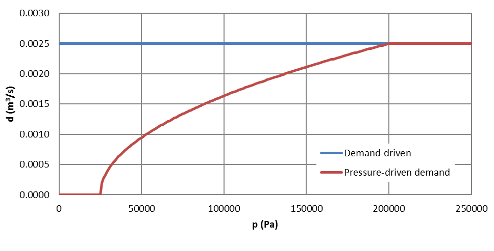
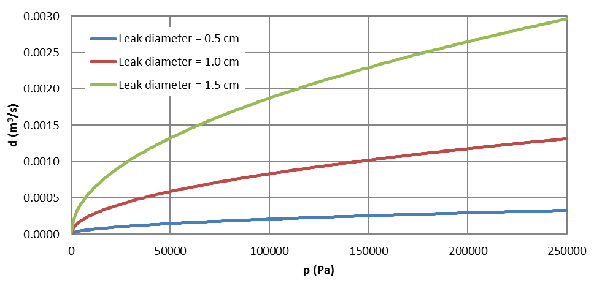

.. raw:: latex

    \clearpage

Hydraulic simulation
==============================

WNTR contains two simulators: the EpanetSimulator and the WNTRSimulator.
See :ref:`software_framework` for more information on features and limitations of these simulators. 

EpanetSimulator
-----------------
The EpanetSimulator can be used to run EPANET 2.00.12 Programmer's Toolkit [Ross00]_ or EPANET 2.2.0 Programmer's Toolkit [EPANET22]_.  
EPANET 2.2.0 is used by default and runs demand-driven and pressure dependent hydraulic analysis.  
EPANET 2.00.12 runs demand-driven hydraulic analysis only.
Both versions can also run water quality simulations, as described in :ref:`water_quality_simulation`.  

The user can switch between pressure dependent demand (PDD) or demand-driven (DD) hydraulic simulation by setting
the ``wn.options.hydraulic.demand_model`` option.

.. doctest::
    :hide:

    >>> import wntr
    >>> try:
    ...    wn = wntr.network.model.WaterNetworkModel('../examples/networks/Net3.inp')
    ... except:
    ...    wn = wntr.network.model.WaterNetworkModel('examples/networks/Net3.inp')

.. doctest::

	>>> wn.options.hydraulic.demand_model = 'DD'  
	>>> wn.options.hydraulic.demand_model = 'PDD'
	
.. note:: 
   EPANET 2.2.0 uses the terms demand-driven analysis (DDA) and pressure driven 
   analysis (PDA).  In WNTR, the user can select demand-driven using 'DD' or 'DDA'
   and pressure dependent demand using 'PDD' or 'PDA'.

A hydraulic simulation using the EpanetSimulator is run using the following code:
	
.. doctest::

	>>> sim = wntr.sim.EpanetSimulator(wn)
	>>> results = sim.run_sim() # by default, this runs EPANET 2.2.0
	
The user can switch between EPANET version 2.00.12 and 2.2.0 as shown below:

.. doctest::

	>>> results1 = sim.run_sim(version=2.0) # runs EPANET 2.00.12
	>>> results2 = sim.run_sim(version=2.2) # runs EPANET 2.2.0
	
WNTRSimulator
-----------------
The WNTRSimulator is a hydraulic simulation engine based on the same equations
as EPANET. The WNTRSimulator does not include equations to run water quality 
simulations. The WNTRSimulator includes the option to simulate leaks, and run hydraulic simulations
in demand-driven or pressure dependent demand mode.

As with the EpanetSimulator, the user can switch between DD and PDD by setting
the ``wn.options.hydraulic.demand_model`` option.  

.. doctest::

	>>> wn.options.hydraulic.demand_model = 'DD'  
	>>> wn.options.hydraulic.demand_model = 'PDD'
	
A hydraulic simulation using the WNTRSimulator is run using the following code:

.. doctest::

	>>> sim = wntr.sim.WNTRSimulator(wn)
	>>> results = sim.run_sim()

More information on the simulators can be found in the API documentation, under
:class:`~wntr.sim.epanet.EpanetSimulator` and 
:class:`~wntr.sim.core.WNTRSimulator`.

Hydraulic options
-------------------
The hydraulic simulation options include 
headloss model, 
viscosity, 
diffusivity, 
trails,
accuracy,
default pattern, 
demand multiplier, 
demand model,
minimum pressure,
required pressure, and 
pressure exponent.
Note that EPANET 2.0.12 does not use the demand model, minimum pressure, required pressure, or pressure exponent.
Options that directly apply to hydraulic simulation that are not used in the
WNTRSimulator are described in :ref:`limitations`.   

When creating a water network model from an EPANET INP file, hydraulic options are populated from the [OPTIONS] sections of the EPANET INP file.
All of these options can be modified in WNTR and then written to an EPANET INP file.
More information on water network options can be found in :ref:`options`. 

Mass balance at nodes
-------------------------
Both simulators use the mass balance equations from EPANET [Ross00]_:

.. math::

    \sum_{p \in P_{n}} q_{p,n} - D_{n}^{act} = 0 \hspace{1in} \forall n \in N
    
where 
:math:`P_{n}` is the set of pipes connected to node :math:`n`, 
:math:`q_{p,n}` is the flow rate of water into node :math:`n` from pipe :math:`p` (m³/s), 
:math:`D_{n}^{act}` is the actual demand out of node :math:`n` (m³/s), and 
:math:`N` is the set of all nodes. 
If water is flowing out of node :math:`n` and into pipe :math:`p`, then 
:math:`q_{p,n}` is negative. Otherwise, it is positive.

Headloss in pipes
-------------------------
Both simulators use the Hazen-Williams headloss formula from EPANET [Ross00]_:

.. math:: H_{n_{j}} - H_{n_{i}} = h_{L} = 10.667 C^{-1.852} d^{-4.871} L q^{1.852}

where 
:math:`h_{L}` is the headloss in the pipe (m), 
:math:`C` is the Hazen-Williams roughness coefficient (unitless), 
:math:`d` is the pipe diameter (m), 
:math:`L` is the pipe length (m),  
:math:`q` is the flow rate of water in the pipe (m³/s),
:math:`H_{n_{j}}` is the head at the starting node (m), and 
:math:`H_{n_{i}}` is the head at the ending node (m).

The flow rate in a pipe is positive if water is flowing from
the starting node to the ending node and negative if water is flowing
from the ending node to the starting node. 

The WNTRSimulator solves for pressures and flows throughout the network 
as a set of linear equations.
However, the Hazen-Williams headloss formula is not valid for negative
flow rates. Therefore, the WNTRSimulator uses a reformulation of this constraint. 

For :math:`q<0`:

.. math:: h_{L} = -10.667 C^{-1.852} d^{-4.871} L |q|^{1.852} 

For :math:`q \geq 0`:

.. math:: h_{L} = 10.667 C^{-1.852} d^{-4.871} L |q|^{1.852}

These equations are symmetric across the origin
and valid for any :math:`q`. Thus, this equation can be used for flow in
either direction. However, the derivative with respect to :math:`q` at :math:`q = 0` 
is :math:`0`. In certain scenarios, this can cause the Jacobian matrix of the
set of hydraulic equations to become singular (when :math:`q=0`). 
To overcome this limitation, the WNTRSimulator
splits the domain of :math:`q` into six segments to
create a piecewise smooth function.

.. as presented below.

	.. math::

		\frac{h_{L}}{k} &= -|q|^{1.852}                           \hspace{2.5in}      q < -q_{2} \\
		\frac{h_{L}}{k} &= -(a |q|^{3} + b |q|^{2} + c |q| + d)   \hspace{1in}      -q_{2} \leq q \leq -q_{1} \\
		\frac{h_{L}}{k} &= -m |q|                                 \hspace{2.4in}      -q_{1} < q \leq  0 \\
		\frac{h_{L}}{k} &= m |q|                                  \hspace{2.75in}      0 < q < q_{1}  \\
		\frac{h_{L}}{k} &= a |q|^{3} + b |q|^{2} + c |q| + d      \hspace{1.5in}      q_{1} \leq q \leq q_{2} \\
		\frac{h_{L}}{k} &= |q|^{1.852}                            \hspace{2.6in}      q_{2} < q 

	where 
	:math:`m` is 0.001,
	:math:`q_{1}` is 0.0002,  
	:math:`q_{2}` is 0.0004,
	a = (2*(f1-f2) - (q1-q2)*(df2+df1))/(q2**3-q1**3+3*q1*q2*(q1-q2))
	b = (df1 - df2 + 3*(q2**2-q1**2)*a)/(2*(q1-q2))
	c = df2 - 3*q2**2*a - 2*q2*b
	d = f2 - q2**3*a - q2**2*b - q2*c
	f1 = m* q1
	f2 =q2**1.852
	df1 = m
	df2 = 1.852* q2**0.852

	.. math:: 

		k = 10.667 C^{-1.852} d^{-4.871} L

	Internally, these equations are reformulation to handle absolute values. 
	The result is that flow can be in either
	direction and the derivative with respect to :math:`q` is non-zero at all
	values of :math:`q`. The two polynomials function to smooth the transition between the other equations, with coefficients chosen so that both function and
	gradient values are continuous at :math:`-q_{2}`, :math:`-q_{1}`, :math:`q_{1}`, and
	:math:`q_{2}`. 
	
Demand-driven simulation
-------------------------

In a demand-driven simulation, the pressure in the system depends on the node demands.
The mass balance and headloss equations described above are solved assuming 
that node demands are known and satisfied.  
This assumption is reasonable under normal operating conditions and for use in network design.  
Both simulators can run hydraulics using demand-driven simulation.

Pressure dependent demand simulation
--------------------------------------

In situations that lead to low pressure conditions (i.e., fire fighting, 
power outages, pipe leaks), consumers do not always receive their requested 
demand and a pressure dependent demand simulation is recommended.
In a pressure dependent demand simulation, the delivered demand depends on the pressure.  
The mass balance and headloss equations described above are solved by 
simultaneously determining demand along with the network pressures and flow rates.  

The WNTRSimulator can run hydraulics using a pressure dependent demand simulation
according to the following pressure-demand relationship [WaSM88]_:

.. math::

	d = 
	\begin{cases}
	0 & p \leq P_0 \\
	D_f(\frac{p-P_0}{P_f-P_0})^e & P_0 \leq p \leq P_f \\
	D_f & p \geq P_f
	\end{cases}

where 
:math:`d` is the actual demand (m³/s), 
:math:`D_f` is the desired demand (m³/s), 
:math:`p` is the pressure (Pa), 
:math:`P_f` is the required pressure (Pa) - this is the pressure above which the consumer should receive the desired demand, and 
:math:`P_0` is the minimum pressure (Pa) - this is the pressure below which the consumer cannot receive any water, 
:math:`e` is the pressure exponent, usually set equal to 0.5.
The set of nonlinear equations comprising the hydraulic 
model and the pressure-demand relationship is solved directly using a 
Newton-Raphson algorithm.  

:numref:`fig-pressure-dependent` illustrates the pressure-demand relationship using both the demand-driven and pressure dependent demand simulations.
In the example, 
:math:`D_f` is 0.0025 m³/s (39.6 GPM),
:math:`P_f` is 30 psi, and 
:math:`P_0` is 5 psi.
Using the demand-driven simulation, the demand is equal to :math:`D_f` regardless of pressure.  
Using the pressure dependent demand simulation, the demand starts to decrease when the pressure is below :math:`P_f` and goes to 0 when pressure is below :math:`P_0`.

.. _fig-pressure-dependent:

   
   Relationship between pressure (p) and demand (d) using both the demand-driven and pressure dependent demand simulations.

The following example sets required and minimum pressure for each junction.  Note that required and minimum pressure can vary throughout the network.

.. doctest::

    >>> for name, node in wn.junctions():
    ...     node.required_pressure = 21.097 # 30 psi
    ...     node.minimum_pressure = 3.516 # 5 psi
    
Leak model
-------------------------

The WNTRSimulator includes the ability to add leaks to the network.
The leak is modeled with a general form of the equation proposed by Crowl and Louvar
[CrLo02]_ where the mass flow rate of fluid through the hole is expressed as:

.. math::

	d_{leak} = C_{d} A p^{\alpha} \sqrt{\frac{2}{\rho}}

where 
:math:`d_{leak}` is the leak demand (m³/s),
:math:`C_d` is the discharge coefficient (unitless), 
:math:`A` is the area of the hole (m²), 
:math:`p` is the gauge pressure inside the pipe (Pa), 
:math:`\alpha` is the discharge coefficient, and 
:math:`\rho` is the density of the fluid.
The default discharge coefficient is 0.75 (assuming turbulent flow), but 
the user can specify other values if needed.  
The value of :math:`\alpha` is set to 0.5 (assuming large leaks out of steel pipes).  
Leaks can be added to junctions and tanks.  
A pipe break is modeled using a leak area large enough to drain the pipe.  
WNTR includes methods to add leaks to any location along a pipe by splitting the pipe into two sections and adding a node. 

:numref:`fig-leak` illustrates leak demand.
In the example, the diameter of the leak is set to 0.5 cm, 1.0 cm, and 1.5 cm. 

.. _fig-leak:

   
   Relationship between leak demand (d) and pressure (p).

The following example adds a leak to the water network model.

.. doctest::

    >>> node = wn.get_node('123')           
    >>> node.add_leak(wn, area=0.05, start_time=2*3600, end_time=12*3600)
    
Pause and restart 
------------------

The WNTRSimulator includes the ability to 

* Reset initial values and re-simulate using the same water network model.  Initial values include simulation time, tank head, reservoir head, pipe status, pump status, and valve status.

* Pause a hydraulic simulation, change network operations, and then restart the simulation

* Save the water network model and results to files and reload for future analysis

These features are helpful when evaluating various response action plans or when 
simulating long periods of time where the time resolution might vary.

The following example runs a hydraulic simulation for 10 hours and then restarts the simulation for another 14 hours.
The results from the first 10 hours and last 14 hours can be combined for analysis or analyzed separately.  Furthermore, 
network operations can be modified between simulations.

.. doctest::

    >>> wn.options.time.duration = 10*3600
    >>> sim = wntr.sim.WNTRSimulator(wn)
    >>> first_10_hours_results = sim.run_sim()
    >>> wn.options.time.duration = 24*3600
    >>> sim = wntr.sim.WNTRSimulator(wn)
    >>> last_14_hours_results = sim.run_sim()
    
To restart the simulation from time zero, the user has several options.

1. Use the existing water network model and reset initial conditions. 
   Initial conditions include simulation time, tank head, reservoir head, pipe status, pump status, and valve status.
   This option is useful when only initial conditions have changed between simulations.
   
   .. doctest::

       >>> wn.reset_initial_values()

2. Save the water network model to a file and reload that file each time a simulation is run.  
   A pickle file is generally used for this purpose.  
   A pickle file is a binary file used to serialize and de-serialize a Python object.
   This option is useful when the water network model contains custom controls that would not be reset using the option 1, 
   or when the user wants to change operations between simulations.
   
   The following example saves the water network model to a file before using it in a simulation.
   
   .. doctest::

       >>> import pickle
       >>> f=open('wn.pickle','wb')
       >>> pickle.dump(wn,f)
       >>> f.close()
       >>> sim = wntr.sim.WNTRSimulator(wn)
       >>> results = sim.run_sim()
    
   The next example reload the water network model from the file before the next simulation.
   
   .. doctest::
   
       >>> f=open('wn.pickle','rb')
       >>> wn = pickle.load(f)
       >>> f.close()
       >>> sim = wntr.sim.WNTRSimulator(wn)
       >>> results = sim.run_sim()
    
If these options do not cover user specific needs, then the water network
model would need to be recreated between simulations or reset by hand.
Note that when using the EpanetSimulator, the model is reset each time it is used in 
a simulation.

Advanced: Customized models with WNTR's AML
-------------------------------------------

WNTR has a custom algebraic modeling language (AML) that is used for
WNTR's hydraulic model (used in the
:class:`~wntr.sim.core.WNTRSimulator`). This AML is primarily used for
efficient evaluation of constraint residuals and derivatives. WNTR's
AML drastically simplifies the implementation, maintenance,
modification, and customization of hydraulic models. The AML allows
defining variables and constraints in a natural way. For example,
suppose the user wants to solve the following system of nonlinear equations.

.. math::

   y - x^{2} = 0 \\
   y - x - 1 = 0

To create this model using WNTR's AML, the following can be used:
   
.. doctest::

   >>> from wntr.sim import aml
   >>> m = aml.Model()
   >>> m.x = aml.Var(1.0)
   >>> m.y = aml.Var(1.0)
   >>> m.c1 = aml.Constraint(m.y - m.x**2)
   >>> m.c2 = aml.Constraint(m.y - m.x - 1)

Before evaluating the constraint residuals or the Jacobian, :func:`~wntr.sim.aml.aml.Model.set_structure` must be called:

.. doctest::

   >>> m.set_structure()
   >>> m.evaluate_residuals() # doctest: +SKIP
   array([ 0., -1.])
   >>> m.evaluate_jacobian()  # doctest: +SKIP
   <2x2 sparse matrix of type '<class 'numpy.float64'>'
	with 4 stored elements in Compressed Sparse Row format>
   >>> m.evaluate_jacobian().toarray() # doctest: +SKIP
   array([[-2.,  1.],
       [-1.,  1.]])

The methods :func:`~wntr.sim.aml.aml.Model.evaluate_residuals` and
:func:`~wntr.sim.aml.aml.Model.evaluate_jacobian` return a NumPy array
and a SciPy sparse CSR matrix, respectively. Variable values can also
be loaded with a NumPy array. For example, a Newton
step (without a line search) would look something like

.. doctest::

   >>> from scipy.sparse.linalg import spsolve
   >>> x = m.get_x()
   >>> d = spsolve(m.evaluate_jacobian(), -m.evaluate_residuals())
   >>> x += d
   >>> m.load_var_values_from_x(x)
   >>> m.evaluate_residuals() # doctest: +SKIP
   array([-1., 0.])

WNTR includes an implementation of Newton's Method with a line search
which can solve one of these models.

.. doctest::

   >>> from wntr.sim.solvers import NewtonSolver
   >>> opt = NewtonSolver()
   >>> res = opt.solve(m)
   >>> m.x.value # doctest: +SKIP
   1.618033988749989
   >>> m.y.value # doctest: +SKIP
   2.618033988749989
