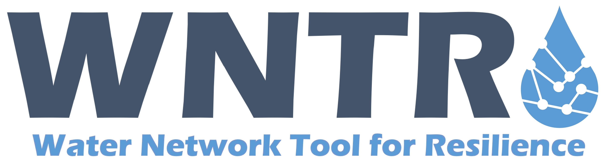

   
========================================
Water Network Tool for Resilience (WNTR)
========================================

The Water Network Tool for Resilience (WNTR) is an EPANET compatible Python package 
designed to simulate and analyze resilience of water distribution networks.

The official WNTR software repository is hosted in the U.S. EPA's GitHub organization
(https://github.com/USEPA/WNTR); releases are available via PyPI and conda-forge
(see :ref:`installation`).

Key Features in WNTR
=====================

.. list-table:: 
   :widths: 65 35
   :header-rows: 0

   * - .. _fig_wntr_features:
       .. figure:: figures/wntr_features.png
          :width: 750
     - .. include:: attention.rst
	   
.. toctree::
   :maxdepth: 1
   :hidden:

   userguide
   wntr-api
   users

.. include:: citing_wntr.rst

US EPA Disclaimer
=================

The U.S. Environmental Protection Agency through its Office of Research and Development funded and collaborated 
in the research described here under an Interagency Agreement with the Department of Energy's Sandia National Laboratories.
It has been subjected to the Agency's review and has been approved for publication. Note that approval does not signify that 
the contents necessarily reflect the views of the Agency. Mention of trade names products, or services does not convey official 
EPA approval, endorsement, or recommendation.  

Sandia Funding Statement
========================

Sandia National Laboratories is a multimission laboratory managed and operated by National Technology and 
Engineering Solutions of Sandia, LLC., a wholly owned subsidiary of Honeywell International, Inc., for the 
U.S. Department of Energy's National Nuclear Security Administration under contract DE-NA-0003525.

