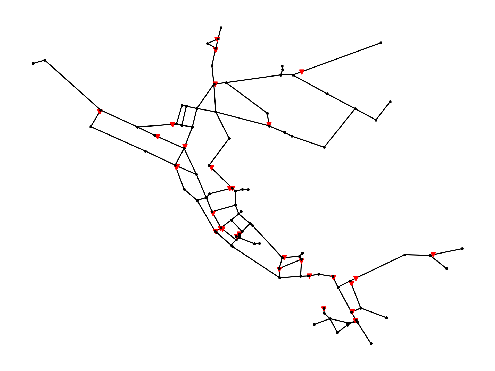
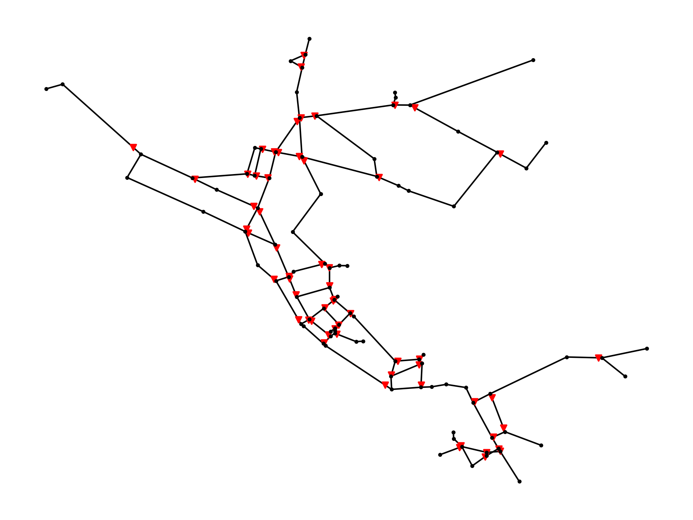

.. raw:: latex

    \clearpage
	
Data layers
======================================

Data layers contain data which are not part of the water network model or graph, but can be used in analysis.
Currently, WNTR includes a data format for valve layers; additional data layers can be added in the future.

.. _valvelayer:

Valve layer
------------

While valves are typically included in the water network model, the user can also define a valve layer to be used in additional analysis.
A valve layer can be used to group links and nodes into segments based on the location of isolation valves.
The segments can be used to compute valve layer attributes, including 
the number of valves surrounding each valve,
the increase in segment demand if a given valve is removed, and 
the increase in segment pipe length if a given valve is removed.                                   
See :ref:`topographic_metrics` for more details.
An example is included in the :ref:`graphics` section.

In a valve layer, the location of each valve is defined using the link the valve is installed on 
and the node the valve protects. This information is stored in a pandas DataFrame, which is indexed by valve 
number with columns named 'link' and 'node.'
For example, the following valve layer defines a valve on Pipe 1 that protects Junction A (:numref:`fig-valve-layer`).

.. doctest::
    :hide:

    >>> import wntr
    >>> import numpy as np
    >>> import pandas as pd
    >>> import matplotlib.pylab as plt
    >>> try:
    ...    wn = wntr.network.model.WaterNetworkModel('../examples/networks/Net3.inp')
    ... except:
    ...    wn = wntr.network.model.WaterNetworkModel('examples/networks/Net3.inp')
    >>> np.random.seed(123)
    >>> valve_layer = pd.DataFrame(columns=['link', 'node'])
    >>> valve_layer.loc[0] = ['Pipe 1', 'Junction A']
    
.. doctest::

    >>> print(valve_layer)
         link        node
    0  Pipe 1  Junction A
    
.. _fig-valve-layer:

   Example valve placement.

WNTR includes a method to generate valve layers based on **random** or **strategic** placement.  
The following example generates a **random** valve placement with 40 valves, 
"head()" is used to return the first 5 rows.
The valve layer can be included in water network graphics (:numref:`fig-random-valve-layer`).

.. doctest::

    >>> import wntr # doctest: +SKIP
	
    >>> wn = wntr.network.WaterNetworkModel('networks/Net3.inp') # doctest: +SKIP
    >>> random_valve_layer = wntr.network.generate_valve_layer(wn, 'random', 40)
    >>> print(random_valve_layer.head())
      link node
    0  317  273
    1  221  161
    2  283  239
    3  295  249
    4  303  257
    >>> ax = wntr.graphics.plot_valve_layer(wn, random_valve_layer, add_colorbar=False)
    
.. doctest::
    :hide:

    >>> plt.tight_layout()
    >>> plt.savefig('random_valve_layer.png', dpi=300)

.. _fig-random-valve-layer:

   
   Valve layer using random placement.
   
The **strategic** placement specifies the number of pipes (n) from each node that do NOT contain a valve.  
In this case, n is generally 0, 1, or 2 (i.e., N, N-1, or N-2 valve placement) [WaWC06]_ [LWFZ17]_.
For example, if three pipes connect to a node and n = 2, then two of those pipes will not contain a valve and one pipe will contain a valve.
The following example generates a strategic N-2 valve placement.
The valve layer can be included in water network graphics (:numref:`fig-strategic-valve-layer`).

.. doctest::

    >>> strategic_valve_layer = wntr.network.generate_valve_layer(wn, 'strategic', 2)
    >>> ax = wntr.graphics.plot_valve_layer(wn, strategic_valve_layer, add_colorbar=False)
    
.. doctest::
    :hide:

    >>> plt.tight_layout()
    >>> plt.savefig('strategic_valve_layer.png', dpi=300)

.. _fig-strategic-valve-layer:

   
   Valve layer using strategic N-2 placement.
