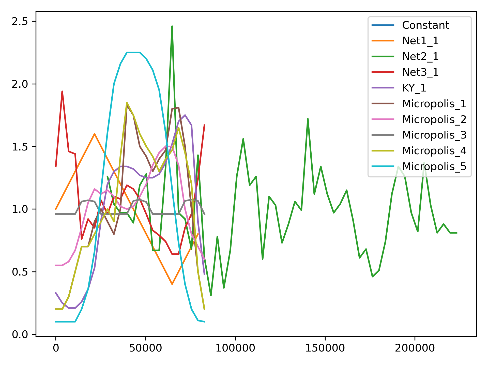
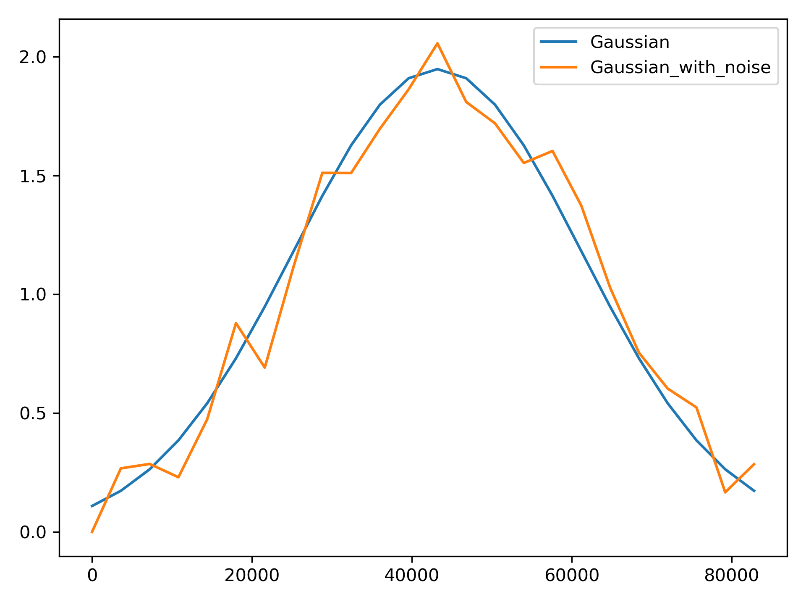
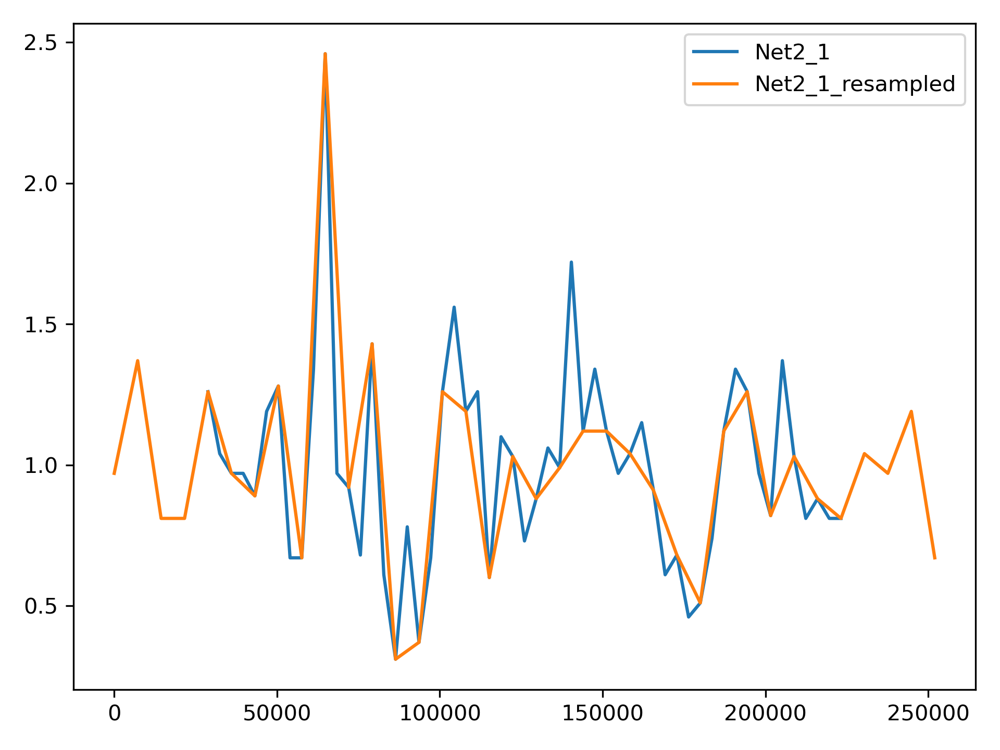

.. raw:: latex

    \clearpage

.. _options:

.. doctest::
    :hide:

    >>> import matplotlib.pylab as plt
	
Libraries
================================

WNTR includes the following libraries to help create water network models. 
Libraries reside in the :class:`wntr.library` module.

* :ref:`model_library`
* :ref:`demand_pattern_library`
* :ref:`msx_library`

.. _model_library:

Model library
----------------------

The :class:`~wntr.library.model_library.ModelLibrary` class contains methods to define
a dictionary mapping of model names to EPANET INP file paths.  
The model names can then be used to build water network models.
Additional models can be added to the library by adding file paths to the library 
directories.

The model library that is used by the :class:`~wntr.network.model.WaterNetworkModel` 
is stored in ``wntr.library.model_library``.  The library includes EPANET INP files that 
are distributed with WNTR.

The following example prints model names in the model library and then uses 
Net3 to create a WaterNetworkModel.

.. doctest::

    >>> import wntr
    
    >>> model_library = wntr.library.model_library
    
    >>> print(model_library.model_name_list) # doctest: +SKIP
    ['ky10', 'ky4', 'Net1', 'Net2', 'Net3', 'Net6']
    
    >>> print(model_library.get_filepath('Net3')) # doctest: +SKIP
    '...\wntr\library\networks\Net3.inp'

    # Note that the absolute path is stored in the library
    
    >>> wn = wntr.network.WaterNetworkModel('Net3')

The following notional example illustrates how to add EPANET INP files that reside in a user specified directory, 
(in this case, C:\\Users\username\INP_files), 
and then create a model from an INP file in that directory 
(in this case, MyINP.inp).

.. doctest::

    >>> model_library.add_directory('C:\\Users\username\INP_files') # doctest: +SKIP
    >>> wn = wntr.network.WaterNetworkModel('MyINP') # doctest: +SKIP

.. _demand_pattern_library:

Demand pattern library
----------------------

The :class:`~wntr.library.demand_library.DemandPatternLibrary` class contains demand patterns 
and methods to help create and modify patterns.  
The demand pattern library can be used to add or modify patterns in a :class:`~wntr.network.model.WaterNetworkModel`.

An instance of the demand pattern library is stored in ``wntr.library.demand_library``.
The default demand pattern library contains patterns from Net1, Net2, Net3, and Micropolis water network models.  
Additional patterns can be added to the default library to be accessed in later sessions.
A sample entry from the default demand pattern library is shown below:: 

	{
		"name": "Micropolis_2",
		"category": "Residential",
		"description": "Residential",
		"citation": "Brumbelow, Kelly, 02 Micropolis (2021). Synthetic Systems. 4. https://uknowledge.uky.edu/wdst_synthetic/4",
		"start_clocktime": 0,
		"pattern_timestep": 3600,
		"wrap": true,
		"multipliers": [
			0.55, 0.55, 0.58, 0.67, 0.85, 1.05,
			1.16, 1.12, 1.15, 1.1, 1.02, 1.0,
			1.02, 1.1, 1.2, 1.35, 1.45, 1.5,
			1.5, 1.35, 1.0, 0.8, 0.7, 0.6]
	}

The demand pattern library includes the following capabilities:

* Load a library of patterns from a JSON file - :meth:`~wntr.library.demand_library.DemandPatternLibrary.__init__`
* Add a pattern to the library - :meth:`~wntr.library.demand_library.DemandPatternLibrary.add_pattern`
* Create a pulse pattern (on/off sequence) - :meth:`~wntr.library.demand_library.DemandPatternLibrary.add_pulse_pattern`
* Create a pattern that follows a gaussian distribution - :meth:`~wntr.library.demand_library.DemandPatternLibrary.add_gaussian_pattern`
* Create a pattern that follows a triangular distribution - :meth:`~wntr.library.demand_library.DemandPatternLibrary.add_triangular_pattern`
* Combine patterns - :meth:`~wntr.library.demand_library.DemandPatternLibrary.add_combined_pattern`
* Create a copy of a pattern - :meth:`~wntr.library.demand_library.DemandPatternLibrary.copy_pattern`
* Modify the pattern timestep or start clocktime - :meth:`~wntr.library.demand_library.DemandPatternLibrary.resample_multipliers`
* Add gaussian random noise to a pattern - :meth:`~wntr.library.demand_library.DemandPatternLibrary.apply_noise`
* Normalize the pattern to have a mean of 1 - :meth:`~wntr.library.demand_library.DemandPatternLibrary.normalize_pattern`
* Filter patterns by category - :meth:`~wntr.library.demand_library.DemandPatternLibrary.filter_by_category`
* Create a :class:`~wntr.network.elements.Pattern` object to add the pattern to a :class:`~wntr.network.model.WaterNetworkModel` - :meth:`~wntr.library.demand_library.DemandPatternLibrary.to_Pattern`
* Create a Pandas Series (pattern indexed by time in seconds) to easily analyze or further modify the pattern - :meth:`~wntr.library.demand_library.DemandPatternLibrary.to_Series`
* Plot patterns - :meth:`~wntr.library.demand_library.DemandPatternLibrary.plot_patterns`
* Save and load custom libraries for use in subsequent projects - :meth:`~wntr.library.demand_library.DemandPatternLibrary.write_json`
Each library entry is defined as a dictionary with the following keys:

* **name**: Pattern name (string)
* **category**: Pattern category (string, optional)
* **description**: Pattern description (string, optional)
* **citation**: Pattern citation (string, optional)
* **start_clocktime**: Time of day (in seconds from midnight) at which pattern begins (integer)
* **pattern_timestep**: Pattern timestep in seconds (integer)
* **wrap**: Indicates if the sequence of pattern values repeats (True or False)
* **multipliers**: Pattern values (list of floats)

Note that the pattern duration is not explicitly defined.  Duration is inferred from the list of multipliers and the pattern timestep.
Several methods include duration as a optional input argument to change how long multipliers are repeated.  
If wrap = False, the pattern values are set to 0 after the final multiplier value.

The following examples illustrate the functionality of the demand pattern library, including creation, modification, and combination of patterns. 
Note, methods that add or modify patterns return a pandas Series of the pattern.

Load the default demand pattern library, print names of the library entries, and plot patterns.

.. doctest::

    >>> from wntr.library.demand_library import DemandPatternLibrary
    >>> demand_library = wntr.library.demand_library
    >>> print(demand_library.pattern_name_list)
    ['Null', 'Constant', 'Net1_1', 'Net2_1', 'Net3_1', 'KY_1', 'Micropolis_1', 'Micropolis_2', 'Micropolis_3', 'Micropolis_4', 'Micropolis_5']
    >>> ax = demand_library.plot_patterns()
	
.. doctest::
    :hide:
    
    >>> plt.tight_layout()
    >>> plt.savefig('demand_library.png', dpi=300)
	
.. _fig_demand_library:

   Demand library patterns.
   
Add a pulse and gaussian pattern.

.. doctest::

    >>> on_off_sequence=[3*3600,6*3600,14*3600,20*3600]
    >>> series = demand_library.add_pulse_pattern('Pulse', on_off_sequence)
    >>> series = demand_library.add_gaussian_pattern('Gaussian', mean=12*3600, 
    ...     std=5*3600, duration=24*3600, pattern_timestep=3600, 
    ...     start_clocktime=0, normalize=True)

Add noise to a pattern.

.. doctest::

    >>> demand_library.copy_pattern('Gaussian', 'Gaussian_with_noise')
    >>> series = demand_library.apply_noise('Gaussian_with_noise', 0.1, normalize=True,
    ...     seed=123)
    >>> ax = demand_library.plot_patterns(names=['Gaussian', 'Gaussian_with_noise'])

.. doctest::
    :hide:
    
    >>> plt.tight_layout()
    >>> plt.savefig('demand_library_gaussian.png', dpi=300)
	
.. _fig_demand_library_gaussian:

   Demand patterns, with and without noise.
   
Return a Pandas Series of the pattern.

.. doctest::

    >>> series = demand_library.to_Series('Gaussian_with_noise', duration=48*3600)
    >>> print(series.head())
    0        7.474e-04
    3600     2.676e-01
    7200     2.862e-01
    10800    2.302e-01
    14400    4.742e-01
    dtype: float64

Create a library of only commercial patterns.

.. doctest::

    >>> from wntr.library.demand_library import DemandPatternLibrary
    >>> commercial_patterns = demand_library.filter_by_category('Commercial')
    >>> commercial_demand_library = DemandPatternLibrary(commercial_patterns)
    >>> print(commercial_demand_library.pattern_name_list)
    ['Micropolis_1', 'Micropolis_4', 'Micropolis_5']

Resample a pattern with new time parameters.  This is useful when applying patterns to a network with different start clocktime and/or pattern timestep.
For example, pattern "Net2_1", which has a start clocktime of 28800 seconds and pattern timestep of 3600 seconds, 
can be resampled so it can be used in Net1, which has a start clocktime of 0 seconds and pattern timestep of 7200 seconds.

.. doctest::

    >>> demand_library.copy_pattern('Net2_1', 'Net2_1_resampled')
    >>> series = demand_library.resample_multipliers('Net2_1_resampled', duration=3*24*3600,
    ...     pattern_timestep=7200, start_clocktime=0)
    >>> ax = demand_library.plot_patterns(names=['Net2_1', 'Net2_1_resampled'])

.. doctest::
    :hide:
    
    >>> plt.tight_layout()
    >>> plt.savefig('demand_library_resampled.png', dpi=300)
	
.. _fig_demand_library_resampled:

   Demand patterns, with and without resampling to match the start clocktime and pattern timestep of Net1.
   
Add the new pattern to a :class:`~wntr.network.model.WaterNetworkModel` of Net1.

.. doctest::

    >>> wn = wntr.network.WaterNetworkModel('Net1')
    >>> junction = wn.get_node('11')
	
    >>> pattern = demand_library.to_Pattern('Net2_1_resampled')
    >>> category = demand_library.library['Net2_1_resampled']['category']
	
    >>> wn.add_pattern('from_Net2', pattern)
    >>> junction.add_demand(base=5e-5, pattern_name='from_Net2', category=category)
    >>> print(junction.demand_timeseries_list)
    <Demands: [<TimeSeries: base_value=0.00946352946, pattern_name='1', category='None'>, <TimeSeries: base_value=5e-05, pattern_name='from_Net2', category='None'>]>

Write the new pattern library to a file.

.. doctest::

    >>> demand_library.write_json("Custom_demand_pattern_library.json")

Load an existing demand pattern library for use in subsequent projects.

.. doctest::

    >>> custom_demand_library = DemandPatternLibrary("Custom_demand_pattern_library.json")
    >>> print(custom_demand_library.pattern_name_list)
    ['Null', 'Constant', 'Net1_1', 'Net2_1', 'Net3_1', 'KY_1', 'Micropolis_1', 'Micropolis_2', 'Micropolis_3', 'Micropolis_4', 'Micropolis_5', 'Pulse', 'Gaussian', 'Gaussian_with_noise', 'Net2_1_resampled']

.. _msx_library:

Multispecies model library
---------------------------

The :class:`~wntr.library.msx.MsxLibrary` class contains a library of MSX models that can be used in
multispecies reaction simulations.
See :ref:`msx_water_quality` for more information on simulating multispecies reactions in WNTR.

An instance of the multispecies model library is stored in ``wntr.library.reaction_library``.
The library includes the following models:

* `Arsenic oxidation/adsorption <https://github.com/USEPA/WNTR/blob/msx/wntr/msx/_library_data/arsenic_chloramine.json>`_ :cite:p:`shang2023`
* `Batch chloramine decay <https://github.com/USEPA/WNTR/blob/msx/wntr/msx/_library_data/batch_chloramine_decay.json>`_ 
* `Lead plumbosolvency <https://github.com/USEPA/WNTR/blob/msx/wntr/msx/_library_data/lead_ppm.json>`_ :cite:p:`bwms20`
* `Nicotine/chlorine reaction <https://github.com/USEPA/WNTR/blob/msx/wntr/msx/_library_data/nicotine.json>`_ 
* `Nicotine/chlorine reaction with reactive intermediate <https://github.com/USEPA/WNTR/blob/msx/wntr/msx/_library_data/nicotine_ri.json>`_ 

The models are stored in JSON format.
Additional models can be loaded into the library by setting a user specified path.  
Additional models could also be added directly to the WNTR Reactions library.

The following example loads the Lead plumbosolvency model (lead_ppm) from the MsxLibrary.

.. doctest::

    >>> reaction_library = wntr.library.reaction_library
    
    >>> print(reaction_library.model_name_list())  # doctest: +SKIP
    ['arsenic_chloramine', 'batch_chloramine_decay', 'lead_ppm', 'nicotine', 'nicotine_ri']
    
    >>> lead_ppm = reaction_library.get_model("lead_ppm")
    >>> print(lead_ppm)
    MsxModel(name='lead_ppm')
