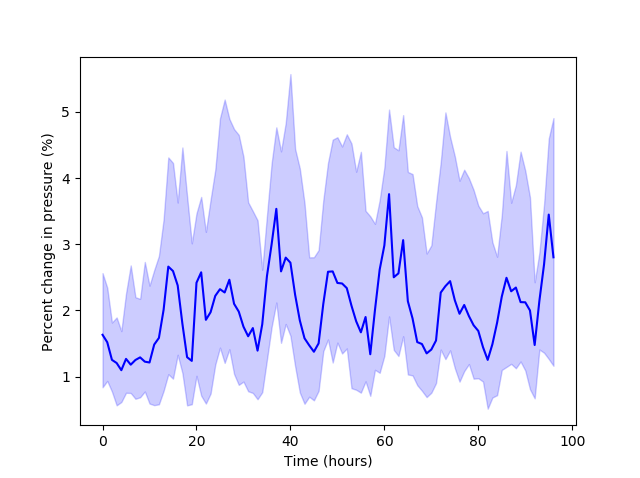

.. raw:: latex

    \clearpage

Network morphology
======================================

The water network model morphology can be modified in several ways using WNTR, including
network skeletonization, 
modifying node coordinates, and 
splitting or breaking pipes.

Network skeletonization
----------------------------
The goal of network skeletonization is to reduce the size of a water network model with minimal impact on system behavior.
Network skeletonization in WNTR follows the procedure outlined in [WCSG03]_.  
The skeletonization process retains all tanks, reservoirs, valves, and pumps, along with all junctions and pipes that are associated with controls.
Junction demands and demand patterns are retained in the skeletonized model, as described below.
Merged pipes are assigned equivalent properties for diameter, length, and roughness to approximate the updated system behavior.
Pipes that fall below a user defined pipe diameter threshold are candidates for removal based on three operations, including:

1. **Branch trimming**: Dead-end pipes that are below the pipe diameter threshold are removed from the model (:numref:`fig-branch-trim`).  
   The demand and demand pattern assigned to the dead-end junction is moved to the junction that is retained in the model.  
   Dead-end pipes that are connected to tanks or reservoirs are not removed from the model.
   
	.. _fig-branch-trim:
	.. figure:: figures/skel_branch.png
	   :width: 752
	   :alt: Branch trim
	   
	   Branch trimming.
	  
2. **Series pipe merge**: Pipes in series are merged if both pipes are below the pipe diameter threshold (:numref:`fig-series-merge`).  
   The demand and demand pattern assigned to the connecting junction is moved to the nearest junction that is retained in the model.
   The merged pipe is assigned the following equivalent properties:
   
   .. math:: D_{m} = max\left(D_{1}, D_{2}\right)
   .. math:: L_{m} = L_{1} + L_{2}
   .. math:: C_{m} = \left(\frac{L_{m}}{{D_{m}}^{4.87}}\right)^{0.54}\left(\frac{L_{1}}{{D_{1}}^{4.87}{C_{1}}^{1.85}}+\frac{L_{2}}{{D_{2}}^{4.87}{C_{2}}^{1.85}}\right)^{-0.54}
   
   where 
   :math:`D_{m}` is the diameter of the merged pipe, :math:`D_{1}` and :math:`D_{2}` are the diameters of the original pipes, 
   :math:`L_{m}` is the length of the merged pipe, :math:`L_{1}` and :math:`L_{2}` are the lengths of the original pipes, 
   :math:`C_{m}` is the Hazen-Williams roughness coefficient of the merged pipe, and :math:`C_{1}` and :math:`C_{2}` are the Hazen-Williams roughness coefficients of the original pipes. 
   Minor loss and pipe status of the merged pipe are set equal to the minor loss and pipe status for the pipe selected for maximum diameter.
   Note, if the original pipes have the same diameter, :math:`D_{m}` is based on the pipe name that comes first in alphabetical order.
   
	.. _fig-series-merge:
	.. figure:: figures/skel_series.png
	   :width: 731
	   :alt: Series merge
	   
	   Series pipe merge.
	   
3. **Parallel pipe merge**: Pipes in parallel are merged if both pipes are below the pipe diameter threshold (:numref:`fig-parallel-merge`).  
   This operation does not reduce the number of junctions in the system.
   The merged pipe is assigned the following equivalent properties:
   
   .. math:: D_{m} = max\left(D_{1}, D_{2}\right)
   .. math:: L_{m} = \text{Length of the pipe selected for max diameter}
   .. math:: C_{m} = \left(\frac{L_{m}^{0.54}}{{D_{m}}^{2.63}}\right)\left(\frac{C_{1}{D_{1}}^{2.63}}{{L_{1}}^{0.54}}+\frac{C_{2}{D_{2}}^{2.63}}{{L_{2}}^{0.54}}\right)
   
   where
   :math:`D_{m}` is the diameter of the merged pipe, :math:`D_{1}` and :math:`D_{2}` are the diameters of the original pipes, 
   :math:`L_{m}` is the length of the merged pipe, :math:`L_{1}` and :math:`L_{2}` are the lengths of the original pipes, 
   :math:`C_{m}` is the Hazen-Williams roughness coefficient of the merged pipe, and :math:`C_{1}` and :math:`C_{2}` are the Hazen-Williams roughness coefficients of the original pipes. 
   Minor loss and pipe status of the merged pipe are set equal to the minor loss and pipe status for the pipe selected for max diameter.
   Note, if the original pipes have the same diameter, :math:`D_{m}` is based on the pipe name that comes first in alphabetical order.
   
   .. _fig-parallel-merge:
   .. figure:: figures/skel_parallel.png
      :width: 734
      :alt: Parallel merge
	  
      Parallel pipe merge.
	  
The :class:`~wntr.morph.skel.skeletonize` function is used to perform network skeletonization.
The iterative algorithm first loops over all candidate pipes (pipes below the pipe diameter threshold) and removes branch pipes.  
Then the algorithm loops over all candidate pipes and merges pipes in series.
Finally, the algorithm loops over all candidate pipes and merges pipes in parallel.
This initial set of operations can generate new branch pipes, pipes in series, and pipes in parallel.
This cycle repeats until the network can no longer be reduced.  
The user can specify if branch trimming, series pipe merge, and/or parallel pipe merge should be included in the skeletonization operations.  
The user can also specify a maximum number of cycles to include in the process. 

.. only:: latex

   See the `online API documentation <https://wntr.readthedocs.io/en/latest/apidoc/wntr.morph.skel.html>`_ for more information on skeletonization.

Results from network skeletonization include the skeletonized water network model and (optionally) 
a "skeletonization map" that maps original network nodes to merged nodes that are represented in the skeletonized network.  
The skeletonization map is a dictionary where 
the keys are original network nodes and 
the values are a list of nodes in the network that were merged as a result of skeletonization operations.  
For example, if 'Junction 1' was merged into 'Junction 2' and 'Junction 3' remained unchanged as
part of network skeletonization, then the skeletonization map would contain the following information::

	{
	'Junction 1': [],
	'Junction 2': ['Junction 1', 'Junction 2'],
	'Junction 3': ['Junction 3']
	}

This map indicates that the skeletonized network does not contain 'Junction 1', 'Junction 2' in the 
skeletonized network is the merged product of the original 'Junction 1' and 'Junction 2,' and 
'Junction 3' was not changed. 
'Junction 2' in the skeletonized network will therefore contain demand and demand patterns from 
the original 'Junction 1' and 'Junction 2.'

The following example performs network skeletonization on Net6  
and compares system pressure using the original and skeletonized networks.
The example starts by creating a water network model for Net6, listing the number of network components (e.g., 3356 nodes, 3892 links), and then skeletonizing it using a using a pipe diameter threshold of 12 inches. 
The skeletonization procedure reduces the number of nodes in the network from 
approximately 3000 to approximately 1000 (:numref:`fig-skel-example`).

.. doctest::
    :hide:
	
    >>> import wntr
    >>> try:
    ...    wn = wntr.network.model.WaterNetworkModel('../examples/networks/Net6.inp')
    ... except:
    ...    wn = wntr.network.model.WaterNetworkModel('examples/networks/Net6.inp')
	
.. doctest::

    >>> import matplotlib.pylab as plt
    >>> import wntr  # doctest: +SKIP
	
    >>> wn = wntr.network.WaterNetworkModel('networks/Net6.inp') # doctest: +SKIP
    >>> wn.describe()
    {'Nodes': 3356, 'Links': 3892, 'Patterns': 3, 'Curves': 60, 'Sources': 0, 'Controls': 124}
    
    >>> skel_wn = wntr.morph.skeletonize(wn, 12*0.0254)
    >>> skel_wn.describe()
    {'Nodes': 1154, 'Links': 1610, 'Patterns': 3, 'Curves': 60, 'Sources': 0, 'Controls': 124}
    
    >>> fig, (ax1, ax2) = plt.subplots(1, 2, figsize=(10,5))
    >>> ax = wntr.graphics.plot_network(wn, node_size=10, title='Original', 
    ...     ax=ax1) 
    >>> ax = wntr.graphics.plot_network(skel_wn, node_size=10, 
    ...     title='Skeletonized', ax=ax2)

.. doctest::
    :hide:
    
    >>> plt.tight_layout()
    >>> plt.savefig('skel_example.png', dpi=300)
    
.. _fig-skel-example:
.. figure:: figures/skel_example.png
   :width: 800
   :alt: Skeletonization example
   
   Original and skeletonized Net6.

Hydraulic are then simulated using the original and skeletonized networks.

.. doctest::

    >>> sim = wntr.sim.EpanetSimulator(wn)
    >>> results_original = sim.run_sim()
    
    >>> sim = wntr.sim.EpanetSimulator(skel_wn)
    >>> results_skel = sim.run_sim()
    
The simulation results are used to compute the pressure difference between the 
original and skeletonized networks.  The pressure difference is computed at 
nodes that exist in the skeletonized network.

.. doctest::

    >>> skel_junctions = skel_wn.junction_name_list
    >>> pressure_orig = results_original.node['pressure'].loc[:,skel_junctions]
    >>> pressure_skel = results_skel.node['pressure'].loc[:,skel_junctions]
    >>> pressure_diff = (abs(pressure_orig - pressure_skel)/pressure_orig)*100
    >>> pressure_diff.index = pressure_diff.index/3600 # convert time to hours

The 25th, 50th (median) and 75th percentiles in pressure difference can then be extracted.

.. doctest::

    >>> m25 = pressure_diff.quantile(0.25, axis=1)
    >>> m50 = pressure_diff.quantile(0.50, axis=1)
    >>> m75 = pressure_diff.quantile(0.75, axis=1)
    
:numref:`fig-skel-hydraulics` shows the median (dark blue line) and 
the 25th to 75th percentile (shaded region) for node pressure throughout the network over a 4 day simulation.
Pressure differences are very small in this example.

.. doctest::

    >>> fig = plt.figure()
    >>> ax = m50.plot()
    >>> poly = ax.fill_between(m25.index, m25, m75, color='b', alpha=0.2)
    >>> text = ax.set_xlabel('Time (hr)')
    >>> text = ax.set_ylabel('Percent change in pressure (%)')

.. doctest::
    :hide:
    
    >>> plt.tight_layout()
    >>> plt.savefig('skel_hydraulics.png', dpi=300)
    
.. _fig-skel-hydraulics:

   
   Pressure differences between the original and skeletonized Net6.

.. _modify_node_coords:

Modify node coordinates
----------------------------

WNTR includes several options to modify node coordinates, denoted as :math:`(x, y)` below, including:

* **Scale coordinates**: Multiply coordinates by a scale factor (in meters) using the function :class:`~wntr.morph.node.scale_node_coordinates`.

   .. math:: (x, y) = (x*scale, y*scale)
   
* **Translate coordinates**: Shift coordinates by an offset (in meters) in the x and y direction using the function :class:`~wntr.morph.node.translate_node_coordinates`.
   
   .. math:: (x, y) = (x+offset_{x}, y+offset_{y})
   
* **Rotate coordinates**: Rotate coordinates counterclockwise by :math:`\theta` degrees using the function :class:`~wntr.morph.node.rotate_node_coordinates`.
   
   .. math:: (x, y) = \begin{bmatrix} cos(\theta) & -sin(\theta) \\sin(\theta) & cos(\theta) \end{bmatrix} \boldsymbol{\cdot} (x, y)

* **Convert coordinates between UTM and longitude/latitude**: Convert coordinates from UTM to longitude/latitude 
  or visa-versa using the functions 
  :class:`~wntr.morph.node.convert_node_coordinates_UTM_to_longlat` and :class:`~wntr.morph.node.convert_node_coordinates_longlat_to_UTM`.

* **Convert coordinates to UTM or longitude/latitude**: Convert coordinates from arbitrary distance units directly into UTM or longitude/latitude using the functions 
  :class:`~wntr.morph.node.convert_node_coordinates_to_UTM` and
  :class:`~wntr.morph.node.convert_node_coordinates_to_longlat`.
  The user supplies the names of two nodes in their network along with their
  UTM or longitude/latitude coordinates.  Ideally, these nodes span a decent range of the network (for example, 
  the nodes could be in the upper right and lower left).

.. note:: 
   Functions that convert coordinates to UTM and longitude/latitude require the Python package **utm** [Bieni19]_, which is an optional dependency of WNTR.
		 
The following example returns a copy of the water network model with 
node coordinates scaled by 100 m.

.. doctest::
    :hide:

    >>> import wntr
    >>> try:
    ...    wn = wntr.network.model.WaterNetworkModel('../examples/networks/Net3.inp')
    ... except:
    ...    wn = wntr.network.model.WaterNetworkModel('examples/networks/Net3.inp')
	
.. doctest::

    >>> wn = wntr.network.WaterNetworkModel('networks/Net3.inp') # doctest: +SKIP
    >>> wn_scaled_coord = wntr.morph.scale_node_coordinates(wn, 100)

The next example converts node coordinates to longitude/latitude. The longitude and latitude coordinates of two locations (e.g., nodes, tanks) on the map must be provided to convert the other node coordinates to longitude/latitude. 

.. doctest::

    >>> longlat_map = {'Lake':(-106.6587, 35.0623), '219': (-106.5248, 35.1918)}
    >>> wn_longlat = wntr.morph.convert_node_coordinates_to_longlat(wn, longlat_map)

.. _split_break_pipes:

Split or break pipes
----------------------------

WNTR includes the functions :class:`~wntr.morph.link.split_pipe` 
and :class:`~wntr.morph.link.break_pipe` to split or break a pipe.

For a pipe split, the original pipe is split into two pipes by adding a new 
junction and new pipe to the model.  
For a pipe break, the original pipe is broken into two disconnected pipes by 
adding two new junctions and a new pipe to the model.  

.. note::
  With a pipe break, flow is no longer possible from one side of the break to the other. This is more likely to introduce non-convergable hydraulics than a pipe split with a leak added.

The updated model retains the original length of the pipe section (:numref:`fig-split-break`). 
The split or break occurs at a user specified distance between the 
original start and end nodes of the pipe (in that direction). 
The new pipe can be added to either end of the original pipe. 
    
* The new junction has a base demand of 0 and the default demand pattern.
  The elevation and coordinates of the new junction are based on a linear 
  interpolation between the end points of the original pipe.
    
* The new pipe has the same diameter, roughness, minor loss, 
  and base status of the original pipe. 

* Check valves are not added to the new
  pipe. Since the new pipe can be connected at either the start
  or the end of the original pipe, the user can control if the split occurs before
  or after a check valve. 
    
* No controls are added to the new pipe; the original pipe keeps any controls. 

.. _fig-split-break:
.. figure:: figures/pipe_split_break.png
    :width: 774
    :alt: Pipe split and pipe break
	
    Pipe split and pipe break.
	
The following example splits pipe '123' in Net3 into pipes '123' and '123_B.'  
The new junction is named '123_node.' The new node is then used to add a leak 
to the model.

.. doctest::

    >>> wn = wntr.morph.split_pipe(wn, '123', '123_B', '123_node')
    >>> leak_node = wn.get_node('123_node')           
    >>> leak_node.add_leak(wn, area=0.05, start_time=2*3600, end_time=12*3600)
