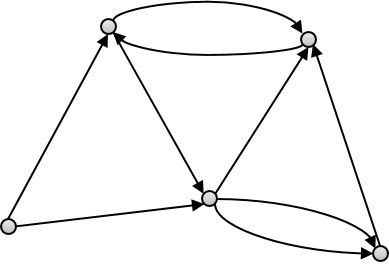

.. raw:: latex

    \clearpage

NetworkX graph
======================================

WNTR can generate a NetworkX data object that stores network connectivity as a graph. 
The ability to easily integrate NetworkX with WNTR facilitates the use of numerous standard graph algorithms, 
including algorithms that describe network structure.

A **graph** is a collection of nodes that are connected by links.  
For water networks, nodes represent junctions, tanks, and reservoirs while links represent pipes, pumps, and valves.
The NetworkX graph can be used to analyze network structure.

The type of NetworkX graph generated by WNTR is a directed multigraph. 
A **directed multigraph** is a graph with direction associated with links and 
the graph can have multiple links with the same start and end node. 
A simple example is shown in :numref:`fig-graph`.
For water networks, the link direction is from the start node to the end node. 
The link direction is used as a reference to track flow direction in the network.
For example, positive flow indicates that the flow direction is from the start node to the end node 
while negative flow indicates that the flow direction is from the end node to the start node.
Multiple links with the same start and end node can be used to represent redundant pipes or backup pumps.

A NetworkX graph generated from a water network model stores 
the start and end node of each link, 
node coordinates, 
and node and link types (i.e., tank, reservoir, valve).
NetworkX includes numerous methods to analyze the structure of complex networks.
For more information on NetworkX, see https://networkx.github.io/.

.. _fig-graph:

   Example directed multigraph.
   
A NetworkX directed multigraph can an be obtained from a WaterNetworkModel using 
the following function:

.. doctest::
    :hide:

    >>> import wntr
    >>> try:
    ...    wn = wntr.network.model.WaterNetworkModel('../examples/networks/Net3.inp')
    ... except:
    ...    wn = wntr.network.model.WaterNetworkModel('examples/networks/Net3.inp')
	
.. doctest::

    >>> import wntr # doctest: +SKIP
	
    >>> wn = wntr.network.WaterNetworkModel('networks/Net3.inp') # doctest: +SKIP
    >>> G = wn.get_graph() # directed multigraph
	
The graph is stored as a nested dictionary.  The nodes and links
can be accessed using the graph's `node` and `adj` attribute (`adj` is used to get adjacent nodes and links).

.. doctest::

    >>> node_name = '123'
    >>> G.nodes[node_name] # doctest: +SKIP
    >>> G.adj[node_name] # doctest: +SKIP

The graph can be used to access NetworkX methods, for example:

.. doctest::

    >>> import networkx as nx
	
    >>> node_degree = G.degree()
    >>> closeness_centrality = nx.closeness_centrality(G)
    >>> ax = wntr.graphics.plot_network(wn, node_attribute=closeness_centrality)

See :ref:`topographic_metrics` for more information.

Additional network types
-------------------------------------------------
Some methods in NetworkX require that networks are undirected, connected, 
weighted, or have only one edge between nodes.

An **undirected graph** is a graph with no direction associated with links.
The following NetworkX method can be used to convert a directed graph to 
an undirected graph:

.. doctest::

    >>> uG = G.to_undirected() # undirected multigraph
       
A **connected graph** is a graph where a path exists between every node in the 
network (i.e., no node is disconnected).  
The following NetworkX method can be used to check if a graph is connected:

.. doctest::

    >>> nx.is_connected(uG)
    True

A **weighted graph** is a graph in which each node and/or link is given a weight.  
The WNTR method :class:`~wntr.network.model.WaterNetworkModel.get_graph` 
can be used to weight the graph by node and/or link attributes.
In the following example, the graph is weighted by length. This graph can then 
be used to compute path lengths:

.. doctest::

    >>> length = wn.query_link_attribute('length')
    >>> wG = wn.get_graph(wn, link_weight=length) # weighted directed multigraph
	
A **simple graph** is a graph with one edge between nodes.
The following NetworkX method can be used to convert a multigraph to a simple graph:

.. doctest::

    >>> sG = nx.Graph(G) # directed simple graph
