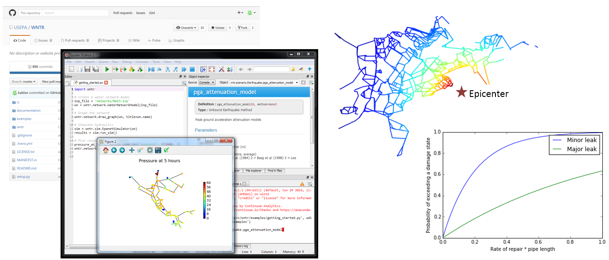

.. raw:: latex

    \newpage
    
Overview
======================================

Water distribution systems face multiple challenges, including 
aging infrastructure, 
water quality concerns, 
pipe breaks, 
uncertainty in supply and demand, 
natural disasters, 
environmental emergencies, 
and terrorist attacks.  
All of these have the potential to disrupt a large portion of a water system.  
Increasing resilience to these types of hazards is essential to improving 
water security.  Water utilities need to be able to predict how their system 
will perform during disruptive events and understand how to best absorb, 
recover from, and more successfully adapt.  Simulation and analysis tools 
can help water utilities explore how their network will respond to expected, 
and unexpected, events and help inform decisions to make networks
more resilient over time [USEPA2014]_.

The Water Network Tool for Resilience (WNTR, pronounced *winter*) is a python 
package designed to simulate and analyze resilience of 
water distribution networks.  
The API is flexible and allows for changes to the network structure and operations, 
along with simulation of disruptive events and recovery actions.  

   
   WNTR code repository on GitHub, interactive development environment using Spyder, and sample graphics generated by WNTR.
   
WNTR includes capabilities to:

* **Generate water network models** from scratch or using EPANET network model files

* **Modify network structure** by adding/removing components and changing component characteristics

* **Modify network operation** by changing initial conditions, component settings, and time-based and conditional controls

* **Add disruptive events** including pipe leaks, power outages, contaminant injection, and changes to supply and demand

* **Add response/repair strategies** including leak repair, retrofitted pipes, power restoration, and backup generation

* **Simulate network hydraulics and water quality** using pressure-driven or demand-driven hydraulic simulation, the ability to pause and restart simulations, and run simulations in parallel

* **Run probabilistic simulations** using fragility curves for component failure
  
* **Compute resilience** using topographic, hydraulic, water quality/security, and economic metrics

* **Analyze results and generate graphics** including state transition plots, network graphics, and network animation
