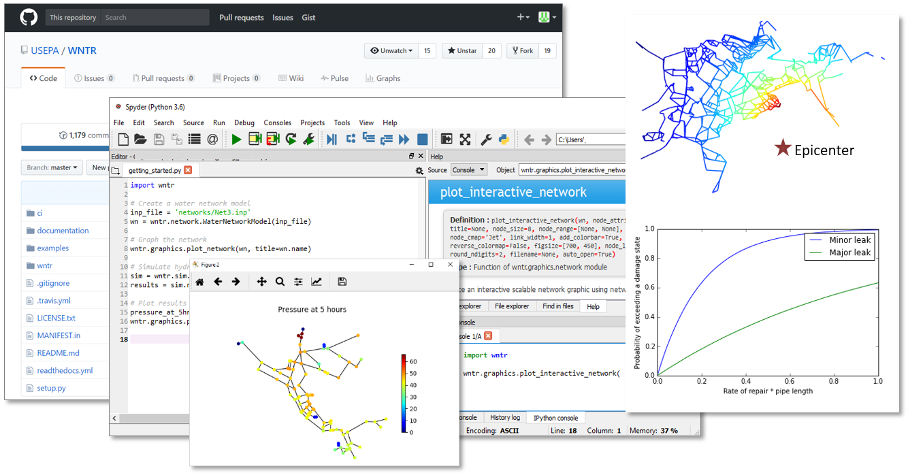
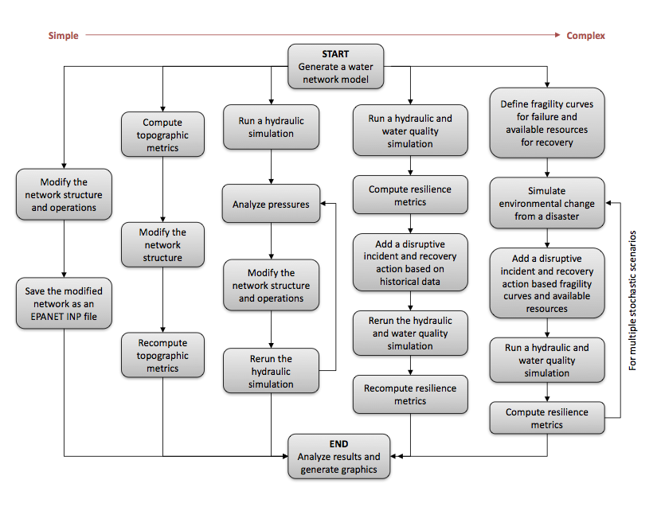

.. raw:: latex

    \setcounter{secnumdepth}{1}
    \clearpage
	
Overview
======================================

.. raw:: latex

    \pagenumbering{arabic}
    \setcounter{page}{1}
    
Drinking water systems face multiple challenges, including aging infrastructure, 
water quality concerns, uncertainty in supply and demand, natural disasters, 
environmental emergencies, and cyber and terrorist attacks.  
All of these have the potential to disrupt a large portion of a water system, 
causing damage to infrastructure and outages to customers.  
Increasing resilience to these types of hazards is essential to improving 
water security.  

As one of the United States (US) sixteen critical infrastructure sectors, drinking water
is a national priority.  The National Infrastructure Advisory Council  
defined infrastructure resilience as “the ability to reduce the magnitude and/or 
duration of disruptive events. The effectiveness of a resilient infrastructure 
or enterprise depends upon its ability to anticipate, absorb, adapt to, and/or 
rapidly recover from a potentially disruptive event” [NIAC09]_.

Being able to predict how drinking water systems will perform during disruptive 
incidents and understanding how to best absorb, recover from, and more successfully adapt
to such incidents can help enhance resilience.  Simulation and analysis tools 
can help water utilities to explore the capacity of their systems to handle disruptive 
incidents and guide the planning necessary to make systems more resilient over time [USEPA14]_.

The Water Network Tool for Resilience (WNTR, pronounced *winter*) is a Python 
package designed to simulate and analyze resilience of water distribution networks.  
Here, a network refers to the collection of pipes, pumps, valves, junctions, tanks, and reservoirs that 
make up a water distribution system. WNTR has an application programming interface (API) 
that is flexible and allows for changes to the network structure and operations, 
along with simulation of disruptive incidents and recovery actions. 

WNTR is based upon EPANET, which is a tool to simulate the movement and fate of drinking water 
constituents within distribution systems. Users are encouraged to be familiar with the use of
EPANET and/or should have background knowledge in hydraulics and pressurized pipe network modeling before using WNTR. 
EPANET has a graphical user interface that might be a useful tool to facilitate the visualization of the network 
and the associated analysis results. Information on EPANET can be found at https://www.epa.gov/water-research/epanet. 
**WNTR is compatible with EPANET 2.00.12** [Ross00]_ **and EPANET 2.2** [RWTS20]_. In addition, users should have 
experience using Python, including the installation of additional Python packages. General information on Python can be found at https://www.python.org/. 

WNTR can be installed through the United States Environmental Protection Agency (US EPA) 
GitHub organization at https://github.com/USEPA/WNTR.  An integrated development environment 
(IDE), like Spyder, is recommended for users and developers.
:numref:`fig-overview` shows the GitHub webpage, Spyder IDE, and sample graphics 
generated by WNTR.

.. _fig-overview:

   
   WNTR code repository on GitHub, integrated development environment using Spyder, and sample graphics generated by WNTR.

WNTR includes capabilities to:

* **Generate water network models** from scratch or from existing EPANET-formatted water network model input (EPANET INP) files [Ross00]_ [RWTS20]_.  See EPANET documentation on `INP file format <https://epanet22.readthedocs.io/en/latest/back_matter.html#input-file-format>`_ for more details.

* **Modify network structure** by adding/removing components or changing component characteristics

* **Modify network operation** by changing initial conditions, component settings, supply and demand, and time-based and conditional controls

* **Add disruptive incidents** including damage to tanks, valves, and pumps, pipe leaks, power outages, contaminant injection, and environmental changes

* **Add response/repair/mitigation strategies** including leak repair, retrofitted pipes, power restoration, and backup generation

* **Simulate network hydraulics and water quality** using pressure dependent demand or demand-driven hydraulic simulation, and the ability to pause and restart simulations

* **Run probabilistic simulations** using fragility curves for component failure
  
* **Compute resilience** using topographic, hydraulic, water quality/security, and economic metrics

* **Analyze results and generate graphics** including state transition plots, network graphics, and network animation

These capabilities can be linked together in many different ways.
:numref:`fig-use-cases` illustrates four example use cases, from simple to complex.  

.. _fig-use-cases:

   

   Flowchart illustrating four example use cases.

While EPANET includes some features to model and analyze water distribution system resilience, 
WNTR was developed to greatly extend these capabilities.
WNTR provides a flexible platform for modeling a wide range of disruptive incidents and repair strategies, and 
includes an extensible hydraulic simulator.
Furthermore, WNTR is compatible with widely used scientific computing packages for Python, 
including NetworkX [HaSS08]_, pandas [Mcki13]_, NumPy [VaCV11]_, SciPy [VaCV11]_, and Matplotlib [Hunt07]_.  
These packages allow the user to build custom analysis directly in Python, and gain access to tools that
analyze the structure of complex water distribution networks, 
analyze time-series data from simulation results,
run simulations efficiently, and 
create high-quality graphics and animations.

