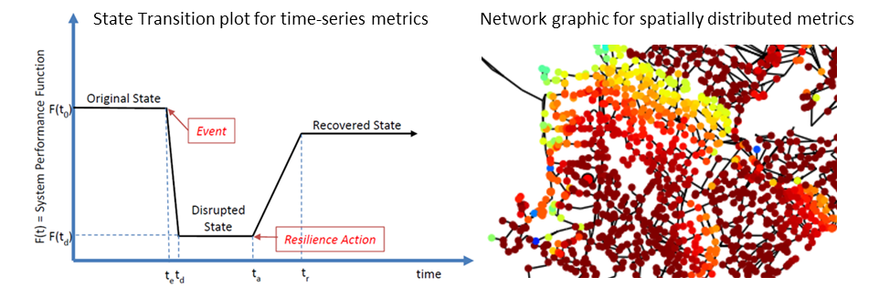

Resilience metrics
======================================

Resilience of water distribution systems refers to the 
design, maintenance, and operations of that system.  
All these aspects must work together to limit the effects of disasters and 
enables rapid return to normal delivery of safe water to customers.
Numerous resilience metrics have been suggested [USEPA2014]_.  
These metrics generally fall into five categories: topographic, hydraulic, water quality, water security, and economic.
While some metrics define resilience as a single network-wide quantity, other metrics define 
quantities that are a function of time, space, or both. 
For this reason, state transition plots [Barker2013]_  and network graphics
are useful ways to visualize resilience and compare metrics, as shown in the figure below.
When quantifying resilience, 
it is important to understand which metric best defines system resilience for 
a particular scenario.  WNTR includes many metrics to help 
researchers compare resilience using different methods.

   Example state transition plot and network graphic used to visualize resilience.

The example **resilience_metrics.py** demonstrates how to compute these metrics.

Topographic metrics
---------------------

Topographic metrics, based on graph theory, can be used to assess the connectivity 
of water distribution networks.
These metrics rely on the physical layout of the network components and can be used to
understand how the underlying structure and connectivity constrains resilience. For
example, a regular lattice, where each node has the same number of edges, is considered to be
the most reliable graph structure. On the other hand, a random lattice has nodes and edges
that are placed according to a random process. A real world WDS probably lies somewhere in
between a regular lattice and a random lattice in terms of structure and reliability.
  
NetworkX includes a wide range of topographic metrics that can be computed using 
the WntrMutliDiGraph.  WNTR includes additional methods/metrics to help compute 
resilience.  These methods are in the :doc:`WntrMultiDiGraph Class</apidoc/wntr.network.WntrMultiDiGraph>`.

=====================================  ================================================================================================================================================
Metric                                 Description
=====================================  ================================================================================================================================================
Node degree				Node degree is the number of links adjacent to a node.  Node degree is a 
					measure of the number of branches in a network.  A node with degree 0 is not 
					connected to the network.  Terminal nodes have degree 1. A node connected to every node (including itself) 
					has degree equal to the number of nodes in the network.  
					Average node degree is system wide metric used to describe the number of 
					connected links in a network.
					Node degree can be computed using the NetworkX method ``degree``.
					Terminal nodes can be found using the method :doc:`terminal_nodes</apidoc/wntr.network.WntrMultiDiGraph>`.

Link density				Link density is the ratio between the total number of links and the maximum 
					number of links in the network.  If links are allowed to connect a node to 
					itself, then the maximum number of links is :math:`{n}^{2}`, where :math:`n` is the number of nodes.  
					Otherwise, the maximum number of nodes is :math:`n(n-1)`.  Link density is 0 for a graph without edges 
					and 1 for a dense graph. The density of multigraphs can be higher than 1.
					Link density can be computed using the NetworkX method ``density``.

Eccentricity and diameter		Eccentricity is the maximum number of links between a node and all other nodes 
					in the graph. Eccentricity is a value between 0 and the number of links 
					in the network.  
					Diameter is the maximum eccentricity in the network. 
					Eccentricity and diameter can only be computed using undirected, connected networks.
					Network X includes methods to convert directed graphs to undirected graphs, ``to_undirected``, and 
					to check if graphs are connected, ``is_connected``.
					Eccentricity and diameter can be computed using the  NetworkX methods 
					``eccentricity`` and ``diameter``.

Simple paths				A simple path is a path between two nodes that does not repeat any nodes.  NetworkX includes a method, ``all_simple_paths``, to compute
					all simple paths between two nodes.  
					The method :doc:`links_in_simple_paths</apidoc/wntr.network.WntrMultiDiGraph>`
					can be used to extract all links in a simple path along with the number of times each link was used in the paths. 
					Paths can be time dependent, if related to simulated flow direction.  The method :doc:`weight_graph</apidoc/wntr.network.WntrMultiDiGraph>` can be used 
					to weight the graph by a specified attribute.

Shortest path lengths			Shortest path lengths is the minimum number of links between a source node and all 
					other nodes in the network.  Shortest path length is a value between 0 and 
					the number of links in the network.
					The average shortest path length is a system wide metric used to describe the number
					of links between a node and all other nodes.
					Shortest path lengths and average shortest path lengths can be computed using the following NetworkX methods
					``shortest_path_length`` and ``average_shortest_path_length``.

Clustering coefficient			Clustering coefficient is the ratio between the total number of triangles and 
					the total number of connected triples.  Clustering coefficient is a value 
					between 0 and 1.
					Clustering coefficient can be computed using the NetworkX method ``clustering``.

Betweenness centrality			Betweenness centrality is the fraction of shortest paths that pass through each 
					node.  Betweenness coefficient is a value between 0 and 1.
					Central point dominance is the average difference in betweenness centrality 
					of the most central point (having the maximum betweenness centrality) 
					and all other nodes. These metrics can be computed using the NetworkX methods ``betweenness_centrality`` and the method :doc:`central_point_dominance</apidoc/wntr.network.WntrMultiDiGraph>`
					
Closeness centrality			Closeness centrality is the inverse of the sum of shortest path from one node to all other nodes.
					Closeness centrality can be computed using the NetworkX method ``closeness_centrality``.

Articulation points			A node is considered an articulation point if the removal of that node 
					(along with all its incident edges) increases the number of connected 
					components of a network.
					Density of articulation points is the ratio of the number of articulation 
					points and the total number of nodes.  
					Density of articulation points is a value between 0 and 1.
					Articulation points can be computed using the NetworkX method ``articulation_points``.

Bridges					A link is considered a bridge if the removal of that link increases the number of connected components in the network.
					The ratio of the number of bridges and the total number of links in the network.  Density of bridges is a value between 0 and 1.
					The method :doc:`bridges</apidoc/wntr.network.WntrMultiDiGraph>` can be used to find bridges in a network.
					
Critical ratio of defragmentation	The threshold where the network loses its large-scale connectivity and 
					defragments, as a function of the node degree.  The critical ratio of 
					defragmentation is related to percolation theory. The ratio is equal 
					to 0 if all 
					The method :doc:`critical_ratio_defrag</apidoc/wntr.network.WntrMultiDiGraph>` can be used to compute the critical ratio of defragmentation of the network.
=====================================  ================================================================================================================================================

..
	Meshedness coefficient: Meshedness coefficient is the ratio of the actual number of cycles in the 
      network to the maximum possible number of cycles in the network.  Meshedness coefficient is a value between 0 and 1.

      Spectral gap: The difference between the first and second eigenvalue of the networks adjacency matrix.
	The method :doc:`spectral_gap</apidoc/wntr.network.WntrMultiDiGraph>` can be used to find the spectral gap of the network.
	
	Algebraic connectivity	: The second smallest eigenvalue of the normalized Laplacian matrix of a network.
	The method :doc:`algebraic_connectivity</apidoc/wntr.network.WntrMultiDiGraph>` can be used to find the algebraic connectivity of the network.
	
	Node-pair reliability: Node-pair reliability (NPR) is the probability that any two nodes 
	are connected in a network.  NPR is computed using ...
	Connectivity will change at each time step, depending on the flow direction.  
	The method :doc:`weight_graph</apidoc/wntr.network.WntrMultiDiGraph>` method 
	can be used to weight the graph by a specified attribute. 
	
Information on additional topographic metrics supported by NetworkX can be found 
at https://networkx.github.io/.

Hydraulic metrics
---------------------

Hydraulic metrics are based upon variable flows and/or pressure; 
calculation of these metrics require simulation of network hydraulics that reflect how the
system operates under normal or abnormal conditions.

=====================================  ================================================================================================================================================
Metric                                 Description
=====================================  ================================================================================================================================================
Pressure				To determine the number of node-time pairs above or below a specified pressure threshold, 
					use the :doc:`query</apidoc/wntr.metrics.query>` method on results.node['pressure'].  

Todini index 				The Todini index [Todini2000]_ is related to the capability of a system to overcome 
					failures while still meeting demands and pressures at the nodes. The 
					Todini index defines resilience at a specific time as a measure of surplus 
					power at each node and measures relative energy redundancy. 
					The Todini index can be computed using the :doc:`todini</apidoc/wntr.metrics.todini>` method.

Entropy 				Entropy [Awumah1990]_ is a measure of uncertainty in a random variable.  
					In a water distribution network model, the random variable is 
					flow in the pipes and entropy can be used to measure alternate flow paths
					when a network component fails.  A network that carries maximum entropy 
					flow is considered reliable with multiple alternate paths.
					Connectivity will change at each time step, depending on the flow direction.  
					The method :doc:`weight_graph</apidoc/wntr.network.WntrMultiDiGraph>` method can be used to weight the graph by a specified attribute. 
					Entropy can be computed using the :doc:`entropy</apidoc/wntr.metrics.entropy>` method.

Fraction of delivered volume		Fraction of delivered volume (FDV) is the ratio of total volume delivered to the total volume requested [Ostfeld2002]_.  
					This metric can be computed as a function of time or space using the :doc:`fdv</apidoc/wntr.metrics.fraction_delivered>` method.

Fraction of delivered demand		Fraction of delivered demand (FDD) is the fraction of time periods where demand is met [Ostfeld2002]_.
					This metric can be computed as a function of time or space using the :doc:`fdd</apidoc/wntr.metrics.fraction_delivered>` method

Population impacted			Population that is impacted by a specific quantity can be computed using the 
					:doc:`population_impacted</apidoc/wntr.metrics.health_impacts>` method.  For example, this method can be used to compute the population
					impacted by pressure below a specified threshold.
=====================================  ================================================================================================================================================

Water quality metrics
---------------------
Water quality metrics are based on concentration or water age; 
calculation of these metrics require water quality simulation.

=====================================  ================================================================================================================================================
Metric                                 Description
=====================================  ================================================================================================================================================
Water age				To determine the number of node-time pairs above or below a specified water age threshold, 
					use the :doc:`query</apidoc/wntr.metrics.query>` method on results.node['quality'] after a simulation using AGE.

Concentration				To determine the number of node-time pairs above or below a specified concentration threshold, 
					use the :doc:`query</apidoc/wntr.metrics.query>` method on results.node['quality'] after a simulation using CONC or TRACE.

Fraction of delivered quality		Fraction of delivered quality (FDQ) is the fraction of time periods where water quality standards are met [Ostfeld2002]_.
					This metric can be computed as a function of time or space using the :doc:`fdq</apidoc/wntr.metrics.fraction_delivered>` method

Average water consumed			Average water consumed is computed at each node, based on node demand and demand patterns [USEPA2015]_.
					The metric can be computed using the :doc:`average_water_consumed</apidoc/wntr.metrics.health_impacts>` method.

Population impacted			As stated above, population that is impacted by a specific quantity can be computed using the 
					:doc:`population_impacted</apidoc/wntr.metrics.health_impacts>` method.  This can be applied to water quality metrics.
=====================================  ================================================================================================================================================

Water security metrics
-----------------------
Water security metrics quality potential consequences of contamination scenarios.  These metrics are documented in [USEPA2015]_.

=====================================  ================================================================================================================================================
Metric                                 Description
=====================================  ================================================================================================================================================
Mass consumed				Mass consumed is the mass of contaminant the exists the network via node demand at each node-time pair [USEPA2015]_.  
					The metric can be computed using the :doc:`mass_contaminant_consumed</apidoc/wntr.metrics.health_impacts>` method

Volume consumed				Volume consumed is the volume of contaminant that exists the network via node demand at each node-time pair [USEPA2015]_.   
					A detection limit may be specified.
					The metric can be computed using the :doc:`volume_contaminant_consumed</apidoc/wntr.metrics.health_impacts>` method

Extent of contamination			Extent of contamination is the length of contaminated pipe at each node-time pair [USEPA2015]_.  
					A detection limit may be specified.
					The metric can be computed using the :doc:`extent_contaminant</apidoc/wntr.metrics.health_impacts>` method.

Population impacted			As stated above, population that is impacted by a specific quantity can be computed using the 
					:doc:`population_impacted</apidoc/wntr.metrics.health_impacts>` method.  This can be applied to water security metrics.
=====================================  ================================================================================================================================================
..
	Contaminate ingested
	Population dosed
	Population exposed
	Population killed

Economic metrics
------------------
Economic metrics include network cost and greenhouse gas emissions.

=====================================  ================================================================================================================================================
Metric                                 Description
=====================================  ================================================================================================================================================
Network cost				Network cost can be computed based on equations from the Battle of Water Networks II [Salomons2012]_
					using the :doc:`cost</apidoc/wntr.metrics.cost>` method.

Greenhouse gas emissions		Greenhouse gas emissions can be computed based on equations from the Battle of Water Networks II [Salomons2012]_ 
					using the :doc:`ghg_emissions</apidoc/wntr.metrics.ghg_emissions>` method.
=====================================  ================================================================================================================================================
