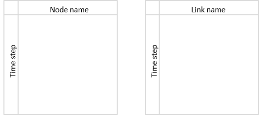
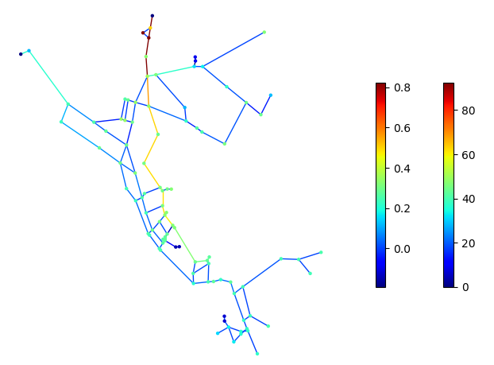

.. raw:: latex

    \clearpage

.. _simulation_results:

Simulation results
=============================
Simulation results are stored in a results object which contains:

* Timestamp when the results were created
* Network name
* Node results
* Link results

.. doctest::
    :hide:

    >>> from __future__ import print_function, division
    >>> import pandas as pd
    >>> import matplotlib.pylab as plt
	>>> import wntr
    >>> pd.set_option('precision', 2)
    >>> try:
    ...    wn = wntr.network.model.WaterNetworkModel('../examples/networks/Net3.inp')
    ... except:
    ...    wn = wntr.network.model.WaterNetworkModel('examples/networks/Net3.inp')
    >>> sim = wntr.sim.EpanetSimulator(wn)
    >>> results = sim.run_sim()

The node and link results are dictionaries of pandas DataFrames.  Each dictionary is a key:value pair, where
the key is a result attribute (e.g., node demand, link flowrate) and the value is a DataFrame. 
DataFrames are indexed by timestep (in seconds from the start of the simulation) with columns that are
labeled using node or link names. 
The use of pandas facilitates a comprehensive set of time series analysis options that can be used to evaluate results.
For more information on pandas, see http://pandas.pydata.org/.

Conceptually, DataFrames can be visualized as blocks of data with 2 axis, as shown in :numref:`fig-dataframe`.
 
.. _fig-dataframe:

   
   Conceptual representation of DataFrames used to store simulation results.

Node results include DataFrames for each of the following attributes:

* Demand
* Leak demand (only when the WNTRSimulator is used)
* Head
* Pressure
* Quality (only when the EpanetSimulator is used. Water age, tracer percent, or chemical concentration is stored, depending on the mode of water quality analysis)
	
For example, node results generated with the EpanetSimulator have the following keys:

.. doctest::

    >>> node_keys = results.node.keys()
    >>> print(node_keys) # doctest: +SKIP
    dict_keys(['demand', 'head', 'pressure', 'quality']) 
	
Link results include DataFrames for each of the following attributes:

* Velocity
* Flowrate
* Status (0 indicates closed, 1 indicates open)
* Headloss (only when the EpanetSimulator is used)
* Setting (only when the EpanetSimulator is used)
* Friction factor (only when the EpanetSimulator is used)
* Reaction rate (only when the EpanetSimulator is used)
* Link quality (only when the EpanetSimulator is used)

For example, link results generated with the EpanetSimulator have the following keys:

.. doctest::

    >>> link_keys = results.link.keys()
    >>> print(link_keys) # doctest: +SKIP
    dict_keys(['flowrate', 'frictionfact', 'headloss', 'linkquality', 'rxnrate', 'setting', 'status', 'velocity']) 

To access node pressure over all nodes and times:

.. doctest::

    >>> pressure = results.node['pressure']

DataFrames can be sliced to extract specific information. For example, to access the pressure at node '123' over all times (the ":" notation returns all variables along the specified axis, "head()" returns the first 5 rows, values displayed to 2 decimal places):

.. doctest::

    >>> pressure_at_node123 = pressure.loc[:,'123']
    >>> print(pressure_at_node123.head()) 
    0       47.08
    900     47.13
    1800    47.18
    2700    47.23
    3600    47.94
    Name: 123, dtype: float32
	
To access the pressure at time 3600 over all nodes (values displayed to 2 decimal places):

.. doctest::

    >>> pressure_at_1hr = pressure.loc[3600,:]
    >>> print(pressure_at_1hr.head())
    name
    10    28.25
    15    28.89
    20     9.10
    35    41.52
    40     4.18
    Name: 3600, dtype: float32
	
Data can be plotted as a time series, as shown in :numref:`fig-plot-timeseries`:

.. doctest::
    :hide:
    
    >>> fig = plt.figure()
    
.. doctest::

    >>> ax = pressure_at_node123.plot()
    >>> text = ax.set_xlabel("Time (s)")
    >>> text = ax.set_ylabel("Pressure (m)") 

.. doctest::
    :hide:

    >>> plt.tight_layout()
    >>> plt.savefig('plot_timeseries.png', dpi=300)
    
.. _fig-plot-timeseries:
.. figure:: figures/plot_timeseries.png
   :width: 640
   :alt: Time-series graph.

   Time series graphic showing pressure at a node.
   
Data can also be plotted on the water network model, as shown in :numref:`fig-plot-network`.
Note that the :class:`~wntr.graphics.network.plot_network` function returns matplotlib objects 
for the network nodes and edges, which can be further customized by the user.
In this figure, the node pressure at 1 hr is plotted on the network. Link attributes can be 
plotted in a similar manner.

.. doctest::
    :hide:
    
    >>> fig = plt.figure()
    
.. doctest::

    >>> nodes, edges = wntr.graphics.plot_network(wn, node_attribute=pressure_at_1hr, 
    ...    node_range=[30,55], node_colorbar_label='Pressure (m)')

.. doctest::
    :hide:

    >>> plt.tight_layout()
    >>> plt.savefig('plot_network.png', dpi=300)
    
.. _fig-plot-network:

   Network graphic showing pressure at 1 hour.

Network and time series graphics can be customized to add titles, legends, axis labels, and/or subplots.
   
Pandas includes methods to write DataFrames to the following file formats:

* Excel
* Comma-separated values (CSV)
* Hierarchical Data Format (HDF)
* JavaScript Object Notation (JSON)
* Structured Query Language (SQL)

For example, DataFrames can be saved to Excel files using:

   >>> pressure.to_excel('pressure.xlsx')

.. note:: 
   The Pandas method ``to_excel`` requires the Python package **openpyxl**, which is an optional dependency of WNTR.