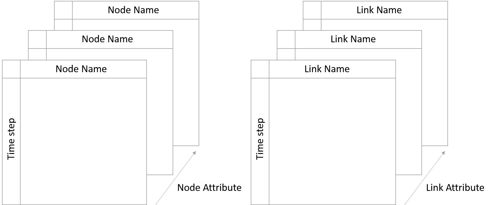

.. _simulation_results:

.. raw:: latex

    \clearpage

Simulation results
=============================
WNTR uses Pandas data objects to store simulation results.
The use of Pandas facilitates a comprehensive set of time series analysis options that can be used to evaluate results.
For more information on Pandas, see http://pandas.pydata.org/.

Results are stored in Pandas Panels.  A Panel is a 3-dimensional database. 
One Panel is used to store nodes results and one Panel is used to store link results. 
The Panels are indexed by:

* Node or link attribute

* Time in seconds from the start of the simulation

* Node or link name

Conceptually, Panels can be visualized as blocks of data with 3 axis, as shown in :numref:`fig-panel`.
 
.. _fig-panel:

   
   Conceptual representation of Panels used to store simulation results.

Node attributes include:

* Demand
* Expected demand
* Leak demand (only when the WNTRSimulator is used)
* Pressure
* Head
* Quality (only when the EpanetSimulator is used for a water quality simulation. Water age, tracer percent, or chemical concentration is stored, depending on the type of water quality analysis)
* Type (junction, tank, or reservoir)
	
Link attributes include:

* Velocity
* Flowrate
* Status (0 indicates closed, 1 indicates open)
* Type (pipe, pump, or valve)

The example **simulation_results.py** demonstrates use cases of simulation results.
Node and link results are accessed using:

.. literalinclude:: ../examples/simulation_results.py
   :lines: 13-14

The indices can be used to extract specific information from the Panels.
For example, to access the pressure and demand at node '123' at 1 hour:

.. literalinclude:: ../examples/simulation_results.py
   :lines: 17
	
To access the pressure for all nodes and times (the ":" notation returns all variables along the specified axis):  

.. literalinclude:: ../examples/simulation_results.py
   :lines: 20

Attributes can be plotted as a time-series, as shown in :numref:`fig-plot-timeseries`:
	
.. literalinclude:: ../examples/simulation_results.py
   :lines: 23-24

.. _fig-plot-timeseries:
.. figure:: figures/plot_timeseries.png
   :scale: 75 %
   :alt: Time-series graph.

   Example time-series graphic.
   
Attributes can be plotted on the water network model, as shown in :numref:`fig-plot-network`.
In this figure, the node pressure at 1 hr and link flowrate at 1 hour are plotted on the network. 
A colorbar is included for both node and link attributes:
	
.. literalinclude:: ../examples/simulation_results.py
   :lines: 27-30

.. _fig-plot-network:
.. figure:: figures/plot_network.png
   :scale: 75 %
   :alt: Network graphic

   Example network graphic.

Network and time-series graphics can be customized to add titles, legends, axis labels, etc.
   
Panels can be saved to Excel files using:

.. literalinclude:: ../examples/simulation_results.py
   :lines: 33-34
