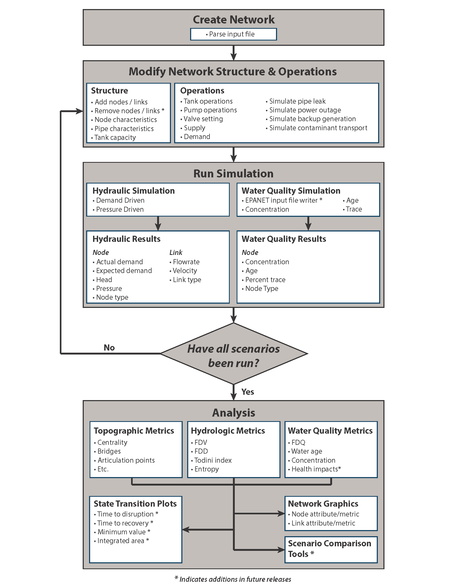

Overview
======================================

Water distribution systems face multiple challenges, including: 
aging infrastructure, 
water quality concerns, 
pipe breaks, 
uncertainty in supply and demand, 
natural disasters, 
environmental emergencies, 
and terrorist attacks.  
All of these have the potential to disrupt a large portion of a water system.  
Increasing resilience to these types of hazards is essential to improving 
water security.  Water utilities need to be able to predict how their system 
will perform during disruptive events and understand how to best absorb, 
recover from, and more successfully adapt.  Simulation and analysis tools 
can help water utilities explore how their network will respond to expected, 
and unexpected, events and help inform decisions to make networks
more resilient over time [USEPA2014]_.
Resilience of water distribution systems refers to the 
design, maintenance, and operations of that system.  
All these aspects must work together to limit the effects of disasters and 
enables rapid return to normal delivery of safe water to customers.

The Water Network Tool for Resilience (WNTR, pronounced *winter*) is a python package designed to simulate and analyze resilience of 
water distribution networks.  The software includes:

* Pressure driven and demand driven hydraulic simulation
* Water quality simulation
* Disaster models to simulate pipe breaks and power outages
* A wide range of resilience metrics 
* Analysis and visualization tools

The API is flexible and allows for changes to the network structure and operations, 
along with simulation of disruptive events and recovery actions.  
WNTR is compatible with EPANET inp files [Rossman2000]_.  A flowchart of features is shown below. 

.. todo:: Add additional background from the Roadmap

   Flowchart of WNTR capabilities

