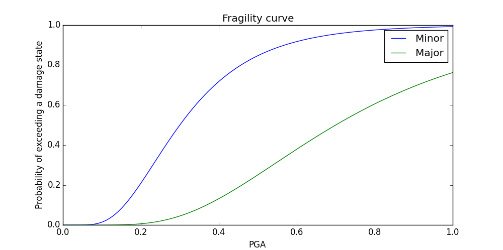

.. _stochastic_simulation:

Stochastic simulation
===============================

Stochastic simulation can be used to evaluate an ensemble of hydraulic and/or water quality 
scenarios.  For disaster scenarios, the location, duration, and severity of different types of events
can be drawn from distributions and included in the simulation.  
Distributions can be a function of component properties (i.e. age, material) or 
based on engineering standards.
Numpy includes many distributions and random selection methods that can be used for stochastic
simulation.  For example, the following code can be used to select N unique pipes 
based on the failure probability of each pipe::
	
	N = 2
	failure_probability = {'pipe1': 0.10, 'pipe2': 0.20, 'pipe3': 0.25, 'pipe4': 0.15, 
		'pipe5': 0.30}
	pipes_to_fail = np.random.choice(failure_probability.keys(), N, replace=False, 
		p=failure_probability.values())
				     
The example **stochastic_simulation.py** runs multiple realizations 
of a pipe leak scenario where the location and duration are drawn from probability 
distributions.

Fragility curves are commonly used in disaster models to define the probability 
of exceeding a given damage state as a function environmental change.
Fragility curves are closely related to survival curves, which are used to define the probability of component failure due to age.  
To estimate earthquake damage, fragility curves are defined as a function of peak
ground acceleration (PGA), peak ground velocity (PGV), or repair rate.  Fragility curves can also
be defined as a function of flood stage, wind speed, and temperature for other
types of disasters.  
The American Lifelines Alliance report [ALA2001]_
includes seismic fragility curves for water system components.

Fragility curves can have multiple damage states.  
Each state is defined with a name (i.e. 'Major', 'Minor'), 
priority (i.e. 1, 2, where higher numbers = higher priority), 
and distribution (using scipy.stats).
The distribution can be defined for all elements using the keyword 'Default', 
or can be defined for individual components.
Each fragility curve includes a "No damage" state with priority 0 (lowest priority).

.. literalinclude:: ../examples/fragility_curves.py
   :lines: 2, 25-27

The following figure illustrates a fragility curve based on PGA with
three damage states: No damage, minor damage, and major damage.  

   Example fragility curve.
   
The example **fragility_curves.py** uses fragility curves to 
determine probability of failure.  

