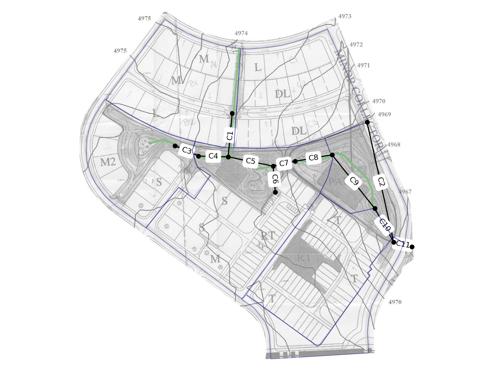
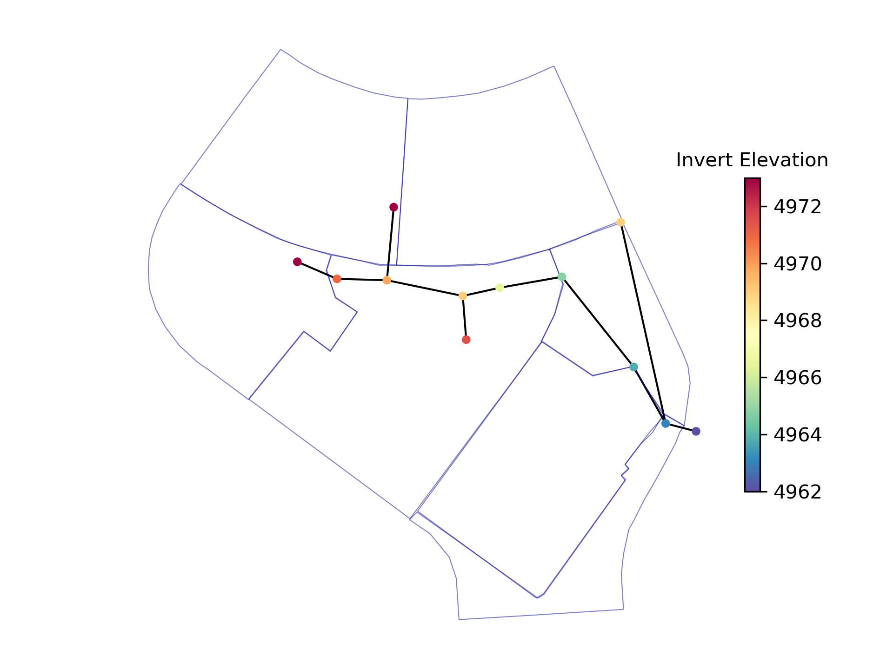

.. role:: red

.. raw:: latex

    \clearpage

.. doctest::
    :hide:
    
    >>> import matplotlib.pylab as plt
    >>> import wntr.stormwater as swntr
    >>> try:
    ...    swn = swntr.network.StormWaterNetworkModel('../examples/networks/Site_Drainage_Model.inp')
    ... except:
    ...    swn = swntr.network.StormWaterNetworkModel('examples/networks/Site_Drainage_Model.inp')
    >>> try:
    ...    swnP = swntr.network.StormWaterNetworkModel('../examples/networks/Pump_Control_Model.inp')
    ... except:
    ...    swnP = swntr.network.StormWaterNetworkModel('examples/networks/Pump_Control_Model.inp')
    >>> try:
    ...    backdrop_img = plt.imread('../figures/Site-Post.jpg')
    ... except:
    ...    backdrop_img = plt.imread('documentation/figures/Site-Post.jpg')

.. _stormwater:

Stormwater/wastewater analysis using S-WNTR
===========================================

.. note:: 
   Stormwater and wastewater resilience analysis capabilities in WNTR are new
   and should be considered beta software. 
   Feedback can be posted at https://github.com/USEPA/WNTR/issues.

Overview 
--------

The following section describes capabilities in WNTR to 
quantify the resilience of stormwater and wastewater systems.  
This capability resides in the :class:`~wntr.stormwater` subpackage of WNTR and 
is referred to as S-WNTR (pronounced "S-winter").
**S-WNTR is intended to 
leverage existing stormwater and wastewater software within a framework that 
facilitates the use of WNTR capabilities for resilience analysis.**
For that reason, some familiarity with WNTR is recommended before using S-WNTR.
Drinking water functionality in WNTR is cross referenced in 
the documentation below to provide additional background.

S-WNTR uses EPA's `Storm Water Management Model (SWMM) <https://www.epa.gov/water-research/storm-water-management-model-swmm>`_ :cite:p:`ross22`
through the use of two open-source Python packages managed by the `pyswmm organization <https://www.pyswmm.org>`_.
This includes: 

* **pyswmm** :cite:p:`pyswmm`: used to run SWMM hydraulic simulations, https://github.com/pyswmm/pyswmm
* **swmmio** :cite:p:`swmmio`: used to access and modify SWMM INP files, https://github.com/pyswmm/swmmio

A subset of WNTR classes/methods/functions that were developed for drinking water 
resilience analysis are imported into the stormwater subpackage to provide capabilities for 
stormwater and wastewater resilience analysis.

S-WNTR is intended to be used a standalone package.
In the examples below, the stormwater subpackage is imported as "swntr".

.. doctest::

    >>> import wntr.stormwater as swntr

S-WNTR includes the following modules:

.. _table-wntr-stormwater-modules:
.. table:: WNTR Stormwater Modules
   
   =================================================  =============================================================================================================================================================================================================================================================================
   Module                                             Description
   =================================================  =============================================================================================================================================================================================================================================================================
   :class:`~wntr.stormwater.gis`	                  Contains methods to integrate geospatial data into the model and analysis.
   :class:`~wntr.stormwater.graphics`                 Contains methods to generate network and fragility curve graphics.
   :class:`~wntr.stormwater.io`	                      Contains methods to read and write stormwater network models and translate models to other formats.
   :class:`~wntr.stormwater.metrics`	              Contains methods to compute resilience, including topographic and hydraulic metrics.
   :class:`~wntr.stormwater.network`	              Contains methods to define stormwater network models.
   :class:`~wntr.stormwater.scenario`                 Contains methods to define fragility/survival curves.
   :class:`~wntr.stormwater.sim`		              Contains methods to simulate hydraulics.
   =================================================  =============================================================================================================================================================================================================================================================================

Installation
------------

Follow WNTR's :ref:`installation` instructions to install S-WNTR.  

S-WNTR requires the following dependencies (included in the `requirements file <https://github.com/kaklise/WNTR/blob/swmm/requirements.txt>`_):

* numpy
* scipy
* networkx
* pandas
* matplotlib
* setuptools
* geopandas
* pyswmm
* swmmio

Units
-----

While WNTR uses SI units for all drinking water models and analysis (see :ref:`units`), 
**stormwater and wastewater models are not converted to SI units** when loaded into S-WNTR.
Therefore, any additional data used in analysis or computation should adhere the units of the model.

.. dropdown:: **SWMM unit conventions**
	
	For reference, :numref:`table-swmm-units` includes SWMM unit conventions :cite:p:`ross22`.  

	.. _table-swmm-units:
	.. csv-table:: SWMM INP File Unit Conventions
	   :file: tables/swmm_units.csv
	   :widths: 30, 30, 30
	   :header-rows: 1
   

Stormwater network model
------------------------

A stormwater network model can be created directly from SWMM INP files. 
The model is stored in a
:class:`~wntr.stormwater.network.StormWaterNetworkModel` object.  

.. doctest::
	
    >>> swn = swntr.network.StormWaterNetworkModel('networks/Site_Drainage_Model.inp') # doctest: +SKIP
	>>> swnP = swntr.network.StormWaterNetworkModel('networks/Pump_Control_Model.inp') # doctest: +SKIP

.. note::
   The stormwater examples in this documentation all use **Site_Drainage_Model.inp** to build the StormWaterNetworkModel, named ``swn``.  
   Examples that involve pumps use **Pump_Control_Model.inp** to build the StormWaterNetworkModel, named ``swnP``.  
   Both model files are distributed with SWMM :cite:p:`ross22`.

.. doctest::
    :hide:

    >>> fig, ax = plt.subplots()
    >>> f = ax.imshow(backdrop_img[::-1], origin='lower', alpha=0.5)
    >>> f = ax.set_xlim(0, 1423)
    >>> f = ax.set_ylim(0, 1475)
    >>> f = swntr.graphics.plot_network(swn, link_labels=True, ax=ax)
    >>> plt.tight_layout()
    >>> plt.savefig('plot_Site_Drainage_Model.png', dpi=300)
	
.. _fig-swmm-network:

   
   Stormwater network model from Site_Drainage_Model.inp.

.. dropdown:: **Model attributes**
	
	The StormWaterNetworkModel includes the following DataFrames which store model attributes 
	(and correspond to sections of SWMM INP files).

	* ``swn.junctions``
	* ``swn.outfalls``
	* ``swn.storage``
	* ``swn.conduits``
	* ``swn.weirs``
	* ``swn.orifices``
	* ``swn.pumps``
	* ``swn.controls``
	* ``swn.subcatchments``
	* ``swn.raingages``
	* ``swn.options``
	* ``swn.report``

	A full list of SWMM INP file sections that are supported by S-WNTR are stored in ``swn.section_names``.
		
	Model attributes are stored in Pandas DataFrames or Series.
	For example, ``swn.junctions`` contains the following information:

	.. doctest::
		
		>>> swn.junctions # doctest: +SKIP
			  InvertElev  MaxDepth  InitDepth  SurchargeDepth  PondedArea
		Name
		J1        4973.0         0          0               0           0
		J2        4969.0         0          0               0           0
		J3        4973.0         0          0               0           0
		J4        4971.0         0          0               0           0
		J5        4969.8         0          0               0           0
		J6        4969.0         0          0               0           0
		J7        4971.5         0          0               0           0
		J8        4966.5         0          0               0           0
		J9        4964.8         0          0               0           0
		J10       4963.8         0          0               0           0
		J11       4963.0         0          0               0           0

	The DataFrames and Series can be modified by the user and the   
	updated model is used in hydraulic simulation and analysis.

	The StormWaterNetworkModel object also includes methods to return a list of 
	junction names, conduits names, etc. 

	.. doctest::
		
		>>> swn.conduit_name_list
		['C1', 'C2', 'C3', 'C4', 'C5', 'C6', 'C7', 'C8', 'C9', 'C10', 'C11']
	
	Additional properties on the StormWaterNetworkModel include:
	
	* ``swn.conduit_cross_section``
	* ``swn.conduit_volume``
	
	.. note:: 
	   :class:`~wntr.stormwater.network.StormWaterNetworkModel` uses ``swmmio.Model`` to 
	   read and write the SWMM INP file. 
	   swimmio stores this information in Pandas and GeoPandas data formats.

.. dropdown:: **Class methods**

	In addition to modifying StormWaterNetworkModel DataFrames directly, the following class
	methods are also available to help modify models.

	* :class:`~wntr.stormwater.network.StormWaterNetworkModel.add_composite_patterns`: 
	  Combine multiple dry weather flows into a single composite base value and pattern 
	  and update the model (updates ``swn.dwf`` and ``swn.patterns``)
	* :class:`~wntr.stormwater.network.StormWaterNetworkModel.add_pump_outage_control`: 
	  Add a pump outage control to the model (updates ``swn.controls``)
	* :class:`~wntr.stormwater.network.StormWaterNetworkModel.anonymize_coordinates`: 
	  Anonymize model coordinates (using a spring layout) and remove vertices and polygons 
	  to anonymize the model (updates ``swn.coordinates``, ``swn.vertices``, and ``swn.polygons``)
	* :class:`~wntr.stormwater.network.StormWaterNetworkModel.timeseries_to_datetime_format` and 
	  :class:`~wntr.stormwater.network.StormWaterNetworkModel.timeseries_from_datetime_format`: 
	  Convert between SWMM formatted timeseries DataFrames and datetime indexed DataFrames

.. dropdown:: **Model I/O**

	S-WNTR includes the following functions to read/write files and transform 
	the StormWaterNetworkModel to other data formats.

	* :class:`~wntr.stormwater.io.read_inpfile`: Create a StormWaterNetworkModel object from a SWMM INP file 
	* :class:`~wntr.stormwater.io.write_inpfile`: Write a SWMM INP file from a StormWaterNetworkModel
	* :class:`~wntr.stormwater.io.to_graph`: Convert a StormWaterNetworkModel object into a NetworkX graph object
	* :class:`~wntr.stormwater.io.to_gis`: Convert a StormWaterNetworkModel object into a WaterNetworkGIS object
	* :class:`~wntr.stormwater.io.write_geojson`: Write GeoJSON files from a StormWaterNetworkModel

	Additional methods are available for reading hydraulic simulation results files.  
	See :ref:`stormwater_simulation` for more information.

	* :class:`~wntr.stormwater.io.read_outfile`: Read the SWMM binary output file into Pandas DataFrames
	* :class:`~wntr.stormwater.io.read_rptfile`: Read the SWMM summary report file into Pandas DataFrames

.. _stormwater_simulation:

Hydraulic simulation
--------------------

Hydraulic simulations are run using the 
:class:`~wntr.stormwater.sim.SWMMSimulator` class. Simulation results are stored in a series of 
Pandas DataFrames, as described in the following section.

.. doctest::
	
    >>> sim = swntr.sim.SWMMSimulator(swn) 
    >>> results = sim.run_sim()

.. note:: 
   :class:`~wntr.stormwater.sim.SWMMSimulator` uses ``swmmio`` and ``pyswmm`` to run the full
   duration of the SWMM simulation. pyswmm can be used directly for stepwise simulation.

.. dropdown:: **Overland flow**
	
	Overland flow is an important aspect of resilience analysis for stormwater and wastewater systems. 
	While SWMM quantifies ponded volume and flooding loss, which account for flood impacts 
	at the discharge node, SWMM does not support 2D overland flow.  
	Open source and commercial software tools like GisToSWMM5 :cite:p:`niemi2019automated` 
	and PCSWMM :cite:p:`pcswmm` are able to generate 2D overland 
	meshes that can be stored in SWMM INP files and run using SWMM.

	To include overland flow in S-WNTR, 
	the user should first modify their INP file to include 2D overland conduits.

.. dropdown:: **Simulation results**

	Simulation results are stored in a 
	:class:`~wntr.stormwater.sim.ResultsObject` organized in **node**, **link**, **subcatchment**, and **report** sections.
	Each section contains a
	DataFrames storing a timeseries of 
	simulation results or summary information.
	See drinking water documentation on :ref:`simulation_results` for more information on the format of simulation results in WNTR.

	The S-WNTR :class:`~wntr.stormwater.sim.ResultsObject` includes the following sections:
	
	**results.node** includes the following timeseries for junctions, outfall, and storage nodes:

	* Invert depth
	* Hydraulic head
	* Ponded volume
	* Lateral inflow
	* Total inflow
	* Flooding loss
	* Pollution concentration

	**results.link** results include the following timeseries for conduits, weirs, orifices, and pumps:

	* Flow rate
	* Flow depth
	* Flow velocity
	* Capacity
	* Pollution concentration

	**results.subcatchment** results include the following timeseries:

	* Rainfall
	* Snow depth
	* Evaporation loss
	* Infill loss
	* Runoff rate
	* Groundwater outflow rate
	* Groundwater table elevation
	* Soil moisture
	* Pollution concentration

	**results.report** results include the following summary information:
	
	* Node summary
	* Node depth summary
	* Node inflow summary
	* Node surcharge summary
	* Node flooding summary
	* Storage volume summary
	
	* Link summary
	* Link flow summary
	* Link pollutant load summary
	* Conduit surcharge summary
	* Pumping summary
	
	* Subcatchment summary
	* Subcatchment runoff summary
	* Subcatchment washoff summary

	The following example lists node attributes (Note that attribute names use all caps with an underscore between words)

	.. doctest::
		
		>>> print(results.node.keys())
		dict_keys(['INVERT_DEPTH', 'HYDRAULIC_HEAD', 'PONDED_VOLUME', 'LATERAL_INFLOW', 'TOTAL_INFLOW', 'FLOODING_LOSSES', 'POLLUT_CONC_0'])

	The following example extracts the 'C0' conduit capacity from simulation results.

	.. doctest::
		
		>>> conduit_capacity = results.link['CAPACITY'].loc[:, 'C1']

	Simulation timeseries can also be extracted directly from a SWMM binary output file 
	using the function :class:`~wntr.stormwater.io.read_outfile` and 
	a report summary can be extracted directly from a SWMM report file 
	using the function :class:`~wntr.stormwater.io.read_rptfile`, as shown in the example below.
	The ``file_prefix`` is used to name the output files.
	The default file prefix is "temp".
	
	.. doctest::
		
		>>> sim = swntr.sim.SWMMSimulator(swn) 
		>>> results = sim.run_sim(file_prefix='base') # creates base.bin and base.rpt
		
		>>> timeseries_results = swntr.io.read_outfile('base.out')
		>>> summary_report = swntr.io.read_rptfile('base.rpt')

Disaster scenarios
------------------
Disaster scenarios can be defined based on a **specific threat**
or **threat agnostic** analysis.
For example, a specific landslide threat can be quantified using 
GIS data to define landslide potential and fragility curves
to define the probability a conduit is damaged as a function of displacement.
Threat agnostic impacts can be quantified using criticality analysis, 
where the impact of individual component failures is evaluated.

.. dropdown:: **Modeling damage**
		
	To model disaster scenarios, attributes and controls in the 
	:class:`~wntr.stormwater.network.StormWaterNetworkModel` are modified to 
	reflect the damage state. 
	Several damage scenarios can be used to quantify resilience of the 
	stormwater/wastewater systems, this includes:

	* **Long term power outages**: Power outages impact pumps and lift stations. 
	  The method :class:`~wntr.stormwater.network.StormWaterNetworkModel.add_pump_outage_control` 
	  adds a control to the model which turns a pump off and on at user specified start and end times, respectively.
	  By default, the control priority is set to 4 (highest) to override other controls.
	  
	  .. doctest::
		  >>> # The following example uses swnP
		  >>> start_time = 4.5 # hours
		  >>> end_time = 12 # hours
		  >>> control = swnP.add_pump_outage_control('PUMP1', start_time, end_time, control_suffix="_outage") 
		  
	  Note that controls can be viewed and modified using ``swn.controls`` which stores controls as 
	  a Pandas DataFrame (one row per control).  

	  .. doctest::
	  
		  >>> print(swnP.controls.loc['RULE PUMP1_outage', 'Control']) 
		  IF SIMULATION TIME > 4.5 AND SIMULATION TIME < 12 THEN PUMP PUMP1 status = OFF ELSE PUMP PUMP1 status = ON PRIORITY 4

	* **Conduit blockage or collapse**: Conduit blockage or collapse impacts the flowrate at the conduit.  
	  The flowrate in a conduit can be constrained by modifying conduit properties as follows:
	  
	  * Decrease max flow. Note that a max flow value of 0 means that the flowrate is unconstrained (no upper bound).
	  * Increate roughness
	  * Decrease cross sectional area

	  .. doctest::
		
		  >>> swn.conduits.loc['C1', "MaxFlow"] = 1e-6
		  >>> swn.conduits.loc['C1', "Roughness"] = 0.999
		  >>> swn.xsections.loc['C1', "Geom1"] = 0.00125

	* **Extreme rainfall events**: Increased runoff impacts combined stormwater/wastewater systems.
      The methods :class:`~wntr.stormwater.network.StormWaterNetworkModel.timeseries_to_datetime_format` can be used to 
      convert ``swn.timeseries`` into a datetime Pandas DataFrame.  This format is easy to modify or import from other data sources.
      The method :class:`~wntr.stormwater.network.StormWaterNetworkModel.add_timeseries_from_datetime_format` can then be used to 
      add timeseries formatted as datetime Pandas DataFrames to the model.  This facilitates greater flexibility in the way timeseries are modified.
      
	  The following example creates a new timeseries that is a combination of a 100 and 10 year rainfall event, 
	  adds the new timeseries to the model, and then updates the data source of the raingage.
	  
	  .. doctest::
		
		  >>> swn.timeseries_name_list
		  ['2-yr', '10-yr', '100-yr']
		  >>> ts = swn.timeseries_to_datetime_format()
		  >>> ts['New'] = ts['100-yr'] + ts['10-yr'].shift(periods=12, fill_value=0)
		  >>> ax = ts.plot()
		  >>> timeseries = swn.add_timeseries_from_datetime_format(ts['New'])
		  >>> swn.timeseries_name_list
		  ['2-yr', '10-yr', '100-yr', 'New']
		  >>> swn.raingages['DataSourceName'] = 'New'

      .. doctest::
          :hide:
    
          >>> plt.tight_layout()
          >>> plt.savefig('timeseries_plot.png', dpi=300)
	
      .. _fig-fragility:
      .. figure:: figures/timeseries_plot.png
         :width: 640
         :alt: Timeseries plot

         Timeseries plot
   
	See :ref:`stormwater_examples` below.

.. dropdown:: **Geospatial capabilities**
	
	Site and hazard specific GIS data can be used to define disaster scenarios 
	through the use of geospatial capabilities which allow the user to identify 
	components which intersect areas impacted by disruptive events. 
	Furthermore, GIS data can be used to characterize community impact based on the 
	location of critical facilities and vulnerable populations.

	Example GIS data that can help inform disaster scenarios includes:

	* Hazard maps
	* Elevation data
	* Census data
	* Social vulnerability data
	* Location of critical facilities and emergency services

	S-WNTR includes a :class:`~wntr.stormwater.gis` module which 
	facilitates the use of GIS data in geospatial operations, like 
	:class:`~wntr.stormwater.gis.snap` and :class:`~wntr.stormwater.gis.intersect`.

	The :class:`~wntr.stormwater.network.StormWaterNetworkModel` can be converted into a 
	:class:`~wntr.stormwater.gis.WaterNetworkGIS` object, as shown below.

	.. doctest::
		
		>>> swn_gis = swn.to_gis()

	The user can also write geojson files, using the function :class:`~wntr.stormwater.io.write_geojson`.

	See drinking water documentation on :ref:`geospatial` for more information.

.. dropdown:: **Fragility curves**
	
	Fragility curves are used within disaster scenarios to define the probability that a
	component fails for a specific environmental change.  For example, fragility curves can define the 
	probability of conduit collapse as a function of peak ground acceleration from an earthquake, or the 
	probability of damage to a pump station as a function of flood stage.

	:numref:`fig-fragility2` illustrates the fragility curve as a function of peak ground acceleration.  
	For example, if the peak ground acceleration is 0.3 at 
	a specific pipe, the probability of exceeding a Major damage state is 0.16 and the probability
	of exceeding the Minor damage state is 0.80.  

	.. _fig-fragility2:
	.. figure:: figures/fragility_curve.png
	   :width: 640
	   :alt: Fragility curve

	   Example fragility curve.
	   
	See drinking water documentation on :ref:`fragility_curves` for more information.

.. dropdown:: **Criticality analysis**
	
	In cases where a specific disaster scenario is not included in the analysis, 
	a series of simulations can be used to perform N-k contingency analysis, 
	where N is the number of elements and k elements fail.
	N-1 contingency analysis is commonly called criticality analysis :cite:p:`wawc06`
	and uses a series of simulations to impart damage to one component at a time.
	In stormwater and wastewater systems, the analysis can include the following:

	* Conduit criticality
	* Pump criticality

	See drinking water documentation on :ref:`criticality` for more information.

Resilience metrics
------------------

Resilience of stormwater and wastewater distribution systems depends on many factors, including the 
design, maintenance, and operations of that system. For that reason, the WNTR stormwater module 
includes several metrics to help quantify resilience.  
Additional metrics could also be added at a later date.

.. dropdown:: **Topographic metrics**
		
	Topographic metrics, based on graph theory, can be used to assess the connectivity 
	of stormwater and wastewater systems. Many metrics can be computed directly using NetworkX.
	See drinking water documentation on :ref:`topographic_metrics` for more information.

	The StormWaterNetworkModel can be converted to a NetworkX graph as shown below:

	.. doctest::
		
		>>> G = swn.to_graph()

	.. note:: 
	   The :class:`~wntr.stormwater.network.StormWaterNetworkModel.to_graph` method uses ``swmmio.Model`` to 
	   create the NetworkX graph object.  The WNTR methods includes additional options to add node and link weight, and 
	   modify the direction of links according to the sign of the link weight (generally flow direction).

	The graph can be used in NetworkX functions to compute network topographic metrics. 
	Example topographic metrics include:

	* Node degree
	* Betweenness centrality
	* Shortest path length
	* Segmentation groups 
	* and many more

	The following example uses NetworkX to compute node degree.

	.. doctest::
		
		>>> import networkx as nx
		
		>>> G = swn.to_graph()
		>>> node_degree = nx.degree(G)

.. dropdown:: **Travel paths**
	
	Since stormwater and wastewater systems typically operate in a unidirectional mode (flow in one direction), 
	it is possible to identify assets that are upstream and downstream from other assets.  This calculation helps identify 
	travel time along flow paths and capacity limitations along those paths.
	
	Travel path metrics include:
	
	* Upstream edges or nodes from a starting node
	* Downstream edges or nodes from a starting node
	* Shortest path edges or nodes between two nodes
	
	The following example identifies upstream edges from a single node.
	
	.. doctest::
		
		>>> average_flowrate = results.link['FLOW_RATE'].mean()
		>>> G_flow = swn.to_graph(link_weight=average_flowrate, modify_direction=True)
		>>> upstream_edges = swntr.metrics.upstream_edges(G_flow, 'J8')

.. dropdown:: **Travel time**
	
	Travel time along an individual conduit is simply computed as the conduit length divided by the conduit velocity.  
	
	.. doctest::
		
		>>> length = length = swn.links['Length']
		>>> average_velocity = results.link['FLOW_VELOCITY'].mean()
		>>> travel_time = swntr.metrics.conduit_travel_time(length, average_velocity) # in seconds

    If velocites are stable, the travel time along a path can be computed as the sum of travel times along that path.
	
	.. doctest::
		
		>>> path_edges = swntr.metrics.shortest_path_edges(G_flow, 'J1', 'J9')
		>>> path_travel_time = travel_time[path_edges].sum() # in seconds

.. dropdown:: **Time to reach capacity**
	
	The time for an individual conduit to reach a specified capacity can be approximated by knowing the conduit available volume and average flowrate.  
	This assumes that the flowrate is blocked at the outflow of each conduit. 
	This rough approximation overly simplifies dynamics from blocked flow, but can be useful to identify areas with marginal reserve.

	.. doctest::

		>>> flow_units = swnP.options.loc['FLOW_UNITS', 'Value']
		>>> volume = swn.conduit_volume
		>>> average_capacity = results.link['CAPACITY'].mean()
		>>> available_volume = swntr.metrics.conduit_available_volume(volume, average_capacity, threshold=1)
		>>> time_to_capacity = swntr.metrics.conduit_time_to_capacity(available_volume, average_flowrate, flow_units=flow_units)

	To compute the time to reach capacity along a path, the total available volume and max flowrate are used in the calculation.  
	Again, this overly simplifies dynamics from blocked flow, but can be useful to identify response time for upstream assets.
	
	.. doctest::

		>>> path_average_capacity = average_capacity[path_edges]
		>>> path_average_flowrate = average_flowrate[path_edges]
		>>> path_time_to_capacity = swntr.metrics.conduit_time_to_capacity(path_average_capacity, path_average_flowrate, flow_units=flow_units, connected=True)
		
.. dropdown:: **Pump power and energy use**
	
	Pump flowrate and headloss can be used to compute power and energy use as a function of time.
	
	The following example uses pump flowrate and headloss to compute pump power and energy.
	
	.. doctest::

		>>> # The following example uses swnP
		>>> flow_units = swnP.options.loc['FLOW_UNITS', 'Value']
		>>> sim = swntr.sim.SWMMSimulator(swnP)
		>>> results = sim.run_sim()
		
		>>> pump_flowrate = results.link['FLOW_RATE'].loc[:, swn.pump_name_list]
		>>> node_head = results.node['HYDRAULIC_HEAD']
		>>> pump_headloss = swntr.metrics.headloss(node_head, swn.pump_name_list, swn)
		>>> pump_power = swntr.metrics.pump_power(pump_flowrate, pump_headloss, flow_units)
		>>> pump_energy = swntr.metrics.pump_energy(pump_flowrate, pump_headloss, flow_units)

Graphics
--------

Network attributes, simulation results, and resilience metrics can be plotted in several 
ways to better understand system characteristics.  

* Basic network graphics can be generated using the function :class:`~wntr.stormwater.graphics.plot_network`.  
* Time series graphics can be generated using options available in Matplotlib and Pandas.
* Fragility curves can be plotted using the function :class:`~wntr.stormwater.graphics.plot_fragility_curve`.  

See drinking water documentation on :ref:`graphics` for more information on graphics capabilities in WNTR.

The following example creates a network plot with invert elevation.

.. doctest::
    :hide:
    
    >>> fig = plt.figure()
    
.. doctest::
	
    >>> ax = swntr.graphics.plot_network(swn, node_attribute='InvertElev', 
    ...    node_colorbar_label='Invert Elevation')

.. doctest::
    :hide:

    >>> plt.tight_layout()
    >>> plt.savefig('plot_basic_stormwater_network.png', dpi=300)
    
.. _fig-network-2:

   
   Basic stormwater network graphic.

.. _stormwater_examples:

Examples
--------

``[TODO: Add examples, or link to Jupyter notebooks]``

* Upstream/downstream assets
* Response time
* Conduit criticality
* Power outages
* Extreme rainfall
